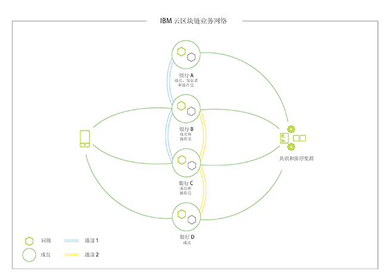

---

copyright:
  years: 2018, 2019
lastupdated: "2019-07-10"

keywords: blockchain components, ca, certificate authorities, peer, ordering service, orderer, channel, smart contract, applications

subcollection: blockchain

---

{:external: target="_blank" .external}
{:shortdesc: .shortdesc}
{:screen: .screen}
{:codeblock: .codeblock}
{:note: .note}
{:important: .important}
{:tip: .tip}
{:pre: .pre}

# 区块链组件概述
{: #blockchain-component-overview}

{{site.data.keyword.blockchainfull}} Platform 的组件和结构基于 [Hyperledger Fabric](https://hyperledger-fabric.readthedocs.io/en/release-1.4/){: external}（这是一个开放式源代码许可的区块链解决方案，{{site.data.keyword.IBM_notm}} 是其主要贡献者）的底层基础架构和工具。基于 Fabric 的网络包括几个标准组件，这些组件可部署到多种配置中，以支持种类繁多的用例。

要更全面地了解 Fabric 网络以及组成该网络的组件的相互关系，请从 Fabric 社区文档查看[有关区块链网络的结构的此文档](https://hyperledger-fabric.readthedocs.io/en/release-1.4/network/network.html)，其中显示了如何创建和健全网络。

要获取基于 Fabric 的网络中组件的高级概述，请查看以下视频：

<iframe class="embed-responsive-item" id="youtubeplayer" title="入门套餐视频" type="text/html" width="640" height="390" src="https://www.youtube.com/embed/sJaT2L99BUo" frameborder="0" webkitallowfullscreen mozallowfullscreen allowfullscreen> </iframe>

*尽管此视频主要从入门套餐和企业套餐网络的角度介绍组件，但这些信息仍然与 {{site.data.keyword.blockchainfull_notm}} Platform for {{site.data.keyword.cloud_notm}} Private 的客户管理解决方案高度相关。*

在本概述中，我们将只重点关注认证中心 (CA)、排序节点、同级、智能合同以及应用程序。如[构建网络教程](/docs/services/blockchain/howto?topic=blockchain-ibp-console-build-network#ibp-console-build-network)中所示，此顺序并非任意的，它反映了基于 Fabric 的网络中组件的部署顺序。

## 认证中心
{: #blockchain-component-overview-ca}

身份和许可权是基于 Fabric 的区块链网络的基石。身份采用 CA 颁发的 x.509 证书的形式，它们与信用卡的相似之处在于可*识别*某个人，可包括其相关属性。然后，这些证书将通过包含在组件或通道级别的 MSP 文件夹中，从而链接到许可权。例如，同级 MSP 将拥有名为 **admins** 的 MSP 子文件夹。其证书位于该 admin 文件夹中的任何用户都是同级的管理员，这意味着他们能够执行允许该同级的管理员执行的任何操作。每当通过其签名证书识别的用户尝试执行管理操作时，同级内的验证系统都将执行检查。该证书与“admin”文件夹中的证书匹配吗？如果匹配，那么可以执行该操作。否则，执行该操作的请求将被拒绝。

{{site.data.keyword.blockchainfull_notm}} Platform CA 基于 [Hyperledger Fabric-CA](https://hyperledger-fabric-ca.readthedocs.io/en/release-1.4/){: external}，但是只要使用基于 x.509 证书的 PKI，就可以使用其他 CA。可以有且通常应该有多个级别的 CA。通常不会公开网络的“根 CA”，除非是将证书提供给“中间 CA”，后者会将证书直接颁发给用户和组件，或者颁发给更多层中间 CA。有关如何使用认证中心建立身份和成员资格的更多详细信息，请参阅[有关身份的 Hyperledger Fabric 文档](https://hyperledger-fabric.readthedocs.io/en/release-1.4/identity/identity.html){: external}和[有关成员资格的 Hyperledger Fabric 文档](https://hyperledger-fabric.readthedocs.io/en/release-1.4/membership/membership.html){: external}。

## 排序服务
{: #blockchain-component-overview-orderer}

虽然排序服务通常称为网络的“核心”，但其功能实际上相当简单：将已由同级验证过的事务排序到区块中，然后将这些事务发送回同级以写入其分类帐。在早期版本的 Fabric 中，此功能捆绑在同级内，但是从 Fabric V1.0 开始，已将其分离出来成为单独的组件，以提高同级性能，并避免可能导致潜在状态派生的异常。

在物理级别，此排序功能通常需要一组排序节点，这些节点统称为“排序服务”。

有关排序服务的更多信息，请参阅 [The Ordering Service](https://hyperledger-fabric.readthedocs.io/en/release-1.4/orderer/ordering_service.html){: external}。

## 同级
{: #blockchain-component-overview-peer}

在物理级别，区块链网络主要由同级节点（或者简称为同级）构成。同级是网络的基本元素，因为同级用于托管分类帐和智能合同（这些对象包含在[“链代码”](https://hyperledger-fabric.readthedocs.io/en/release-1.4/developapps/chaincodenamespace.html){: external}中）。更准确地说，同级托管分类帐的**实例**以及智能合同的**实例**。由于智能合同和分类帐分别用于封装网络中的共享过程和共享信息，因此同级的这些方面使其成为了解 Fabric 实际所执行操作的合适起点。

要了解有关同级的更多具体信息，请查看 Fabric 社区文档中[仅关注同级的此文档](https://hyperledger-fabric.readthedocs.io/en/release-1.4/peers/peers.html){: external}。

## 通道
{: #blockchain-component-overview-channels}

通道是一种机制，用于在网络中的成员之间提供开放通信层。可以在成员的子集之间创建多个通道，从而支持[用于实现隐私的多个机制](https://developer.ibm.com/tutorials/cl-blockchain-private-confidential-transactions-hyperledger-fabric-zero-knowledge-proof/){: external}之一。区块链网络上的数据存储在通道分类帐上。通道分类帐在已加入该通道的组织的同级上进行托管。有关通道以及如何使用通道的更多信息，请参阅 [Hyperledger Fabric 文档](https://hyperledger-fabric.readthedocs.io/en/release-1.4/channels.html){: external}。

## 智能合同
{: #blockchain-component-overview-smart-contracts}

要使企业能够相互交易，必须先在某种形式的合同中达成并定义有关规则和流程的共识。这些合同一起制定了“业务模型”，用于管理业务合作伙伴之间的所有交互。

区块链网络中存在相同的需求，其中，这些业务模型的行业术语是“智能合同”，Fabric 和 {{site.data.keyword.blockchainfull_notm}} Platform 将这些合同包含在称为“链代码”的更大结构中，该结构不仅包含业务逻辑，还包括对尝试调用智能合同的用户验证身份的底层基础架构。

商业领域的合同由律师事务所进行签名和存档，而智能合同则安装在同级上，并在通道上“实例化”。

## 应用程序
{: #blockchain-component-overview-applications}

基于 Fabric 的网络中的客户机应用程序（如 {{site.data.keyword.blockchainfull_notm}} Platform）利用底层基础架构（如 API 和 SDK）以及智能合同，允许较高抽象级别的客户机交互（调用和查询）。

要了解应用程序如何与基于 Fabric 的网络进行交互，请查看 Hyperledger Fabric 文档中的 [Developing Applications](https://hyperledger-fabric.readthedocs.io/en/release-1.4/developapps/developing_applications.html){: external} 主题。您还可以访问[创建应用程序](/docs/services/blockchain/howto?topic=blockchain-ibp-console-app#ibp-console-app)主题，以了解如何将应用程序连接到 {{site.data.keyword.blockchainfull_notm}} Platform。

## 示例网络
{: #blockchain-component-overview-example-network}

**图 1** 描述了已部署的区块链网络的示例，其中包含四个成员（每个成员拥有两个同级）、负责分发密码身份资料的认证中心，以及一个定义策略和网络参与者的排序服务。蓝色通道包含全部四个网络成员，而黄色通道仅限于三个成员：银行 B、C 和 D。我们也看到银行 A 扮演了网络发起者的角色，银行 D 仅作为成员在黄色通道的上下文中存在。最后，拥有正确签名的 x509 证书的用户或应用程序能够向网络中的同级发送调用。

