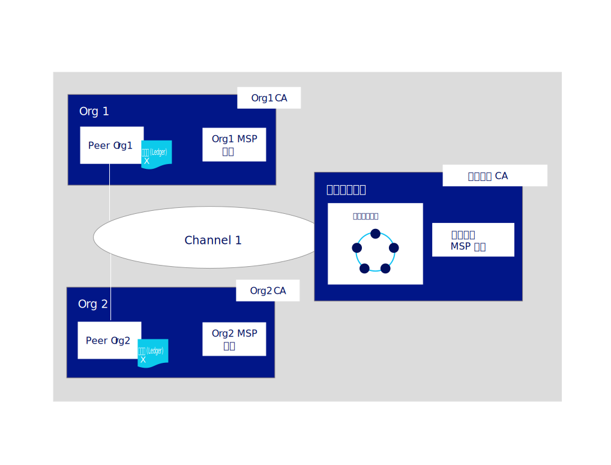
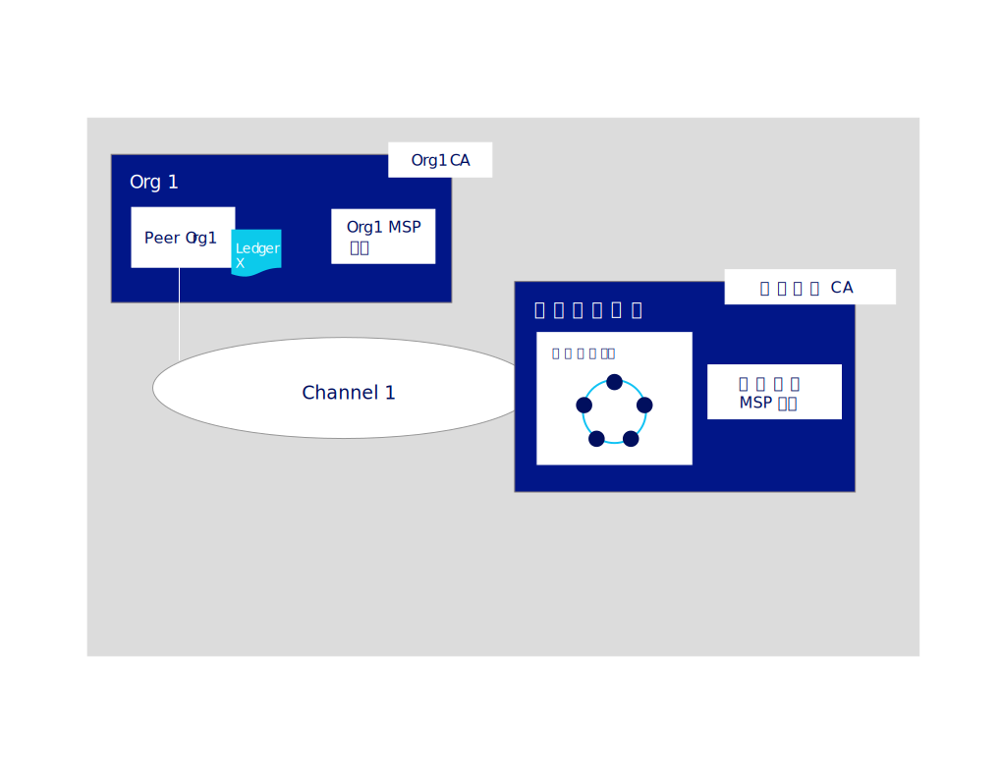

---

copyright:
  years: 2019
lastupdated: "2019-06-18"

keywords: getting started tutorials, create a CA, enroll, register, create an MSP, wallet, create a peer, create ordering service, Raft

subcollection: blockchain

---

{:external: target="_blank" .external}
{:shortdesc: .shortdesc}
{:screen: .screen}
{:codeblock: .codeblock}
{:note: .note}
{:important: .important}
{:tip: .tip}
{:pre: .pre}

# 构建网络教程
{: #ibp-console-build-network}

{{site.data.keyword.blockchainfull}} Platform 是一个区块链即服务产品，支持开发、部署和操作区块链应用程序和网络。您可以通过访问[区块链组件概述](/docs/services/blockchain?topic=blockchain-blockchain-component-overview#blockchain-component-overview)，了解有关区块链组件及其如何一起工作的更多信息。本教程是[样本网络教程系列](/docs/services/blockchain/howto?topic=blockchain-ibp-console-build-network#ibp-console-build-network-sample-tutorial)的第一部分，描述了如何使用 {{site.data.keyword.blockchainfull_notm}} Platform 控制台在部署到我们所选云基础架构中的 Kubernetes 集群上构建功能齐全的网络。
{:shortdesc}


如果使用的是 Beta 试用版 {{site.data.keyword.blockchainfull_notm}} Platform for {{site.data.keyword.cloud_notm}}，那么控制台中的某些面板可能与当前的文档不一致，该文档对应于一般可用 (GA) 服务实例并保持最新。如果您有 Beta 服务实例并希望利用所有最新的功能，目前建议您遵循 [{{site.data.keyword.blockchainfull_notm}} Platform for {{site.data.keyword.cloud_notm}} 入门](/docs/services/blockchain/howto?topic=blockchain-ibp-v2-deploy-iks#ibp-v2-deploy-iks)中的指示信息来供应 GA 服务实例。
{: important}

**目标受众：**本主题适用于负责创建、监视和管理区块链网络的网络操作员。

如果您尚未使用 {{site.data.keyword.blockchainfull_notm}} Platform 控制台通过 {{site.data.keyword.cloud_notm}} Kubernetes Service 将组件部署到 Kubernetes 集群，请参阅 [{{site.data.keyword.blockchainfull_notm}} Platform for {{site.data.keyword.cloud_notm}} 入门](/docs/services/blockchain/howto?topic=blockchain-ibp-v2-deploy-iks#ibp-v2-deploy-iks)（如果使用的是 {{site.data.keyword.cloud_notm}} 集群）或 [{{site.data.keyword.blockchainfull_notm}} Platform for Multicloud 入门](/docs/services/blockchain?topic=blockchain-get-started-console-icp#get-started-console-icp)（如果使用的是 {{site.data.keyword.cloud_notm}} Private）以在非 {{site.data.keyword.cloud_notm}} 云提供者上进行部署。请注意，控制台本身并不位于集群中。控制台是一个可用于将组件部署到集群中的工具。

无论是将组件部署到付费还是免费 Kubernetes 集群，在选择部署节点和创建通道时，都请密切关注您可支配的资源。您负责管理 Kubernetes 集群并根据需要部署其他资源。虽然组件可成功部署到 {{site.data.keyword.cloud_notm}} 免费集群，但添加的组件越多，组件运行的速度越慢。有关组件大小设置以及控制台如何与 {{site.data.keyword.cloud_notm}} Kubernetes Service 集群进行交互的更多信息，请参阅[分配资源](/docs/services/blockchain/howto?topic=blockchain-ibp-console-govern#ibp-console-govern-iks-console-interaction)。如果是使用 {{site.data.keyword.cloud_notm}} Private 部署到其他云提供者，那么您必须查阅该提供者的文档，以了解如何在其中监视您的资源。

## 样本网络教程系列
{: #ibp-console-build-network-sample-tutorial}

本教程系列分为三个部分，可指导您完成以下过程：使用 {{site.data.keyword.blockchainfull_notm}} Platform 控制台将网络部署到 Kubernetes 集群，并安装和实例化智能合同，以创建和互连相对简单的多节点 Hyperledger Fabric 网络。请注意，虽然本教程说明的是此过程如何使用付费 {{site.data.keyword.cloud_notm}} Kubernetes 集群，但相同的基本流程也适用于免费集群，尽管对免费集群有一些限制（例如，无法在免费集群中设置或调整节点大小）。

这些教程中描述的创建和管理组件的过程也适用于使用 {{site.data.keyword.cloud_notm}} Private 在其他云提供者上进行的部署。
{: important}

* **构建网络教程** 此教程将指导您通过创建两个组织（一个用于同级，另一个用于排序服务）和一个通道来完成托管网络的过程。如果要通过创建排序服务并添加组织来构成区块链联盟，请使用本教程。
* [加入网络教程](/docs/services/blockchain/howto?topic=blockchain-ibp-console-join-network#ibp-console-join-network)将指导您通过创建同级并将其加入现有通道来完成加入现有网络的过程。如果您不打算通过创建排序服务来托管网络，或者想要了解加入其他网络的过程，请使用本教程。
* [在网络上部署智能合同](/docs/services/blockchain/howto?topic=blockchain-ibp-console-smart-contracts#ibp-console-smart-contracts)说明了如何编写智能合同并将其部署在网络上。


### 此网络的结构
{: #ibp-console-build-network-structure}

如果完成了**构建网络**和**加入网络**教程中的所有步骤，那么网络会类似于下图中所示的内容：



此配置足以满足测试应用程序和智能合同的需求，也可作为指南来指导构建组件和加入适合您自己用例的生产网络。该网络包含以下组件：

* **两个同级组织**：`Org1` 和 `Org2`  
  本教程系列描述了如何创建两个同级组织和两个关联同级。可以将区块链网络中的组织视为需要相互进行事务处理的两家不同的银行。我们将创建 `Org1` 和 `Org2` 的定义。
* **一个排序服务组织**：`Ordering Service`  
  我们要构建的是分布式分类帐，所以同级和排序服务应该属于不同的组织。因此，为排序服务创建了一个单独的组织。除此之外，排序服务将对发送给同级的事务处理区块进行排序，以写入同级的分类帐并成为区块链。我们将创建 `Ordering Service` 组织的定义。
* **三个认证中心 (CA)**：`Org1 CA、Org2 CA 和 Ordering Service CA`   
  CA 是向与组织关联的用户和节点签发证书的节点。因为最好每个组织部署一个 CA，所以我们将部署总共三个 CA：每个同级组织一个 CA，排序服务组织一个 CA。这些 CA 还将创建每个组织的定义，该定义由成员资格服务提供者 (MSP) 进行封装。TLS CA 与每个组织 CA 一起自动部署，并提供 TLS 证书用于节点之间的通信。有关更多信息，请参阅[使用 TLS CA](/docs/services/blockchain/howto?topic=blockchain-ibp-console-identities#ibp-console-identities-tlsca)。
* **一个排序服务**：`Ordering Service`  
  在付费集群上运行的部署可以选择部署单节点排序服务或崩溃容错五节点排序服务，但免费集群只能选择运行单个节点。五节点排序服务使用 Raft 协议的实现（有关 Raft 的更多信息，请参阅 [The Ordering Service](https://hyperledger-fabric.readthedocs.io/en/release-1.4/orderer/ordering_service.html#raft){: external}），这是本教程将说明的部署选项。目前，仅支持每个排序服务有一个排序服务组织，不管与该组织关联的排序节点有多少。此排序服务将同级组织添加到其“联盟”，联盟是可以创建并加入通道的同级组织的列表。如果要创建一个通道，其中具有部署在不同集群中的组织（这是大多数生产网络的构造方式），那么排序服务管理员需要将已部署在其他控制台中的同级组织导入到自己的控制台。这允许同级组织加入该排序服务上托管的通道。
* **两个同级**：`Peer Org1` 和 `Peer Org2`  
  上图中所示的分类帐 `Ledger x` 由分布式同级进行维护。这些同级使用作为状态数据库的 [Couch DB](https://hyperledger-fabric.readthedocs.io/en/release-1.4/couchdb_as_state_database.html){: external} 部署在与同级关联的单独容器中。此数据库保存所有“状态”的当前值（用键值对表示）。例如，假设 `Org1`（值）是银行资产（键）的当前所有者。区块链（事务列表）本地存储在同级上。
* **一个通道**：`channel1`  
  通道允许多组组织进行事务处理，而不会将其数据公开给不属于该通道的组织。每个通道都有自己的分类帐，由加入该通道的同级共同管理。本教程将创建一个通道，其中有两个组织加入，并说明了如何在通道上对智能合同进行实例化，以供组织用于进行事务处理。

此配置不是必需的。{{site.data.keyword.blockchainfull_notm}} Platform 高度可定制。如果您在 Kubernetes 集群中有资源可用，那么可以使用控制台以无数的配置来部署组件。本教程提供了构建您自己网络所需的步骤，并引用了可更深入地研究 {{site.data.keyword.blockchainfull_notm}} Platform 和控制台的主题。

在本**构建网络**教程中，我们仅构建上述网络的一部分，这个简单的网络可用于在单个通道上托管排序服务以及单个同级组织和同级。下图显示了上述网络中我们将构建的部分：

此配置对于快速入门和测试智能合同非常有用，但在添加其他组织以进行事务处理，从而创建真正的分布式网络之后，此配置才能充分发挥作用。因此，在随后的[加入网络](/docs/services/blockchain/howto?topic=blockchain-ibp-console-join-network#ibp-console-join-network)教程中，我们将说明如何创建其他同级组织和同级，以及如何向通道添加新组织。

在本教程中，我们在控制台中为字段提供的是**建议值**。这样在各选项卡和下拉列表中能更容易识别名称和身份。这些值不是必需的，但您会发现它们很有用，尤其是因为您必须记住特定值（例如，在先前步骤中输入的注册用户的标识和私钥）。这些值并不存储在控制台中，因此如果您忘记了这些值，就必须注册其他用户，并从头开始执行此过程。我们在每项任务后提供了一个建议值表，如果您未使用建议值，建议您在执行本教程的过程中，将您的值记录在该表中。
{:tip}

## 步骤 1：创建同级组织和同级
{: #ibp-console-build-network-create-peer-org1}

对于要使用控制台创建的每个组织，应至少部署一个 CA。CA 是向所有网络参与者（同级、排序服务、客户机、管理员等）签发证书的节点。这些证书（包括签名证书和专用密钥）允许网络参与者通信、认证和最终进行事务处理。除了定义组织本身之外，这些 CA 还将创建属于组织的所有身份和证书。然后，可以使用这些身份部署节点，创建管理员身份并提交事务。有关 CA 和需要创建的身份的更多信息，请参阅[管理身份](/docs/services/blockchain/howto?topic=blockchain-ibp-console-identities#ibp-console-identities)。

在本教程中，我们将创建两个组织，一个将拥有同级，另一个将拥有排序服务。每个组织都需要一个 CA 来签发其证书，因此需要创建**两个 CA**。对于本教程，**一次仅创建一个 CA**。

请观看以下[视频](http://ibm.biz/BlockchainPlatformSeries2){: external}，以了解创建同级的组织和同级的过程。


### 创建同级组织的 CA
{: #ibp-console-build-network-create-CA-org1CA}

在本教程中，CA 将为用户和节点签发证书和专用密钥。这些身份不是由 {{site.data.keyword.IBM_notm}} 管理的，并且密钥不会存储在控制台中。它们仅存储在浏览器的本地存储器中。因此，请确保导出身份以及组织的 MSP。如果尝试通过其他计算机或其他浏览器来访问控制台，那么需要导入这些身份和组织定义。
{:important}

要创建将为第一个组织签发证书的 CA，请在控制台中执行以下步骤：

1. 导航至左侧的**节点**选项卡，并单击**添加认证中心**。通过侧面板，可以定制要创建的 CA 以及此 CA 将为其签发密钥的组织。
2. 在本教程中，我们将创建节点，因此请确保选择**创建**认证中心的选项。然后，单击**下一步**。
3. 使用第二个侧面板为 CA 提供**显示名称**。我们对此 CA 的建议值是 `Org1 CA`。
4. 在下一个面板中，通过指定 **CA 管理员注册标识** `admin` 和私钥 `adminpw`，为 CA 提供管理员凭证。同样，这些也是**建议值**。
5. 如果使用的是付费集群，那么您有机会为节点配置资源分配。对于本教程，请接受所有缺省值，然后单击**下一步**。如果要了解有关如何为节点分配 {{site.data.keyword.cloud_notm}} 中资源的更多信息，请参阅有关[分配资源](/docs/services/blockchain?topic=blockchain-ibp-console-govern#ibp-console-govern-allocate-resources)的主题。如果使用的是免费集群，那么会看到**摘要**页面。
6. 复查“摘要”页面，然后单击**添加认证中心**。

**任务：创建同级组织 CA**

  |**字段**|**显示名称**|**注册标识**|**私钥**|
  | ------------------------- |-----------|-----------|-----------|
  |**创建 CA**|Org1 CA|admin|adminpw|

  *图 3：创建同级组织 CA*

部署 CA 后，在创建组织 MSP、注册用户和**同级**时将使用该 CA。

高级用户可能已经有自己的 CA，并且不希望在控制台中创建新 CA。如果现有 CA 可以签发 `X.509` 格式的证书，那么您可以使用自己的外部 CA，而不在此创建新 CA。请参阅有关[将来自外部 CA 的证书用于同级或排序服务](/docs/services/blockchain/howto?topic=blockchain-ibp-console-build-network#ibp-console-build-network-third-party-ca)的主题，以获取更多信息。

### 使用 CA 注册身份
{: #ibp-console-build-network-use-CA-org1}

您要创建的每个节点或应用程序都需要证书和专用密钥才能加入区块链网络。您还需要为这些节点和应用程序创建管理员身份，以便可以通过控制台对其进行管理。我们将执行此过程两次，即针对创建的每个 CA 执行一次。对于每个 CA，将创建两个身份：

* **组织管理员**：此身份允许您使用平台控制台来操作节点。
* **同级身份**：这是同级本身的身份。每当同级执行操作（例如，对事务背书）时，都会使用自己的证书进行签名。

根据集群类型，部署 CA 最长可能需要 10 分钟。首次部署 CA 时（或在 CA 因其他原因而不可用时），CA 的磁贴中的框将为灰色框。CA 已成功部署并正在运行时，此框将为绿色，指示它处于“正在运行”状态，可用于注册身份。在继续执行以下步骤来注册身份之前，必须等到 CA 状态为“正在运行”。
{:important}

CA 开始运行（如磁贴中的绿色框所示）后，请通过完成以下步骤来生成这些证书：

1. 单击 `Org1 CA`，并确保为该 CA 创建的 `admin` 身份在表中显示。然后，单击**注册用户**按钮。
2. 首先将注册组织管理员，可以通过提供**注册标识** `org1admin` 和**私钥** `org1adminpw` 来执行此步骤。然后，将此身份的 `Type` 设置为 `client`（管理员身份应该始终注册为 `client`，而节点身份应该始终使用 `peer` 类型进行注册）。可以忽略**最大注册数**字段。如果要了解有关注册的更多信息，请参阅[注册身份](/docs/services/blockchain/howto?topic=blockchain-ibp-console-identities#ibp-console-identities-register)。单击**下一步**。
3. 对于本教程，无需使用**添加属性**。如果要了解有关身份属性的更多信息，请参阅[注册身份](/docs/services/blockchain/howto?topic=blockchain-ibp-console-identities#ibp-console-identities-register)。
4. 注册组织管理员后，对同级的身份重复此相同过程（同样使用 `Org1 CA`）。对于同级身份，请提供注册标识 `peer1` 和私钥 `peer1pw`。这是节点身份，因此请选择 `peer` 作为**类型**。可以忽略**最大注册数**字段，并且在下一个面板中，如先前一样，不要分配任何**属性**。

使用 CA 注册这些身份只是**创建**身份的第一步。这些身份在**注册**之后才能使用。对于 `org1admin` 身份，注册将在下一步创建 MSP 期间执行。对于同级，注册将在创建同级期间执行。
{:note}

**任务：注册用户**

  |**字段**|**描述**|**注册标识**|**私钥**|
  | ------------------------- |-----------|-----------|-----------|-----------|
  |**注册用户**|Org1 管理员|org1admin|org1adminpw|
  | |同级身份|peer1|peer1pw|

  *图 4. 使用 CA 注册用户*

### 创建同级组织 MSP 定义
{: #ibp-console-build-network-create-peers-org1}

既然已创建同级的 CA，并使用该 CA **注册**了 `Org1` 管理员的身份以及将与 `Org1` 关联的同级的身份，接下来需要创建同级组织的正式定义，这称为 MSP。请注意，多个同级可以属于一个组织。**每次创建同级时无需创建新组织**。因为这是我们第一次使用本教程，所以将为此组织创建 MSP 标识。在创建 MSP 的过程中，将注册 `org1admin` 身份，并将其添加到电子钱包中。

1. 导航至左侧导航中的**组织**选项卡，并单击**创建 MSP 定义**。
2. 为 MSP 提供显示名称 `Org1 MSP` 和 MSP 标识 `org1msp`。如果要在此字段中指定您自己的 MSP 标识，请确保遵循工具提示中有关此名称的限制的规范。
3. 在**根认证中心详细信息**下，指定先前步骤中用于注册身份的 CA。如果这是您第一次使用本教程，那么应该只会看到一个 CA：`Org1 CA`。
4. 此下方的**注册标识**和**注册私钥**字段将自动填充通过 CA 创建的第一个用户的注册标识 `admin` 和私钥 `adminpw`。不过，使用此身份会为组织提供与 CA 相同的管理员身份，但出于安全原因，建议不要这样做。请改为从下拉列表中选择为组织管理员创建的注册标识 `org1admin`，并输入其关联的私钥 `org1adminpw`。然后，为此身份提供显示名称 `Org1 Admin`。
5. 单击**生成**按钮以将此身份注册为组织的管理员，然后将此身份导出到电子钱包，在创建同级和创建通道时将使用电子钱包中的此身份。
6. 单击**导出**将管理员证书导出到文件系统。如上所述，此身份不会存储在控制台中，也不会由 {{site.data.keyword.IBM_notm}} 进行管理。它仅存储在本地浏览器存储器中。如果切换浏览器，那么需要将此身份导入到电子钱包才能管理同级。
7. 单击**创建 MSP 定义**。

**任务：创建同级组织 MSP**

  |  |**显示名称**|**MSP 标识**|**注册标识**|**私钥**|
  | ------------------------- |-----------|-----------|-----------|-----------|
  |**创建组织**|Org1 MSP|org1msp|||
  |**根 CA**|Org1 CA||||
  |**组织管理员证书**| |  |org1admin|org1adminpw|
  |**身份**|Org1 Admin|||||

  *图 5. 创建同级组织 MSP 定义*

创建 MSP 后，应该能够在**电子钱包**（可以通过单击左侧导航中的**电子钱包**进行访问）中看到同级组织管理员。

**任务：检查电子钱包**

  |**字段**|**显示名称**|**描述**|
  | ------------------------- |-----------|----------|
  |**身份**|Org1 Admin|Org1 管理员身份|

  *图 6. 检查电子钱包*

有关 MSP 的更多信息，请参阅[管理组织](/docs/services/blockchain/howto?topic=blockchain-ibp-console-organizations#ibp-console-organizations)。

务必导出组织管理员身份，因为管理和保护这些证书是您的责任。如果切换浏览器，那么需要导入此管理员身份，否则无法操作 Org1。
{:important}

### 创建同级
{: #ibp-console-build-network-peer-create}

[创建 Org1 CA](/docs/services/blockchain/howto?topic=blockchain-ibp-console-build-network#ibp-console-build-network-create-CA-org1CA)，将其用于注册 Org1 身份，并创建 [Org1 MSP](/docs/services/blockchain/howto?topic=blockchain-ibp-console-build-network#ibp-console-build-network-create-peers-org1) 之后，您已准备好为 Org1 创建同级。

#### 同级扮演的是什么角色？
{: #ibp-console-build-network-peer-role}

务必记住组织本身并不维护分类帐。这是同级的工作。组织还会使用同级来对事务处理建议进行签名，并核准通道配置更新。因为在一个通道上每个组织至少有两个同级即具有高可用性，因此每个组织有三个同级加入一个通道被视为是生产级别实现的最佳实践，因为这可确保即使在一个同级停机进行维护期间也能保持高可用性。不过在本教程中，仅说明了创建单个同级的过程，但您可以重复执行该过程，以满足您自己的业务需求。

从资源分配角度来看，可以将相同同级加入多个通道。同级的设计可确保来自一个通道的数据不能通过同级传递给另一个通道。但是，由于同级将为每个通道存储单独的分类帐，因此必须确保同级具有足够的处理能力和存储空间来处理事务和数据负载。

#### 部署同级
{: #ibp-console-build-network-deploy-peer-role}

使用控制台来执行以下步骤：

1. 在**节点**页面上，单击**添加同级**。
2. 确保选择**创建**同级的选项。然后，单击**下一步**。
3. 为同级提供**显示名称** `Peer Org1`。对于本教程，不要选择将外部 CA 用于同级，但如果需要更多信息，请参阅[使用来自外部 CA 的证书](#ibp-console-build-network-third-party-ca)。单击**下一步**。
4. 在下一个屏幕上，选择 `Org1 CA`，因为这是已用于注册同级身份的 CA。从下拉列表中选择为同级创建的同级身份的**注册标识** `peer1`，并输入其关联的**私钥** `peer1pw`。接着，从下拉列表中选择 `Org1 MSP`，然后单击**下一步**。
5. 下一个侧面板要求提供 TLS CA 信息。创建 CA 时，会同时创建 TLSCA。此 CA 用于为节点的安全通信层创建证书。因此，请从下拉列表中选择为同级创建的同级身份的**注册标识** `peer1`，并输入关联的**私钥** `peer1pw`。**TLS 证书签名请求 (CSR) 主机名**这一选项可供高级用户用于指定可用于对同级端点进行寻址的定制域名。定制域名不属于本教程的一部分，因此暂时将 **TLS CSR 主机名**保留为空白。
6. 如果使用的是付费集群，那么在下一个面板上，您有机会为节点配置资源分配。对于本教程，可以接受所有缺省值，然后单击**下一步**。如果要了解有关如何为节点分配 {{site.data.keyword.cloud_notm}} 中资源的更多信息，请参阅有关[分配资源](/docs/services/blockchain?topic=blockchain-ibp-console-govern#ibp-console-govern-allocate-resources)的主题。如果使用的是免费 {{site.data.keyword.cloud_notm}} 集群，那么会看到**关联身份**面板。
7. 最后一个侧面板要求您**关联身份**，以使其成为同级的管理员。对于本教程，请使组织管理员 `Org1 Admin` 也作为同级管理员。可以使用 `Org1 CA` 注册和登记其他身份，然后使该身份成为同级的管理员，但本教程将使用 `Org1 Admin` 身份。
8. 复查摘要，然后单击**添加同级**。

**任务：部署同级**

  |  |**显示名称**|**MSP 标识**|**注册标识**|**私钥**|
  | ------------------------- |-----------|-----------|-----------|-----------|
  |**创建同级**|Peer Org1|org1msp|||
  |**CA**|Org1 CA||||
  |**同级身份**| |  |peer1|peer1pw|
  |**管理员证书**|org1msp||||
  |**TLS CA**|Org1 CA||||
  |**TLS CA 标识**| ||peer1|peer1pw|
  |**关联身份**|Org1 Admin|||||

  *图 7. 部署同级*

在生产场景中，建议每个组织对每个通道部署三个同级。这可以是加入其他通道的相同三个同级，也可以是其他同级。这取决于组织。这是为了允许一个同级停止运行（例如，在维护周期内），同时仍然保持高可用性同级。要为一个组织部署多个同级，请使用用于注册第一个同级身份的 CA。在本教程中，该 CA 是 `Org1 CA`。接着，使用不同的注册标识和私钥来注册新的同级身份。例如，`org1secondpeer` 和 `org1secondpeerpw`。然后，在创建同级时，提供此注册标识和私钥。由于此同级仍与 Org1 相关联，因此请从下拉列表中选择 `Org1 CA`、`Org1 MSP` 和 `Org1 Admin`。您可以选择为此新同级提供其他管理员，该管理员可以使用 `Org1 CA` 进行注册，但这是可选的。本教程系列仅说明了为每个同级组织创建单个同级的过程。
{:tip}

## 步骤 2：创建排序服务
{: #ibp-console-build-network-create-orderer}

在其他分布式区块链（例如以太坊和比特币）中，没有中央管理机构来对事务排序并将其发送给同级。Hyperledger Fabric 是 {{site.data.keyword.blockchainfull_notm}} Platform 所基于的区块链，其工作方式有所不同。它有一个节点或节点集群，称为**排序服务**。

排序服务是网络中的关键组件，因为它会执行一些基本功能：

- 顾名思义，排序服务用于对发送给同级以写入其分类帐的事务处理区块**排序**。此过程称为“排序”。
- 排序服务维护**排序系统通道**，这是**联盟**（即，允许创建通道的同级组织的列表）所在的位置。联盟本质上是一种多租户工具，根据设计，单个排序服务可以托管多个联盟。
- 排序服务**强制实施策略**（由联盟或通道管理员决定的策略）。这些策略规定了从谁可读取或写入通道，一直到谁可以创建或修改通道的所有内容。例如，网络参与者要求修改通道或联盟策略时，排序服务会处理该请求，以确定参与者是否具有该配置更新的正确管理权限，根据现有配置对其进行验证，生成新配置，然后将其中继到同级。

有关排序服务及其在基于 Hyperledger Fabric 的网络中所扮演角色的更多信息，请参阅 [The Ordering Service](https://hyperledger-fabric.readthedocs.io/en/release-1.4/orderer/ordering_service.html){: external}。

在付费集群中，可以选择是创建单节点排序服务（足以用于测试目的）还是崩溃容错排序服务，后者具有与单个组织绑定的五个节点。在免费集群中，只能创建单节点排序服务。在本教程中，将说明五节点排序服务。

但是，与同级一样，在创建排序服务之前，需要创建 CA 来提供排序服务组织的身份和 MSP。

请观看以下[视频](http://ibm.biz/BlockchainPlatformSeries3){: external}，以了解创建排序服务的组织和排序服务的过程。

### 在控制台中排序
{: #ibp-console-build-network-ordering-console}

在此发行版中，不支持分布式排序服务，即多个组织为一个排序服务提供节点的情况。排序服务中的每个排序节点都将由单个组织进行管理。

可用的生产级别排序服务是基于 `etcd` 中的 Raft 协议实现的崩溃容错 (CFT) 排序服务。Raft 遵循“领导者和追随者”模型，其中领导者节点通过选举产生（每个通道），其决策由追随者复制。Raft 排序服务应该比基于 Kafka 的排序服务更容易设置和管理，并且其设计支持不同的组织向一个分布式排序服务提供节点。有关 Raft 的更多信息，请参阅 [The Ordering Service](https://hyperledger-fabric.readthedocs.io/en/release-1.4/orderer/ordering_service.html#raft){: external}。

目前，排序节点的唯一崩溃容错配置是**五个**节点。虽然可以使用少至三个节点来创建崩溃容错排序服务，但此配置会带来风险。如果一个节点停止运行（例如，在维护周期内），那么只剩下两个节点。如果在此周期内**出于任何原因**丢失另一个节点，那就只剩下一个节点。在这种情况下，排序服务一开始有三个节点，现在只有一个节点了，因此不再符合大多数节点可用的要求（也称为“定额”）。达不到定额，就无法推送任何事务处理。通道将停止运行。

使用五个节点时，可以在丢失两个节点的情况下仍保持定额，这意味着可以在经历维护周期时保持高可用性。因此，付费集群只能在一个节点和五个节点之间进行选择。生产网络应该选择五节点选项，因为根据定义，单节点排序服务不具备崩溃容错性。

在本教程中，将创建五节点排序服务。

### 创建排序服务组织 CA
{: #ibp-console-build-network-create-orderer-ca}

为排序服务创建 CA 的过程与为同级创建 CA 的过程相同。

1. 导航至**节点**选项卡，并单击**添加认证中心**。
2. 在本教程中，我们将创建节点，因此请确保选择**创建**认证中心的选项。然后，单击**下一步**。
3. 为此 CA 提供唯一的显示名称 `Ordering Service CA`。
4. 您可以自由复用 **CA 管理员注册标识** `admin` 和私钥 `adminpw`。因为这是不同的 CA，所以此身份与为 `Org1 CA` 创建的 CA 管理员身份不同，尽管标识和私钥相同。
5. 如果使用的是付费集群，那么在下一个面板上，您有机会为 CA 配置资源分配。对于本教程，请接受所有缺省值，然后单击**下一步**。如果要了解有关如何为节点分配 {{site.data.keyword.cloud_notm}} 的资源的更多信息，请参阅有关[分配资源](/docs/services/blockchain?topic=blockchain-ibp-console-govern#ibp-console-govern-allocate-resources)的主题。如果使用的是免费集群，那么会看到**摘要**页面。
6. 复查“摘要”页面，然后单击**添加认证中心**。

至于同级，高级用户可能已经有自己的 CA，而不希望使用控制台创建新的 CA。如果现有 CA 可以签发 `X.509` 格式的证书，那么您可以使用自己的外部 CA，而不在此创建新 CA。请参阅有关[将来自外部 CA 的证书用于同级或排序服务](/docs/services/blockchain/howto?topic=blockchain-ibp-console-build-network#ibp-console-build-network-third-party-ca)的主题，以获取更多信息。

### 使用 CA 注册排序服务节点和排序服务管理员身份
{: #ibp-console-build-network-use-CA-orderer}

正如对同级执行的操作一样，我们需要使用排序服务 CA 来注册两个身份。选择 CA 后，需要为排序服务组织注册管理员，并为排序服务本身注册身份。如前所述，您应该会在 `Ordering Service CA` 选项卡上看到一个身份；这是为 CA 创建的管理员。

根据集群类型，部署 CA 最长可能需要 10 分钟。首次部署 CA 时（或在 CA 因其他原因而不可用时），CA 的磁贴中的框将为灰色框。CA 已成功部署并正在运行时，此框将为绿色，指示它处于“正在运行”状态，可用于注册身份。在继续执行以下步骤来注册身份之前，必须等到 CA 状态为“正在运行”。
{:important}

CA 开始运行（如 `Ordering Service CA` 的磁贴中的绿色框所示）后，请通过完成以下步骤来生成这些证书：

1. 单击**节点**选项卡中的 `Ordering Service CA`，并确保为该 CA 创建的 `admin` 身份在表中显示。然后，单击**注册用户**按钮。
2. 首先将注册组织管理员，可以通过提供**注册标识** `OSadmin` 和**私钥** `OSadminpw` 来执行此步骤。然后，将此身份的 `Type` 设置为 `client`（管理员身份应该始终注册为 `client`，而节点身份应该始终使用 `peer` 类型进行注册）。可以忽略**最大注册数**字段。如果要了解有关注册的更多信息，请参阅[注册身份](/docs/services/blockchain/howto?topic=blockchain-ibp-console-identities#ibp-console-identities-register)。单击**下一步**。
3. 对于本教程，无需使用**添加属性**。如果要了解有关身份属性的更多信息，请参阅[注册身份](/docs/services/blockchain/howto?topic=blockchain-ibp-console-identities#ibp-console-identities-register)。
4. 注册组织管理员后，对排序服务的身份重复此相同过程（同样使用 `Ordering Service CA`）。对于排序服务节点身份，请提供注册标识 `OS1` 和私钥 `OS1pw`。这是节点身份，因此请选择 `peer` 作为**类型**。可以忽略**最大注册数**字段，并且在下一个面板中，如先前一样，不要分配任何**属性**。

**任务：创建 CA 并注册用户**

  |**字段**|**描述**|**注册标识**|**私钥**|
  | ------------------------- |-----------|-----------|-----------|-----------|
  |**创建 CA**|排序服务 CA|admin|adminpw|
  |**注册用户**|排序服务管理员|OSadmin|OSadminpw|
  |  |排序服务节点身份|OS1|OS1pw|

*图 8. 创建 CA 并注册用户*

对于本教程，仅创建一个节点身份。此身份由要部署的所有五个节点用于创建排序服务。虽然您不希望在多组织排序服务中执行此操作，但鉴于所有排序节点都由同一组织所拥有，因此这是可以接受的。

### 创建排序服务组织 MSP 定义
{: #ibp-console-build-network-create-orderer-org-msp}

创建排序服务组织 MSP 定义，并指定组织的管理员身份。在注册了排序服务管理员和排序服务用户后，需要创建 MSP 标识并对已注册为组织管理员的 `OSadmin` 用户进行注册。

1. 导航至左侧导航中的**组织**选项卡，并单击**创建 MSP 定义**。
2. 为 MSP 定义提供显示名称 `Ordering Service MSP` 和 MSP 标识 `osmsp`。如果选择其他 MSP 标识，请确保遵循工具提示中有关此名称的限制的规范。
3. 在**根认证中心详细信息**下，选择已创建的 `Ordering Service CA`。
4. 此下方的**注册标识**和**注册私钥**字段将自动填充通过 CA 创建的第一个用户的注册标识 `admin` 和私钥 `adminpw`。不过，使用此身份会为组织授予与 CA 身份相同的身份，但出于安全原因，建议不要这样做。请改为从下拉列表中选择为组织管理员创建的注册标识 `OSadmin`，并输入其关联的私钥 `OSadminpw`。然后，为此身份提供显示名称 `Ordering Service Admin`。
5. 单击**生成**按钮以将此身份注册为组织的管理员，然后将此身份导出到电子钱包。
6. 单击**导出**将管理员证书导出到文件系统。如上所述，此身份不会存储在控制台中，也不会由 {{site.data.keyword.IBM_notm}} 进行管理。它仅存储在浏览器中。如果切换浏览器，那么需要导入此身份才能管理排序服务。
7. 单击**创建 MSP 定义**。

**任务：创建排序服务组织 MSP 定义**

  |  |**显示名称**|**MSP 标识**|**注册标识**|**私钥**|
  | ------------------------- |-----------|-----------|-----------|-----------|
  |**创建组织**|Ordering Service MSP|osmsp|||
  |**根 CA**|Ordering Service CA||||
  |**组织管理员证书**| |  |OSadmin|OSadminpw|
  |**身份**|Ordering Service Admin|||||

  *图 9. 创建排序服务组织 MSP 定义*

创建 MSP 后，应该能够在**电子钱包**（可以通过单击左侧导航中的**电子钱包**进行访问）中看到排序服务组织管理员。

**任务：检查电子钱包**

  |**字段**|**显示名称**|**描述**|
  | ------------------------- |-----------|----------|
  |**身份**|Org1 Admin|Org1 管理员身份|
  |**身份**|Ordering Service Admin|排序服务管理员身份|

  *图 10. 创建排序服务组织 MSP 定义*

有关 MSP 的更多信息，请参阅[管理组织](/docs/services/blockchain/howto?topic=blockchain-ibp-console-organizations#ibp-console-organizations)。

务必导出组织管理员身份，因为管理和保护这些证书是您的责任。如果导出了排序服务和排序服务 MSP 定义，可以将其导入到其他控制台，在其中其他操作员可以在排序服务上创建新通道或将同级加入通道。
{:important}

### 部署排序节点
{: #ibp-console-build-network-create-an-orderer}

通过控制台执行以下步骤：

1. 在**节点**页面上，单击**添加排序服务**。
2. 确保选择**创建**排序服务的选项。然后，单击**下一步**。
3. 为排序服务提供**显示名称** `Ordering Service`，如果是位于付费集群中，请选择是希望排序服务具有一个节点（足以用于测试）还是五个节点（适合生产）。选择**五个节点**。不要选择使用外部 CA。这是高级选项。对于本教程，不要选择将外部 CA 用于排序服务，但如果需要更多信息，请参阅[使用来自外部 CA 的证书](#ibp-console-build-network-third-party-ca)。单击**下一步**。
4. 在下一个面板上，选择 `Ordering Service CA` 作为您的 CA。接着，从下拉列表中选择为排序服务创建的节点身份的**注册标识** `OS1`，并输入关联的**私钥** `OS1pw`。然后从下拉列表中选择 MSP：`Ordering Service MSP`。
5. 下一个侧面板要求提供 TLS CA 信息。创建 CA 时，会同时创建 TLS CA。此 CA 用于为节点的安全通信层创建证书。因此，请从下拉列表中选择创建的排序服务身份的**注册标识** `OS1`，并输入其关联的**私钥** `OS1pw`。**TLS 证书签名请求 (CSR) 主机名**这一选项可供高级用户用于指定可用于对排序服务端点进行寻址的定制域名。定制域名不属于本教程的一部分，因此暂时将 **TLS CSR 主机名**保留为空白。
6. 如果使用的是付费集群，那么在下一个面板上，您有机会为节点配置资源分配。对于本教程，可以接受所有缺省值，然后单击**下一步**。您在此处所做的选择将应用于所有五个排序节点。如果要了解有关如何为节点分配 {{site.data.keyword.cloud_notm}} 中资源的更多信息，请参阅有关[分配资源](/docs/services/blockchain?topic=blockchain-ibp-console-govern#ibp-console-govern-allocate-resources)的主题。
7. 通过**关联身份**步骤，可以为排序服务选择管理员。如前所述，选择 `Ordering Service Admin`，然后单击**下一步**。
8. 复查“摘要”页面，然后单击**添加排序服务**。

**任务：创建排序服务**

  |  |**显示名称**|**MSP 标识**|**注册标识**|**私钥**|
  | ------------------------- |-----------|-----------|-----------|-----------|
  |**创建排序服务**|Ordering Service|osmsp|||
  |**CA**|Ordering Service CA||||
  |**排序服务身份**| |  |OS1|OS1pw|
  |**管理员证书**|Ordering Service MSP||||
  |**TLS CA**|Ordering Service CA||||
  |**TLS CA 标识**| ||OS1|OS1pw|
  |**关联身份**|Ordering Service Admin|||||

  *图 11. 创建排序服务*

创建排序服务后，即能够在**节点**面板上看到该服务。

## 步骤 3：加入排序服务托管的联盟
{: #ibp-console-build-network-add-org}

如前所述，同级组织必须对于排序服务是已知的，才能创建或加入通道（这也称为加入“联盟”，即排序服务已知组织的列表）。这是因为通道在技术层面上是通过排序服务实现的同级之间的**消息传递路径**。就像一个同级可以加入多个通道，而不会有信息从一个通道传递到另一个通道一样，排序服务也可以有多个通道通过该服务来运行，而不会将数据公开给其他通道上的组织。

只有排序服务管理员可以将同级组织添加到联盟，因此您需要**是**排序服务管理员，或向排序服务管理员**发送** MSP 信息。

请观看以下[视频](http://ibm.biz/BlockchainPlatformSeries4){: external}，以了解向联盟添加组织、创建通道以及将同级加入通道的过程。

您是使用控制台创建的排序服务管理员，所以此过程相对简单：
1. 导航至**节点**选项卡。
2. 向下滚动到已创建的排序服务，然后单击以将其打开。
3. 在**联盟成员**下，单击**添加组织**。
4. 从下拉列表中选择 `Org1 MSP`，因为这是代表同级组织 `Org1` 的 MSP。
5. 单击**添加组织**。

完成此过程后，`Org1` 可以创建或加入在 `Ordering Service` 上托管的通道。

在本教程中，我们可以轻松访问 `Org1 MSP`，因为同级组织和排序服务组织都是在同一个控制台中创建的。在生产场景中，其他组织的 MSP 定义将由其他网络操作员在其自己的集群中使用自己的 {{site.data.keyword.blockchainfull_notm}} 控制台进行创建。在这些情况下，组织要加入您的联盟时，该组织的组织 MSP 定义需要在频带外操作中发送到您的控制台。此外，您需要导出排序服务并将其发送给其他网络操作员，以便他们可以将其导入到自己的控制台，并将同级加入通道（或创建新通道）。此过程在[导出组织信息](/docs/services/blockchain/howto?topic=blockchain-ibp-console-join-network#ibp-console-join-network-add-org2-remote)下的“加入网络”教程中进行了描述。

## 步骤 4：创建通道
{: #ibp-console-build-network-create-channel}

有关如何更新通道的信息，请参阅[更新通道配置](/docs/services/blockchain/howto?topic=blockchain-ibp-console-govern#ibp-console-govern-update-channel)。

虽然网络成员通常是希望相互进行事务处理的相关业务实体，但有时也可能一部分成员希望在不知道其他成员的情况下进行事务处理。这可通过创建将执行这些事务处理的**通道**来实现。通道与区块链网络结构的相同之处在于，其中包含成员、同级、排序服务、分类帐、策略和智能合同。但是，通过将成员资格（甚至包括知道通道的能力）限制为网络成员资格的特定子集，通道可确保网络成员可以利用网络的总体结构，同时又能根据需要保持隐私。

如上所述，要将 `Org1` 中的同级加入通道，必须先将 `Org1` 添加到联盟。如果组织在创建通道时不是联盟的成员，那么可以稍后通过在相关通道的页面上单击**设置**按钮并执行**更新通道**流程，以创建通道并添加组织。

有关通道以及如何使用通道的更多信息，请参阅 [Hyperledger Fabric 文档](https://hyperledger-fabric.readthedocs.io/en/release-1.4/channels.html){: external}。

请观看上面的“视频 3”，以了解创建通道并将同级加入通道的过程。


<!--
Note that even though the {{site.data.keyword.blockchainfull_notm}} Platform 2.0 uses Hyperledger Fabric v1.4 binaries, because the [gossip protocol](https://hyperledger-fabric.readthedocs.io/en/release-1.4/gossip.html){: external} is not being used with the console, Fabric functionalities that leverage gossip, such as [Private Data](https://hyperledger-fabric.readthedocs.io/en/release-1.4/private-data/private-data.html){: external} and [Service Discovery](https://hyperledger-fabric.readthedocs.io/en/release-1.4/discovery-overview.html){: external}, are not available.
-->

### 创建通道：`channel1`
{: #ibp-console-build-network-create-channel1}

控制台使用同级来收集有关同级所属通道的信息，因此**除非组织已将同级加入通道，否则无法与通道进行交互**。

创建了 CA、身份、MSP、排序服务和同级并将同级组织添加到联盟后，导航至左侧导航中的**通道**选项卡。通道创建和管理工作将在此进行处理。

首次导航至此选项卡时，只显示有**创建通道**和**加入通道**按钮。这是因为您尚未创建通道并将同级加入其中。

#### 创建通道
{: #ibp-console-build-network-channels-create}

通过控制台执行以下步骤：

1. 导航至**通道**选项卡。
2. 单击**创建通道**。这将打开侧面板。
3. 为通道提供**名称** `channel1`。记下此值，因为您需要将此值告知希望加入此通道的任何人。
4. 从下拉列表中选择 `Ordering Service`。
5. 选择将加入此通道的**组织**。我们只创建了一个组织，因此这将是 `Org1 MSP (org1msp)`。使此组织成为**操作员**。注：不要在此处使用 `Ordering Service MSP`。
6. 为通道选择**通道更新策略**。此策略规定必须有多少个组织核准对通道配置的更新。由于本教程仅涉及创建单个组织，因此该策略应为 `1/1`。向通道添加组织时，应该更改此策略以反映出用例的需求。明智的标准是使用大多数组织。例如，`3/5`。
7. 指定要实施的任何**访问控制**限制。注：这是**高级选项**。如果将对资源的访问权设置为特定组织，那么会限制该通道中其他所有组织对该资源的访问权。例如，如果对特定资源的缺省访问权是所有组织的`读取者`，但该访问权已更改为 `Org1` 的 `Admin`，那么**只有** Org1 的管理员有权访问该资源。由于对某些资源的访问权对于通道平稳运行至关重要，因此强烈建议您认真制定访问控制决策。如果决定限制对某个资源的访问权，请确保根据需要为每个组织添加对该资源的访问权。
8. 选择**通道创建节点组织**。由于控制台允许多个组织由单个用户拥有，因此有必要指定哪个组织要创建通道。由于本教程仅限于创建单个组织，因此请从下拉列表中选择 `Org1 MSP` (org1msp)。同样，选择 `Org1 Admin` 作为创建通道的身份。

准备就绪后，单击**创建通道**。这会将您转回至**通道**选项卡，在其中可以看到刚才创建的通道处于暂挂状态的磁贴。

**任务：创建通道**

  |**字段**|**名称**|
  | ------------------------- |-----------|
  |**通道名称**|channel1|
  |**排序服务**|Ordering Service|
  |**组织**|Org1 MSP|
  |**通道更新策略**|1/1|
  |**访问控制表**|无|
  |**通道创建节点组织**|Org1 MSP|
  |**电子钱包身份**|Org1 Admin|

*图 12. 创建通道*

下一步是将同级加入此通道。

## 步骤 5：将同级加入通道
{: #ibp-console-build-network-join-peer}

差不多快要结束了。将同级加入通道是设置网络的基本基础架构的最后一步。如果尚未位于左侧导航中的**通道**选项卡中，请导航至该选项卡。

通过控制台执行以下步骤：

1. 单击 `channel1` 处于暂挂状态的磁贴以启动侧面板。
2. 选择您希望加入通道的同级。对于本教程，请单击 `Peer Org1`。
3. 单击**加入通道**。

## 后续步骤
{: #ibp-console-build-network-next-steps}

创建了同级并将其加入通道后，您即拥有了一个基本而又功能齐全的区块链网络。使用以下步骤来部署智能合同并开始提交事务：

- 使用控制台[在网络上部署智能合同](/docs/services/blockchain/howto?topic=blockchain-ibp-console-smart-contracts#ibp-console-smart-contracts)。
- 安装并实例化智能合同后，可以[使用客户机应用程序提交事务](/docs/services/blockchain/howto?topic=blockchain-ibp-console-smart-contracts#ibp-console-smart-contracts-connect-to-SDK)。
- 使用[商业票据样本](/docs/services/blockchain/howto?topic=blockchain-ibp-console-app#ibp-console-app-commercial-paper)通过样本应用程序代码来部署智能合同示例并提交事务。

还可以使用[加入网络](/docs/services/blockchain/howto?topic=blockchain-ibp-console-join-network#ibp-console-join-network-structure)教程来创建另一个同级组织。可以将第二个组织添加到通道以模拟分布式网络，其中两个同级共享一个通道分类帐。

## 将来自外部 CA 的证书用于同级或排序服务
{: #ibp-console-build-network-third-party-ca}

不必使用 {{site.data.keyword.blockchainfull_notm}} Platform 认证中心作为同级或排序服务的 CA，而可以改为使用来自外部 CA（即非 {{site.data.keyword.IBM_notm}} 托管的 CA）的证书，只要该 CA 签发的是 [X.509](https://hyperledger-fabric.readthedocs.io/en/release-1.4/identity/identity.html#digital-certificates){: external} 格式的证书即可。

### 开始之前
{: #ibp-console-build-network-third-party-ca-prereq}

1. 您需要收集以下证书信息，并将其保存到单独的文件中，这些文件可以上传到控制台。   
**注：**文件内的证书可以是 `PEM` 格式或 `Base64 编码`格式。
 * **同级或排序服务身份证书**：这是来自外部 CA 的签名证书，将由该同级或排序服务使用。
 * **同级或排序服务身份专用密钥**：这是与来自第三方 CA 的签名证书对应的专用密钥，将由此同级或排序服务使用。
 * **同级或排序服务组织 MSP 定义**：必须使用[手动构建 MSP JSON 文件](/docs/services/blockchain/howto?topic=blockchain-ibp-console-organizations#console-organizations-build-msp)中提供的指示信息来手动生成此文件。
 * **TLS CA 证书**：这是外部 TLS CA 创建的公共签名证书，将由此同级或排序服务使用。
  * **TLS CA 专用密钥**：这是与来自 TLS CA 的签名证书对应的专用密钥，将由此同级或排序服务用于与网络上的其他成员进行安全通信。
 * **TLS CA 根证书**：（可选）这是外部 TLS CA 的根证书。必须提供 TLS CA 根证书或中间 TLS CA 证书，也可以同时提供这两者。
 * **中间 TLS 证书**：（可选）这是 TLS 证书（如果 TLS 证书是由中间 TLS CA 签发的）。上传中间 TLS CA 证书。必须提供 TLS CA 根证书或中间 TLS CA 证书，也可以同时提供这两者。
 * **同级或排序服务管理员身份证书**：这是来自外部 CA 的签名证书，将由此同级或排序服务的管理员身份使用。此证书也称为同级或排序服务管理员身份密钥。
 * **同级或排序服务管理员身份专用密钥**：这是与来自外部 CA 的签名证书对应的专用密钥，将由此同级或排序服务的管理员身份使用。

2. 通过单击**组织**选项卡，然后单击**导入 MSP 定义**，将生成的同级或排序服务组织 MSP 定义文件导入到控制台。

现在，您可以选择创建同级或单节点排序服务节点，或者如果您拥有的是付费集群，那么可以选择创建五节点排序服务。

### 选项 1：使用来自外部 CA 的证书创建新的同级或单节点排序服务
{: #ibp-console-build-network-create-peer-orderer-third-party-ca-}

如果要创建新的五节点排序服务，可以跳至**选项 2**。以下指示信息仅适用于使用来自外部 CA 的证书创建同级或单节点排序服务。
{:note}

既然您已经收集了所有必需的证书，现在可以创建使用这些证书的同级或排序服务。请遵循以下指示信息以使用来自外部 CA 的证书创建同级或单节点排序服务。

1. 在**节点**选项卡上，单击**添加同级**或**添加排序服务**。
2. 输入节点的显示名称后，选择要使用外部 CA 的选项。
3. 逐步执行各面板，并上传与收集的证书信息对应的文件。
4. 确保从下拉列表中选择已导入到控制台的同级或排序服务组织 MSP 定义。
5. 在要求您将身份与同级或排序服务相关联的最后一步中，需要单击**新建身份**。
6. 指定任何值作为此身份的**显示名称**。创建节点后，该显示名称将在电子钱包中显示。
7. 在**证书**字段中，上传包含**同级或排序服务管理员身份证书**的文件。
8. 在**专用密钥**字段中，上传包含**同级或排序服务管理员身份专用密钥**的文件。
9. 复查“摘要”页面上的信息，然后单击**添加同级**或**添加排序服务**。

### 选项 2：使用来自外部 CA 的证书创建五节点排序服务
{: #ibp-console-build-network-create-five-node}

如果您拥有付费 {{site.data.keyword.cloud_notm}} Kubernetes Service 集群，或所使用的集群在利用 {{site.data.keyword.cloud_notm}} Private 的其他云提供者上进行托管，那么还可以选择部署使用 Raft 共识协议的五节点排序服务。在部署五节点排序服务之前，需要使用以下指示信息来构建包含这五个节点的所有证书的 JSON 文件：

#### 创建证书 JSON 文件
{: #ibp-console-build-network-create-certs-file}

必需的证书 JSON 文件包含五个 `msp` 条目构成的数组，其中每个数组元素包含其中一个排序节点的证书。您必须为每个节点指定唯一证书，不要在不同排序节点之间复用证书。`component` 部分中的证书表示节点本身的证书，而 `tls` 部分包含 TLS CA 签发的证书。  

- **keystore**：此节点的专用密钥
- **signcerts**：CA 为此节点分配的公用密钥（也称为签名证书或注册证书）。
- **cacerts**：根 CA 的证书。
- **admincerts**：节点管理员用户的证书。这还可能是组织的管理员。
- **intermediatecerts**：如果网络包含多级 CA，请粘贴中间 CA 的证书。如果未使用中间证书，可以将此字段保留为空白。

使用上面收集的证书，在以下字段中以 Base64 格式粘贴相应的证书。

可以通过在本地计算机上运行以下命令，将证书文件 `<cert.pem>` 的内容从 `PEM` 格式转换为 Base64 字符串：

```
export FLAG=$(if [ "$(uname -s)" == "Linux" ]; then echo "-w 0"; else echo "-b 0"; fi)
cat <cert.pem> | base64 $FLAG
```
{:codeblock}

```
[
    {
        "msp": {
            "component": {
            "keystore": [“<cert>“],
                "signcerts": [“<cert>“],
                "cacerts": [“<cert>“],
                "admincerts": [“<cert>“],
                "intermediatecerts": [“<cert>“]
            },
        "tls": {
            "keystore": [“<cert>“],
                "signcerts": [“<cert>“],
                "cacerts": [“<cert>“],
                "intermediatecerts": [“<cert>“]
            }
        }
    },
    {
        "msp": {
            "component": {
            "keystore": [“<cert>“],
                "signcerts": [“<cert>“],
                "cacerts": [“<cert>“],
                "admincerts": [“<cert>“],
                "intermediatecerts": [“<cert>“]
            },
        "tls": {
            "keystore": [“<cert>“],
                "signcerts": [“<cert>“],
                "cacerts": [“<cert>“],
                "intermediatecerts": [“<cert>“]
            }
        }
    },
    {
        "msp": {
            "component": {
            "keystore": [“<cert>“],
                "signcerts": [“<cert>“],
                "cacerts": [“<cert>“],
                "admincerts": [“<cert>“],
                "intermediatecerts": [“<cert>“]
            },
        "tls": {
            "keystore": [“<cert>“],
                "signcerts": [“<cert>“],
                "cacerts": [“<cert>“],
                "intermediatecerts": [“<cert>“]
            }
        }
    },
    {
        "msp": {
            "component": {
            "keystore": [“<cert>“],
                "signcerts": [“<cert>“],
                "cacerts": [“<cert>“],
                "admincerts": [“<cert>“],
                "intermediatecerts": [“<cert>“]
            },
        "tls": {
            "keystore": [“<cert>“],
                "signcerts": [“<cert>“],
                "cacerts": [“<cert>“],
                "intermediatecerts": [“<cert>“]
            }
        }
    },
    {
        "msp": {
            "component": {
            "keystore": [“<cert>“],
                "signcerts": [“<cert>“],
                "cacerts": [“<cert>“],
                "admincerts": [“<cert>“],
                "intermediatecerts": [“<cert>“]
            },
        "tls": {
            "keystore": [“<cert>“],
                "signcerts": [“<cert>“],
                "cacerts": [“<cert>“],
                "intermediatecerts": [“<cert>“]
            }
        }
    }
]
```
{:codeblock}

将此定义保存为 `JSON` 文件。

#### 创建排序服务并将来自外部 CA 的证书用于每个排序节点
{: #ibp-console-build-network-create-five-node-os}

既然您已创建了包含各个排序节点的所有证书的 JSON 文件，现在可以创建排序服务。

1. 在**节点**选项卡上，单击**添加排序服务**。
2. 为五个排序节点输入单个**显示名称**。提供的显示名称将作为每个排序节点名的前缀，在其后会附加一个数字。
3. 在**排序节点数**中，选择**五个排序节点**。
4. 选择**我要使用来自外部认证中心的证书**，然后单击**下一步**。
5. 单击**添加文件**以上传包含所有证书的 JSON 文件。
6. 选择已导入的**组织 MSP** 定义。
7. 您使用的是付费集群，因此在下一个面板上，您有机会为这些节点配置资源分配。您在此处所做的选择将应用于所有五个排序节点。如果要了解有关如何为节点分配资源的更多信息，请参阅有关[分配资源](/docs/services/blockchain?topic=blockchain-ibp-console-govern#ibp-console-govern-allocate-resources)的主题。
8. 复查摘要，然后单击**添加排序服务**。

### 下一步做什么
{: #ibp-console-build-network-third-party-ca-next}

您已从第三方 CA 收集了所有同级或排序服务证书，创建了对应的组织 MSP 定义并创建了同级或排序服务。如果您是按部就班地学习这些教程，可以接着执行下一步。
- 如果创建了同级节点，那么下一步是[创建对事务排序的节点](/docs/services/blockchain/howto?topic=blockchain-ibp-console-build-network#ibp-console-build-network-create-orderer)。
- 如果创建了要加入现有网络的节点，那么下一步是[将组织添加到可以进行事务处理的组织的列表](/docs/services/blockchain/howto?topic=blockchain-ibp-console-join-network#ibp-console-join-network-add-org2)。
- 如果创建了排序服务，那么下一步是[创建通道](/docs/services/blockchain/howto?topic=blockchain-ibp-console-build-network#ibp-console-build-network-create-channel)。
