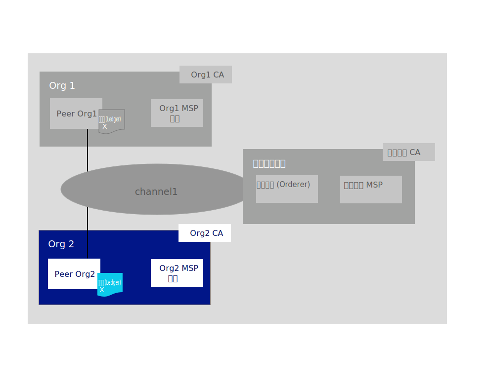

---

copyright:
  years: 2019

lastupdated: "2019-06-21"

keywords: getting started tutorials, create a CA, enroll, register, create an MSP, wallet, create a peer, create ordering service, Raft, join a network, system channel

subcollection: blockchain

---

{:external: target="_blank" .external}
{:shortdesc: .shortdesc}
{:screen: .screen}
{:codeblock: .codeblock}
{:note: .note}
{:important: .important}
{:tip: .tip}
{:pre: .pre}

# 加入网络教程
{: #ibp-console-join-network}

{{site.data.keyword.blockchainfull}} Platform 是一个区块链即服务产品，支持开发、部署和操作区块链应用程序和网络。您可以通过访问[区块链组件概述](/docs/services/blockchain?topic=blockchain-blockchain-component-overview#blockchain-component-overview)，了解有关区块链组件及其如何一起工作的更多信息。本教程是[样本网络教程系列](/docs/services/blockchain/howto?topic=blockchain-ibp-console-build-network#ibp-console-build-network-sample-tutorial)的第二部分，描述了如何在 {{site.data.keyword.blockchainfull_notm}} Platform 控制台中创建节点，然后将其连接到其他集群中托管的区块链联盟。
{:shortdesc}

如果使用的是 Beta 试用版 {{site.data.keyword.blockchainfull_notm}} Platform for {{site.data.keyword.cloud_notm}}，那么控制台中的某些面板可能与当前的文档不一致，该文档对应于一般可用 (GA) 服务实例并保持最新。如果您有 Beta 服务实例并希望利用所有最新的功能，目前建议您遵循 [{{site.data.keyword.blockchainfull_notm}} Platform for {{site.data.keyword.cloud_notm}} 入门](/docs/services/blockchain/howto?topic=blockchain-ibp-v2-deploy-iks#ibp-v2-deploy-iks)中的指示信息来供应 GA 服务实例。
{: important}

**目标受众：**本主题适用于负责创建、监视和管理区块链网络的网络操作员。  

如果您尚未使用 {{site.data.keyword.blockchainfull_notm}} Platform 控制台通过 {{site.data.keyword.cloud_notm}} Kubernetes Service 将组件部署到 Kubernetes 集群，请参阅 [{{site.data.keyword.blockchainfull_notm}} Platform for {{site.data.keyword.cloud_notm}} 入门](/docs/services/blockchain/howto?topic=blockchain-ibp-v2-deploy-iks#ibp-v2-deploy-iks)（如果使用的是 {{site.data.keyword.cloud_notm}} 集群）或 [{{site.data.keyword.blockchainfull_notm}} Platform for Multicloud 入门](/docs/services/blockchain?topic=blockchain-get-started-console-icp#get-started-console-icp)（如果使用的是 {{site.data.keyword.cloud_notm}} Private）以在非 {{site.data.keyword.cloud_notm}} 云提供者上进行部署。请注意，控制台本身并不位于集群中。控制台是一个可用于将组件部署到集群中的工具。

无论是将组件部署到付费还是免费 Kubernetes 集群，在选择部署节点和创建通道时，都请密切关注您可支配的资源。您负责管理 Kubernetes 集群并根据需要部署其他资源。虽然组件可成功部署到 {{site.data.keyword.cloud_notm}} 免费集群，但添加的组件越多，组件运行的速度越慢。有关组件大小设置以及控制台如何与 {{site.data.keyword.cloud_notm}} Kubernetes Service 集群进行交互的更多信息，请参阅[分配资源](/docs/services/blockchain/howto?topic=blockchain-ibp-console-govern#ibp-console-govern-iks-console-interaction)。如果是使用 {{site.data.keyword.cloud_notm}} Private 部署到其他云提供者，那么您必须查阅该提供者的文档，以了解如何在其中监视您的资源。

## 样本网络教程系列
{: #ibp-console-join-network-structure}

本教程系列分为三个部分，可指导您完成以下过程：使用 {{site.data.keyword.blockchainfull_notm}} Platform 控制台将网络部署到 Kubernetes 集群，并安装和实例化智能合同，以创建和互连相对简单的多节点 Hyperledger Fabric 网络。请注意，虽然本教程说明的是此过程如何使用付费 {{site.data.keyword.cloud_notm}} Kubernetes 集群，但相同的基本流程也适用于免费集群，尽管对免费集群有一些限制（例如，无法在免费集群中设置或调整节点大小）。

* [构建网络教程](/docs/services/blockchain/howto?topic=blockchain-ibp-console-build-network#ibp-console-build-network)将指导您完成通过创建排序服务和同级来托管网络的过程。
* **加入网络教程**（即本教程）将指导您完成通过创建同级并将其加入通道来加入现有网络的过程。
* [在网络上部署智能合同](/docs/services/blockchain/howto?topic=blockchain-ibp-console-smart-contracts#ibp-console-smart-contracts)提供了有关如何编写智能合同并将其部署在网络上的信息。

可以使用这些教程中的步骤在一个集群中构建具有多个组织的网络，以用于开发和测试目的。如果要通过创建排序服务和添加组织来构成区块链联盟，请使用**构建网络**教程。使用**加入网络**教程将同级连接到网络。通过遵循这些教程对其他联盟成员执行相应操作，可以创建真正的**分布式**区块链网络。

本教程旨在说明如何将同级加入**现有**网络。本教程假定已在您的或其他 {{site.data.keyword.blockchainfull_notm}} Platform 集群中创建了排序服务。如果您没有要加入的现有网络，请访问[构建网络教程](/docs/services/blockchain/howto?topic=blockchain-ibp-console-build-network#ibp-console-build-network)以了解如何创建网络。**加入网络**教程将引导您完成创建以下 `Org2` 区块链组件（在蓝色框中突出显示）的步骤：  

执行**加入网络**教程中的步骤来创建以下组件并完成以下操作：

* **一个同级组织**：`Org2`  
  创建用于定义组织 `Org2` 的 Org2 成员资格服务提供者 (MSP) 定义。
* **一个同级**：`Peer Org2`   
  上图中所示的分类帐 `Ledger x` 由分布式同级进行维护。该同级使用作为状态数据库的 [Couch DB](https://hyperledger-fabric.readthedocs.io/en/release-1.4/couchdb_as_state_database.html){: external} 进行部署。
* **一个认证中心 (CA)**：`Org2 CA`
  CA 是向所有组织管理员以及向与组织关联的节点签发证书的节点。我们将为同级组织 `Org2` 创建一个 CA。
* **加入一个通道**
  本教程描述了如何加入通过[构建网络教程](/docs/services/blockchain/howto?topic=blockchain-ibp-console-build-network#ibp-console-build-network)创建的通道。

在本教程中，我们在控制台中为某些字段提供的是**建议值**。这样在各选项卡和下拉列表中能更容易识别名称和身份。这些值不是必需的，但您会发现它们很有用，尤其是因为您必须记住在先前步骤中输入的特定值（特别是注册用户的标识和私钥）。如果您忘记了这些值，那么必须为管理员和组件注册其他用户。我们在每项任务后提供了一个建议值表，如果您未使用样本值，建议您在执行本教程过程中，将您在某处确实使用的值记录下来。
{:tip}

## 步骤 1：创建同级组织和同级
{: #ibp-console-join-network-create-ca-org2}

对于要使用控制台创建的每个组织，应至少部署一个 CA。CA 是向所有网络参与者（同级、排序服务、客户机、管理员等）签发证书的节点。这些证书（包括签名证书和专用密钥）允许网络参与者通信、认证和最终进行事务处理。除了定义组织本身之外，这些 CA 还将创建属于组织的所有身份和证书。然后，可以使用这些身份部署节点，创建管理员身份并提交事务。有关 CA 和需要创建的身份的更多信息，请参阅[管理身份](/docs/services/blockchain/howto?topic=blockchain-ibp-console-identities#ibp-console-identities)。

在本教程中，将创建一个组织。因此，需要创建**一个 CA**。

### 创建同级组织 CA
{: #ibp-console-join-network-create-CA-org2CA}

在本教程中，CA 将为用户和节点签发证书和专用密钥。这些身份不是由 {{site.data.keyword.IBM_notm}} 管理的，并且密钥不会存储在控制台中。它们仅存储在浏览器的本地存储器中。因此，请确保导出身份以及组织的 MSP。如果尝试通过其他计算机或其他浏览器来访问控制台，那么需要导入这些身份和组织定义。
{:important}

通过控制台执行以下步骤：  

1. 导航至左侧的**节点**选项卡，并单击**添加认证中心**。通过侧面板，可以定制要创建的 CA 以及此 CA 将为其签发密钥的组织。
2. 在本教程中，我们将创建节点，因此请确保选择**创建**认证中心的选项。然后，单击**下一步**。
3. 使用第二个侧面板为 CA 提供**显示名称**。我们对此 CA 的建议值是 `Org2 CA`。
4. 在下一个面板中，通过指定 **CA 管理员注册标识** `admin` 和私钥 `adminpw`，为 CA 提供管理员凭证。同样，这些也是**建议值**。
5. 如果使用的是付费集群，那么您有机会为节点配置资源分配。对于本教程，请接受所有缺省值，然后单击**下一步**。如果要了解有关如何为节点分配 {{site.data.keyword.cloud_notm}} 中资源的更多信息，请参阅有关[分配资源](/docs/services/blockchain?topic=blockchain-ibp-console-govern#ibp-console-govern-allocate-resources)的主题。如果使用的是免费集群，那么会看到**摘要**页面。
6. 复查“摘要”页面，然后单击**添加认证中心**。

**任务：创建同级组织 CA**

  |**字段**|**显示名称**|**注册标识**|**私钥**|
  | ------------------------- |-----------|-----------|-----------|
  |**创建 CA**|Org2 CA|admin|adminpw|

*图 2. 创建同级组织 CA*  

部署 CA 后，在创建组织 MSP、注册用户、创建网络的入口点（即**同级**）时，将使用该 CA。

高级用户可能已经有自己的 CA，并且不希望在控制台中创建新 CA。如果现有 CA 可以签发 `X.509` 格式的证书，那么可以使用来自您自己的第三方 CA 的证书，而不在此创建新证书。请参阅有关[将第三方 CA 用于同级或排序服务](/docs/services/blockchain/howto?topic=blockchain-ibp-console-build-network#ibp-console-identities)的主题，以获取更多信息。

### 使用 CA 注册身份
{: #ibp-console-join-network-use-CA-org2}

您要创建的每个节点或应用程序都需要证书和专用密钥才能加入区块链网络。您还需要为这些节点和应用程序创建管理员身份，以便可以通过控制台对其进行管理。我们将创建一个 CA，并将其用于创建两个身份：

* **组织管理员**：此身份允许您使用平台控制台来操作节点。
* **同级身份**：这是同级本身的身份。每当同级执行操作（例如，对事务背书）时，都会使用自己的证书进行签名。

根据集群类型，部署 CA 最长可能需要 10 分钟。首次部署 CA 时（或在 CA 因其他原因而不可用时），CA 的磁贴中的框将为灰色框。CA 已成功部署并正在运行时，此框将为绿色，指示它处于“正在运行”状态，可用于注册身份。在继续执行以下步骤来注册身份之前，必须等到 CA 状态为“正在运行”。
{:important}

CA 开始运行（如磁贴中的绿色框所示）后，请通过完成以下步骤来生成这些证书：

1. 单击 `Org2 CA`，并确保为该 CA 创建的 `admin` 身份显示在表中。然后，单击**注册用户**按钮。
2. 首先将注册组织管理员，可以通过提供**注册标识** `org2admin` 和**私钥** `org2adminpw` 来执行此步骤。然后，将此身份的 `Type` 设置为 `client`（管理员身份应该始终注册为 `client`，而节点身份应该始终使用 `peer` 类型进行注册）。“亲缘关系”字段适用于高级用户，不属于本教程范围，因此请单击显示**使用根亲缘关系**的框。如果要了解有关 Fabric CA 如何使用亲缘关系的更多信息，请参阅 [Registering a new identity](https://hyperledger-fabric-ca.readthedocs.io/en/release-1.4/users-guide.html#registering-a-new-identity){: external} 主题。现在，请从列表中选择任何亲缘关系（例如，`Org1`）。此外，请忽略**最大注册数**字段。如果要了解有关注册的更多信息，请参阅[注册身份](/docs/services/blockchain/howto?topic=blockchain-ibp-console-identities#ibp-console-identities-register)。单击**下一步**。
4. 对于本教程，无需使用**添加属性**。如果要了解有关身份属性的更多信息，请参阅[注册身份](/docs/services/blockchain/howto?topic=blockchain-ibp-console-identities#ibp-console-identities-register)。
5. 注册组织管理员后，对同级的身份重复此相同过程（同样使用 `Org2 CA`）。对于同级身份，请提供注册标识 `peer2` 和私钥 `peer2pw`。这是节点身份，因此请选择 `peer` 作为**类型**。单击显示**使用根亲缘关系**的框，并忽略**最大注册数**。然后，在下一个面板中，如先前一样，不要分配任何**属性**。

使用 CA 注册这些身份只是**创建**身份的第一步。这些身份在**注册**之后才能使用。对于 `org2admin` 身份，注册将在下一步创建 MSP 期间执行。对于同级，注册将在创建同级期间执行。
{:note}

**任务：注册用户**

  |**字段**|**描述**|**注册标识**|**私钥**|
  | ------------------------- |-----------|-----------|-----------|-----------|
  |**注册用户**|Org2 管理员|org2admin|org2adminpw|
  | |同级身份|peer2|peer2pw|

*图 3. 使用 CA 注册用户*  

### 创建同级组织 MSP
{: #ibp-console-join-network-create-peers-org2}

既然已创建同级的 CA，并将其用于**注册**了组织身份，接下来需要创建同级组织的正式定义，这称为成员资格服务提供者 (MSP) 定义。多个同级可以属于一个组织。**无需每次创建同级时都创建新组织**。因为这是我们第一次使用本教程，所以将为此组织创建 MSP 标识。在创建 MSP 的过程中，将为 `org2admin` 身份生成证书，并将其添加到电子钱包中。

1. 导航至左侧导航中的**组织**选项卡，并单击**创建 MSP 定义**。
2. 为 MSP 提供显示名称 `Org2 MSP` 和 MSP 标识 `org2msp`。如果要在此字段中指定您自己的 MSP 标识，请确保遵循工具提示中有关此名称的限制的规范。
3. 在**根认证中心详细信息**下，指定先前步骤中用于注册身份的 CA。如果这是您第一次使用本教程，那么应该只会看到一个 CA：`Org2 CA`。
4. 此下方的**注册标识**和**注册私钥**字段将自动填充通过 CA 创建的第一个用户的注册标识 `admin` 和私钥 `adminpw`。不过，使用此身份会为组织授予与 CA 身份相同的身份，但出于安全原因，建议不要这样做。请改为从下拉列表中选择为组织管理员创建的注册标识 `org2admin`，并输入其关联的私钥 `org2adminpw`。然后，为此身份提供显示名称 `Org2 Admin`。
5. 单击**生成**按钮以将此身份注册为组织的管理员，然后将此身份导出到电子钱包，在创建同级和创建通道时将使用电子钱包中的此身份。
6. 单击**导出**将管理员证书导出到文件系统。如上所述，此身份不会存储在集群中，也不会由 {{site.data.keyword.IBM_notm}} 进行管理。它仅存储在本地浏览器存储器中。如果切换浏览器，那么需要将此身份导入到电子钱包才能管理同级。
7. 单击**创建 MSP 定义**。

**任务：创建同级组织 MSP 定义**

  |  |**显示名称**|**MSP 标识**|**注册标识**|**私钥**|
  | ------------------------- |-----------|-----------|-----------|-----------|
  |**创建组织**|Org2 MSP|org2msp|||
  |**根 CA**|Org2 CA||||
  |**组织管理员证书**| |  |org2admin|org2adminpw|
  |**身份**|Org2 Admin|||||

  *图 4. 创建同级组织 MSP 定义*  

创建 MSP 后，应该能够在**电子钱包**（可以通过单击左侧导航中的**电子钱包**进行访问）中看到同级组织管理员。

**任务：检查电子钱包**

  |**字段**|**显示名称**|**描述**|
  | ------------------------- |-----------|----------|
  |**身份**|Org2 Admin|Org2 身份|

  *图 5. 检查电子钱包*  

有关 MSP 的更多信息，请参阅[管理组织](/docs/services/blockchain/howto?topic=blockchain-ibp-console-organizations#ibp-console-organizations)。

务必导出组织管理员身份，因为管理和保护这些证书是您的责任。
{:important}

### 创建同级
{: #ibp-console-join-network-peer-create}

[创建 CA](/docs/services/blockchain/howto?topic=blockchain-ibp-console-join-network#ibp-console-join-network-create-CA-org2CA)，将其用于注册身份，并创建了[同级组织 MSP](/docs/services/blockchain/howto?topic=blockchain-ibp-console-join-network#ibp-console-join-network-create-peers-org2) 后，您已准备好创建同级。

#### 同级扮演的是什么角色？
{: #ibp-console-join-network-peer-role}

务必记住组织本身并不维护分类帐。这是同级的工作。组织还会使用同级来对事务处理建议进行签名，并核准通道配置更新。因为在一个通道上至少有两个同级即具有高可用性，因此至少有两个同级加入一个通道被视为是生产级别实现的最佳实践。但在本教程中，仅说明创建单个同级的过程。

从资源分配角度来看，可以将相同同级加入多个通道。同级的设计可确保来自一个通道的数据不能通过同级传递给另一个通道。但是，由于同级将为每个通道存储单独的分类帐，因此必须确保同级具有足够的处理能力和存储空间来处理事务和数据负载。

#### 部署同级
{: #ibp-console-join-network-deploy-peer-role}

使用控制台来执行以下步骤：

1. 在**节点**页面上，单击**添加同级**。
2. 确保选择**创建**同级的选项。然后，单击**下一步**。
3. 为同级提供**显示名称** `Peer Org2`。对于本教程，不要选择将外部 CA 用于同级，但如果需要更多信息，请参阅[使用来自外部 CA 的证书](/docs/services/blockchain?topic=blockchain-ibp-console-build-network#ibp-console-build-network-third-party-ca)。单击**下一步**。
4. 在下一个屏幕上，选择 `Org2 CA`，因为这是已用于注册同级身份的 CA。从下拉列表中选择为同级创建的同级身份的**注册标识** `peer2`，并输入其关联的**私钥** `peer2pw`。接着，从下拉列表中选择 `Org2 MSP`，然后单击**下一步**。
5. 下一个侧面板要求提供 TLS CA 信息。创建 CA 时，会同时创建 TLSCA。此 CA 用于为节点的安全通信层创建证书。因此，请从下拉列表中选择为同级创建的同级身份的**注册标识** `peer2`，并输入关联的**私钥** `peer2pw`。**TLS CSR 主机名**这一选项可供高级用户用于指定可用于对同级端点进行寻址的定制域名。定制域名不属于本教程的一部分，因此暂时将 **TLS CSR 主机名**保留为空白。
6. 如果使用的是付费集群，那么在下一个面板上，您有机会为节点配置资源分配。对于本教程，可以接受所有缺省值，然后单击**下一步**。如果要了解有关如何为节点分配 {{site.data.keyword.cloud_notm}} 中资源的更多信息，请参阅有关[分配资源](/docs/services/blockchain?topic=blockchain-ibp-console-govern#ibp-console-govern-allocate-resources)的主题。如果使用的是免费 {{site.data.keyword.cloud_notm}} 集群，那么会看到**关联身份**面板。
7. 最后一个侧面板要求您**关联身份**，以使其成为同级的管理员。对于本教程，请使组织管理员 `Org2 Admin` 也作为同级管理员。可以使用 `Org2 CA` 注册和登记其他身份，然后使该身份成为同级的管理员，但本教程将使用 `Org2 Admin` 身份。
8. 复查摘要，然后单击**添加同级**。

**任务：部署同级**

  |  |**显示名称**|**MSP 标识**|**注册标识**|**私钥**|
  | ------------------------- |-----------|-----------|-----------|-----------|
  |**创建同级**|Peer Org2|org2msp|||
  |**CA**|Org2 CA||||
  |**同级身份**| |  |peer2|peer2pw|
  |**管理员证书**|org2msp||||
  |**TLS CA**|Org2 CA||||
  |**TLS CA 标识**| ||peer2|peer2pw|
  |**关联身份**|Org2 Admin|||||

  *图 6. 部署同级*  

在生产场景中，建议对每个通道部署三个同级。这是为了允许一个同级停止运行（例如，在维护周期内），同时仍然保持高可用性同级。要为一个组织部署多个同级，请使用用于注册第一个同级身份的 CA。在本教程中，该 CA 是 `Org2 CA`。接着，使用不同的注册标识和私钥来注册新的同级身份。例如，`org2secondpeer` 和 `org2secondpeerpw`。然后，在创建同级时，提供此注册标识和私钥。由于此同级仍与 Org2 相关联，因此请从下拉列表中选择 `Org2 CA`、`Org2 MSP` 和 `Org2 Admin`。您可以选择为此新同级提供其他管理员，该管理员可以使用 `Org2 CA` 进行注册和登记，但这是可选的。本教程系列仅说明了为每个同级组织创建单个同级的过程。
{:tip}

## 步骤 2：加入排序服务托管的联盟
{: #ibp-console-join-network-add-org2}

如前所述，同级组织必须对于排序服务是已知的，才能创建或加入通道（这也称为加入“联盟”，即排序服务已知组织的列表）。这是因为通道在技术层面上是通过排序服务实现的同级之间的**消息传递路径**。就像一个同级可以加入多个通道，而不会有信息从一个通道传递到另一个通道一样，排序服务也可以有多个通道通过该服务来运行，而不会将数据公开给其他通道上的组织。

只有排序服务管理员可以将同级组织添加到联盟，因此您需要：

* **是**排序服务管理员。对于这种情况，您可以直接将创建的同级组织添加到联盟。
* 向排序服务管理员**发送** MSP 信息，该管理员会将您的组织添加到其联盟。

在下一步中，将说明如何将同级组织添加到由其他 {{site.data.keyword.blockchainfull_notm}} Platform 服务实例中的排序服务托管的联盟。本教程假定您已创建排序服务，并且可以自行执行每个步骤。如果排序服务是由其他人创建的，请确保排序服务管理员执行顶部标有蓝色提示框的步骤。

如果执行了“构建网络”教程或者如果控制台已包含排序服务，那么可以向前跳至[向排序服务添加同级的组织](/docs/services/blockchain/howto?topic=blockchain-ibp-console-join-network#ibp-console-join-network-add-org2-local)。然后，可以继续执行[步骤 3：向现有通道添加同级的组织](/docs/services/blockchain/howto?topic=blockchain-ibp-console-join-network#ibp-console-join-network-add-channel)。

### 导出组织信息
{: #ibp-console-join-network-add-org2-remote}

您需要使用以下步骤将组织 MSP 定义发送给排序服务管理员，然后将其添加到联盟。为了执行这些步骤，您需要成为**同级组织**的管理员，这意味着您在电子钱包中拥有同级组织管理员身份：

1. 导航至**组织**选项卡。您可以看到可供导出的组织列在**可用组织**下。单击组织磁贴内的**下载**按钮，以下载表示同级组织 MSP 的 JSON 配置文件。
2. 在频带外操作中将此文件发送给排序节点管理员。

### 导入组织定义
{: #ibp-console-join-network-import-remote-msp}

此步骤需要由排序服务管理员来完成。
{:tip}

排序服务管理员需要导入此 JSON 文件，以将您的组织添加到其控制台：

- 导航至**组织**选项卡，单击**导入 MSP 定义**按钮，然后选择表示同级组织 MSP 定义的 JSON 文件。可以将`我具有 MSP 定义的管理员身份`复选框保留未选中状态，因为此处无需管理员身份。

### 向排序服务添加同级的组织
{: #ibp-console-join-network-add-org2-local}

此步骤需要由排序服务管理员来完成。
{:tip}

使用以下步骤将同级组织添加到排序服务托管的联盟。只有排序服务管理员可以将同级组织添加到联盟。您必须在电子钱包中拥有排序服务组织管理员身份才能执行此任务。

1. 导航至**节点**选项卡。
2. 向下滚动到要使用的排序服务，然后单击以将其打开。
3. 在**联盟成员**下，单击**添加组织**。
4. 从下拉列表中选择 `Org2 MSP`，因为这是表示 `Org2` 的 MSP。
5. 单击**添加组织**。

如果执行了**构建网络**教程或者如果控制台已包含排序服务和通道，那么现在可以向前跳至[步骤 3：向现有通道添加同级的组织](/docs/services/blockchain/howto?topic=blockchain-ibp-console-join-network#ibp-console-join-network-add-channel)。

### 导出排序服务
{: #ibp-console-join-network-export-ordering-service}

此步骤需要由排序服务管理员来完成。
{:tip}

完成以下步骤来**导出**排序服务，随后同级组织可以将其导入：

1. 导航至**节点**选项卡内的排序服务。单击排序服务名称下方的**下载**箭头，以下载 JSON 配置文件。
2. 在频带外操作中将此文件发送给同级组织。然后，同级组织管理员可以使用此配置文件将排序服务添加到控制台。

### 从其他集群导入排序服务
{: #ibp-console-join-network-import-remote-orderer}

完成以下步骤以将排序服务**导入**到控制台：

1. 导航至**节点**页面，然后单击**添加排序服务**。
2. 单击**导入现有排序服务**的选项。
3. 选择部署了排序服务的**服务位置**，然后单击**添加文件**按钮以选择表示排序服务的 JSON。
4. 系统要求您关联身份时，请选择同级组织身份。在本教程中，该身份是 `Org2 Admin`。单击**添加排序服务**。

完成此过程后，`Org2` 可以创建在 `Ordering Service` 上托管的通道。要创建新通道，而不是加入现有通道，请继续[创建通道](/docs/services/blockchain/howto?topic=blockchain-ibp-console-join-network#ibp-console-join-network-create-channel)。

## 步骤 3：向现有通道添加同级的组织
{: #ibp-console-join-network-add-channel}

此步骤需要由管理员 Org1 来完成。
{:tip}

现在，排序节点管理员可以将同级组织添加到通道：
1. 导航至**通道**选项卡，然后单击 `channel1`。
2. 单击**设置**图标可更新通道以及将同级组织添加到通道。
3. 在**组织**部分中，打开`选择通道成员`下拉列表，并选择同级组织 MSP：`Org2 MSP`。
4. 单击**添加**，然后为该组织分配许可权。建议使该组织成为`操作节点`，以便该组织可以更新通道。
5. 在**通道更新节点 MSP** 下拉列表（在**通道更新节点组织**标题下）中，确保选择 `Org1 MSP`。
6. 在**身份**下拉列表中，确保选择 `Org1 Admin`。
7. 准备就绪后，单击**发送建议**。

在排序服务的管理员将同级组织加入通道后，现在可以将同级加入由排序服务托管的通道。

## 步骤 4：将同级加入通道
{: #ibp-console-join-network-join-peer-org2}

差不多快要结束了。现在可以将同级加入现有通道。您需要通过频带外操作，从作为通道成员的组织获取`通道名称`。在**构建网络**教程中，已创建名为 `channel1` 的通道。如果尚未位于左侧导航中的**通道**选项卡中，请导航至该选项卡。

通过控制台执行以下步骤：

1. 单击**加入通道**按钮以启动侧面板。
2. 选择名为 `Ordering Service` 的排序服务，然后单击**下一步**。
3. 输入要加入的通道的名称 `channel1`，然后单击**下一步**。
4. 选择要加入通道的同级。对于本教程，请单击 `Peer Org2`。
5. 单击**加入通道**。

如果计划利用 Hyperledger Fabric [专用数据](https://hyperledger-fabric.readthedocs.io/en/release-1.4/private-data/private-data.html){: external}或[服务发现](https://hyperledger-fabric.readthedocs.io/en/release-1.4/discovery-overview.html){: external}功能，那么必须在**通道**选项卡中配置组织中的锚点同级。有关如何使用控制台中的**通道**选项卡为专用数据配置锚点同级的更多信息，请参阅[专用数据](/docs/services/blockchain/howto?topic=blockchain-ibp-console-smart-contracts#ibp-console-smart-contracts-private-data)。

## 创建通道
{: #ibp-console-join-network-create-channel}

由于组织现在已是联盟的成员，因此您还可以创建新通道。首先，需要导入其他通道成员的 MSP 定义。请使用以下步骤来创建一个通道，其中包含两个成员：`Org1`（在[构建网络教程](/docs/services/blockchain/howto?topic=blockchain-ibp-console-build-network#ibp-console-build-network)中创建）和 `Org2`（在上述步骤中创建）。

### 导出组织信息
{: #ibp-console-join-network-add-org2-export-info}

此步骤需要由管理员 Org1 来完成。
{:tip}

`Org1` 需要向您发送其组织 MSP 定义，然后您才能将其添加到通道。您需要成为排序服务托管的联盟的成员才能添加到通道。为了执行这些步骤，您需要成为**同级组织**的管理员，这意味着您在电子钱包中拥有同级组织管理员身份：

1. 导航至**组织**选项卡。您可以看到可供导出的组织列在**可用组织**下。单击组织磁贴内的**下载**按钮，以下载表示同级组织 MSP 的 JSON 配置文件。
2. 在频带外操作中将此文件发送给将创建通道的联盟成员。

### 导入组织定义
{: #ibp-console-join-network-create-channel-import-msp}

接下来，需要将 `Org1` 的 MSP 定义导入到您的控制台：

1. 导航至**组织**选项卡，单击**导入 MSP 定义**按钮，然后选择表示同级组织 MSP 定义的 JSON 文件。

#### 创建通道
{: #ibp-console-join-network-channels-create}

通过控制台执行以下步骤：

1. 单击**创建通道**。这将打开侧面板。
2. 为通道提供**名称** `channel2`。记下此值，因为您需要将此值告知希望加入此通道的任何人。
3. 从下拉列表中选择 `Ordering Service`。
4. 选择将加入此通道的**组织**。由于有两个组织，因此先选择并添加 `Org1 MSP (org1msp)`，然后再选择并添加 `Org2 MSP (org2msp)`。至少使这两个组织都成为**操作节点**。注：不要在此处使用 `Ordering Service MSP`。
5. 为通道选择**通道更新策略**。此策略规定必须有多少个组织核准对通道配置的更新。可以选择 `1/2`。向通道添加组织时，应该更改此策略以反映出用例的需求。明智的标准是使用大多数组织。例如，`3/5`。
6. 指定要实施的任何**访问控制**限制。注：这是**高级选项**。如果将对资源的访问权设置为特定组织，那么会限制其他所有组织对该资源的访问权。例如，如果对特定资源的缺省访问权是所有组织的`读取者`，但该访问权已更改为 `Org2` 的 `Admin`，那么**只有** Org2 的管理员有权访问该资源。由于对某些资源的访问权对于通道平稳运行至关重要，因此强烈建议您认真制定访问控制决策。如果决定限制对某个资源的访问权，请确保根据需要为每个组织添加对该资源的访问权。
7. 选择**通道创建节点组织**。由于您是以 `Org2` 的身份运行本教程，并在控制台电子钱包中拥有 `Org2 Admin` 证书，因此请从下拉列表中选择 `Org2 MSP`。同样，选择 `Org2 Admin` 作为创建通道的身份。

准备就绪后，单击**创建通道**。这会将您转回至“通道”选项卡，在其中可以看到刚才创建的通道处于暂挂状态的磁贴。

**任务：创建通道**

  |**字段**|**名称**|
  | ------------------------- |-----------|
  |**通道名称**|channel2|
  |**排序服务**|排序服务|
  |**组织**|Org2 MSP|
  |**通道更新策略**|1/2|
  |**访问控制表**|无|
  |**通道创建节点组织**|Org2 MSP|
  |**身份**|Org2 Admin|

*图 7. 创建通道*

## 后续步骤
{: #ibp-console-join-network-next-steps}

将同级加入通道后，使用以下步骤来部署智能合同，并开始向区块链提交事务：

- 使用控制台[在网络上部署智能合同](/docs/services/blockchain/howto?topic=blockchain-ibp-console-smart-contracts#ibp-console-smart-contracts)。
- 安装并实例化智能合同后，可以[使用客户机应用程序提交事务](/docs/services/blockchain/howto?topic=blockchain-ibp-console-smart-contracts#ibp-console-smart-contracts-connect-to-SDK)。
- 使用[商业票据样本](/docs/services/blockchain/howto?topic=blockchain-ibp-console-app#ibp-console-app-commercial-paper)通过样本应用程序代码来部署智能合同示例并提交事务。
