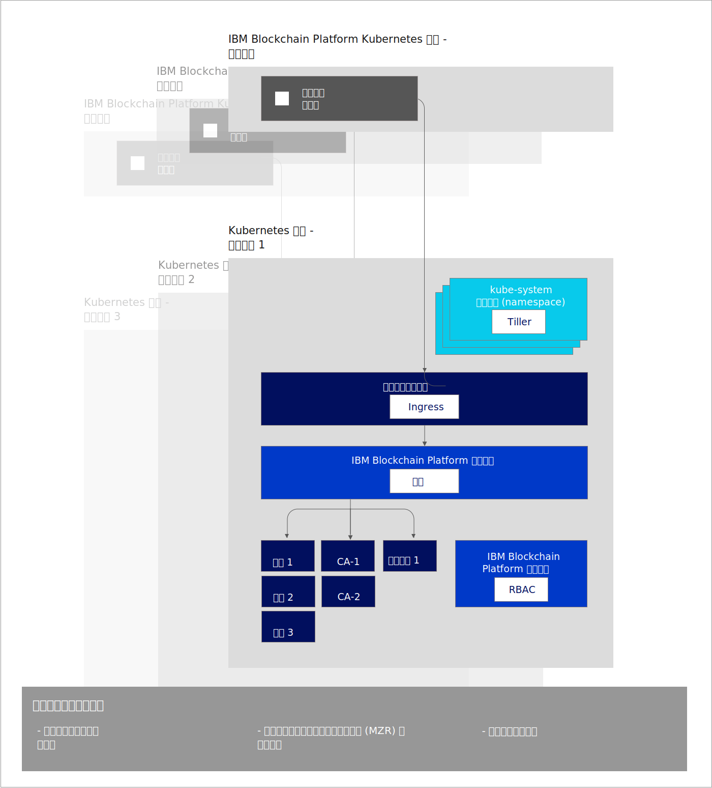

---

copyright:
  years: 2019
lastupdated: "2019-07-16"

keywords: key features, build, operate, grow, architecture, multizone clusters

subcollection: blockchain

---

{:external: target="_blank" .external}
{:shortdesc: .shortdesc}
{:screen: .screen}
{:codeblock: .codeblock}
{:note: .note}
{:important: .important}
{:tip: .tip}
{:pre: .pre}

# 关于 {{site.data.keyword.blockchainfull_notm}} Platform for {{site.data.keyword.cloud_notm}}
{: #ibp-console-overview}

{{site.data.keyword.blockchainfull}} Platform for {{site.data.keyword.cloud_notm}} 是下一代 {{site.data.keyword.blockchainfull_notm}} Platform 产品，让您拥有对部署、证书和专用密钥的完全控制权。它包含新的 {{site.data.keyword.blockchainfull_notm}} Platform 控制台，这是一个用户界面，可以简化和加快将组件部署到由您管理并控制的 {{site.data.keyword.cloud_notm}} Kubernetes Service 的过程。有关 Kubernetes 和 {{site.data.keyword.cloud_notm}} Kubernetes Service 的更多信息，请参阅 [Kubernetes](/docs/services/blockchain/reference?topic=blockchain-k8s-overview)。
{:shortdesc}

{{site.data.keyword.blockchainfull_notm}} Platform for {{site.data.keyword.cloud_notm}} 基于 Hyperledger Fabric 1.4.1。有关 Hyperledger Fabric 1.4.1 新增功能的更多信息，请参阅 [1.4 中的新增内容](https://hyperledger-fabric.readthedocs.io/en/release-1.4/whatsnew.html){: external}。

## 新发行版提供的功能
{: #ibp-console-overview-capabilities}

此最新发行版专为经验丰富的 {{site.data.keyword.blockchainfull_notm}} 和 Hyperledger Fabric 用户量身打造，支持他们托管并加入 {{site.data.keyword.blockchainfull_notm}} 网络。如果您是现有的入门套餐或企业套餐客户，而不是由 {{site.data.keyword.IBM_notm}} 管理您的网络，那么现在您可完全控制自己的 Kubernetes 集群中的组件供应、监视和管理功能。

此 {{site.data.keyword.blockchainfull_notm}} Platform 发行版包含以下主要功能：

**构建 - 综合开发者体验**
- **轻松编码**，通过 Node.js、Golang 或 Java 对智能合同轻松编码，使用新的 {{site.data.keyword.blockchainfull_notm}} VS Code 扩展来编写客户机应用程序，利用与控制台的 **SDK 集成**，并通过我们丰富的教程和样本进行学习。
- **简化的 DevOps** 允许您通过扩展 Kubernetes 资源来添加更多组件，在单个环境中从开发移至测试，再移至生产。
- **最新的 Fabric 主要功能**。利用 Hyperledger Fabric V1.4.1 的最新功能：
  -  [Raft 排序服务](https://hyperledger-fabric.readthedocs.io/en/release-1.4/orderer/ordering_service.html#raft){: external}
  - [**专用数据**集合](/docs/services/blockchain/howto?topic=blockchain-ibp-console-smart-contracts#ibp-console-smart-contracts-private-data)，用于通过 Gossip 协议确保仅与授权同级共享分类帐数据，以提高数据隐私性。
  - [服务发现](https://hyperledger-fabric.readthedocs.io/en/release-1.4/discovery-overview.html){: external}，允许您动态发现和更新应用程序与网络的交互方式。
  - [通道访问控制表](https://hyperledger-fabric.readthedocs.io/en/release-1.4/access_control.html){: external}，允许您对通道和智能合同的管理进行额外控制。
- {{site.data.keyword.cloud_notm}} 服务集成。利用内置 [{{site.data.keyword.cloud_notm}} 服务](/docs/services/blockchain/howto?topic=blockchain-ibp-v2-deploy-iks#ibp-v2-deploy-iks-integrations)，例如 {{site.data.keyword.cloud_notm}} Kubernetes Service 仪表板、{{site.data.keyword.IBM_notm}} Log Analysis with LogDNA 和 {{site.data.keyword.cloud_notm}} Identity and Access Management (IAM)。

**操作 - 全面控制部署**
- **仅部署所需的组件**。将一个同级连接到多个通道和网络，或者托管业务合作伙伴可以连接到的排序服务。
- **保持对身份的完全控制权**。存储和管理用于管理节点的密钥，而无需在 {{site.data.keyword.cloud_notm}} 上存储专用密钥。
- **集中化操作**。通过 {{site.data.keyword.blockchainfull_notm}} Platform 控制台，可以在**一个中央控制台**中部署和管理所有组织和节点，而不必依赖 {{site.data.keyword.IBM_notm}} 或其他供应商来管理排序节点或认证中心。此外，还可以通过控制台在区块链联盟中添加或除去成员，创建和加入通道，以及安装和实例化智能合同。
- **托管或加入网络**。将集群中托管的同级部署到多个云上的多个通道，或邀请其他组织加入您的联盟或通道，同时组织可跨基础架构独立管理其节点。
- **管理访问权**，即管理可以管理或监视节点的用户的访问权。
- **直接访问日志**，即通过 {{site.data.keyword.IBM_notm}} Kubernetes 服务直接访问节点的日志。使用 {{site.data.keyword.cloud_notm}} Log Analysis 服务或第三方服务来抽取和分析日志。
- **与 pod 直接交互**，使用 Kubernetes 仪表板来执行。通过命令行执行到 pod 和容器中以运行命令和更新证书。
- **动态签名集合**，允许通过通道配置对协作管理进行更好的控制。

**增长 - 可伸缩性和灵活性**
- **选择计算**。您可以灵活地决定要在 Kubernetes 集群中供应的 CPU、内存和存储器的数量。有关更多信息，请参阅 [{{site.data.keyword.cloud_notm}} Kubernetes Service 如何与控制台进行交互](/docs/services/blockchain/howto?topic=blockchain-ibp-console-govern#ibp-console-govern-iks-console-interaction)。
- **缩放**，即扩展和缩减 Kubernetes 集群中的资源，仅为所需资源付费。有关更多信息，请参阅[定价](/docs/services/blockchain/howto?topic=blockchain-ibp-pricing#ibp-pricing)。
- **灾难恢复和多区域高可用性**。此选项可在不同区域中复制 Kubernetes 部署，从而支持组件高可用性 (HA) 以及灾难恢复 (DR)。
- **在任意位置运行**（相关指示信息即将推出）。依托 {{site.data.keyword.blockchainfull_notm}} Platform 控制台的**统一代码库**，可以在 {{site.data.keyword.cloud_notm}}、{{site.data.keyword.cloud_notm}} Private 和第三方公共云上运行组件。

请查看此[博客](https://www.ibm.com/blogs/blockchain/2019/02/taking-the-next-step-towards-deploying-blockchain-anywhere){: external}，以了解针对任意位置的业务部署区块链的下一步操作。

此产品适用于要构建和管理自己网络的经验丰富的 Fabric 用户。

## 注意事项
{: #ibp-console-overview-considerations}

部署控制台之前，请确保了解以下注意事项：

- 由于 {{site.data.keyword.blockchainfull_notm}} Platform 的 Beta 试用版和正式 (GA) 发行版的可用性将重叠，因此务必确保您知道自己使用的 {{site.data.keyword.blockchainfull_notm}} Platform 版本。新功能和修订不会推送到 Beta，但会在 {{site.data.keyword.blockchainfull_notm}} Platform 正式版中提供。因此，如果使用的是 {{site.data.keyword.blockchainfull_notm}} Platform Beta 版，那么控制台中的某些面板可能与当前文档不一致，该文档对应于正式服务实例并保持最新。为了利用所有最新的功能，建议您供应新的 GA 服务实例。要了解如何执行此操作，请参阅 [{{site.data.keyword.blockchainfull_notm}} Platform for {{site.data.keyword.cloud_notm}} 入门](/docs/services/blockchain/howto?topic=blockchain-ibp-v2-deploy-iks#ibp-v2-deploy-iks)。
- 使用此发行版部署的所有同级都将 CouchDB 用作其状态数据库。
- 您负责管理 Kubernetes 集群的运行状况监视、安全性和日志记录。请参阅此[信息](/docs/containers?topic=containers-responsibilities_iks#your-responsibilities-by-using-ibm-cloud-kubernetes-service){: external}，以获取有关 {{site.data.keyword.cloud_notm}} 管理的内容以及您所负责部分的详细信息。
- 您还负责监视 Kubernetes 集群的资源使用情况。要监视 Kubernetes 资源，建议将 [{{site.data.keyword.cloud_notm}} SysDig](https://www.ibm.com/cloud/sysdig){: external} 工具与 {{site.data.keyword.cloud_notm}} Kubernetes 仪表板组合使用。如果需要提高集群的存储容量或性能，请参阅有关如何[修改现有卷](/docs/containers?topic=containers-file_storage#change_storage_configuration){: external}的信息。
- 您负责管理和保护证书和专用密钥。{{site.data.keyword.IBM_notm}} 不会在 Kubernetes 集群中或控制台中存储证书。证书仅保存在浏览器的本地存储器中。如果切换浏览器，那么必须将已创建的身份导入到该浏览器。
- {{site.data.keyword.blockchainfull_notm}} Platform 仅在精选区域中可用。请参阅有关 [{{site.data.keyword.blockchainfull_notm}} Platform 位置](/docs/services/blockchain/howto?topic=blockchain-ibp-regions-locations)的主题，以获取更新的列表。
- {{site.data.keyword.blockchainfull_notm}} Platform 无法部署在使用 {{site.data.keyword.IBM_notm}} Kubernetes Service 创建的 OpenShift 集群上。
- 在 {{site.data.keyword.cloud_notm}} Kubernetes 集群中，Kubernetes 必须是 V1.11 或更高稳定版本。使用以下指示信息[升级新集群和现有集群](/docs/services/blockchain/howto?topic=blockchain-ibp-v2-deploy-iks#ibp-v2-deploy-iks-updating-kubernetes)至此版本。
- 如果您不想在 {{site.data.keyword.cloud_notm}} 中供应 Kubernetes 集群时使用预先选择的缺省铜牌级文件存储器，那么可以供应您选择的存储器。请参阅有关[持久性存储器注意事项](/docs/services/blockchain?topic=blockchain-ibp-v2-deploy-iks#ibp-console-storage)的主题来了解更多信息。
- 如果决定在 Kubernetes 集群中包含 {{site.data.keyword.cloud_notm}} 多专区支持，那么必须供应您自己的存储器。请参阅[将多专区 (MZR) 集群用于 {{site.data.keyword.blockchainfull_notm}} Platform](/docs/services/blockchain?topic=blockchain-ibp-v2-deploy-iks#ibp-console-mzr)，以获取更多详细信息。
- 将 {{site.data.keyword.blockchainfull_notm}} Platform 服务实例链接到 {{site.data.keyword.cloud_notm}} Kubernetes 免费集群时，可以免费预览 {{site.data.keyword.blockchainfull_notm}} Platform 30 天。但性能在吞吐量、存储器和功能方面会受到限制。{{site.data.keyword.cloud_notm}} 将在 30 天后删除您的集群，并且您无法将任何节点或数据从免费集群迁移到付费集群。虽然 {{site.data.keyword.blockchainfull_notm}} Platform Beta 试用版是免费的，但如果选择付费 Kubernetes 集群，而不是受限的免费集群，那么会针对 Kubernetes 服务向您的 {{site.data.keyword.cloud_notm}} 帐户收费。
- 不支持“虚拟路由和转发 (VRF)”。{site.data.keyword.blockchainfull_notm}} Platform 服务与启用了子网 IP 块之间自动全局路由的帐户不兼容。与此类似，配置了专用 VLAN 的 Kubernetes 集群也不受支持。

## 迁移
{: #ibp-console-overview-migration}

目前，无法从任何 {{site.data.keyword.blockchainfull_notm}} Platform 产品迁移到 {{site.data.keyword.blockchainfull_notm}} Platform for {{site.data.keyword.cloud_notm}}。

所有 {{site.data.keyword.blockchainfull_notm}} Platform Beta 试用版服务实例都无法迁移到正式 (GA) 发行版。

## 许可和定价
{: #ibp-console-overview-license-and-pricing}

{{site.data.keyword.blockchainfull_notm}} Platform for {{site.data.keyword.cloud_notm}} 引入了基于虚拟处理器核心 (VPC) 使用量的全新按小时定价模型。简化的模型基于 {{site.data.keyword.blockchainfull_notm}} Platform 节点每小时使用的 CPU（或 VPC）数量，统一费率为 **0.29 美元/VPC-小时**，其中 **1 VPC = 1 CPU**。请参阅有关[定价](/docs/services/blockchain?topic=blockchain-ibp-saas-pricing)的主题，以获取更多详细信息。

## 入门
{: #ibp-console-overview-deploy}

有关如何部署 {{site.data.keyword.blockchainfull_notm}} Platform for {{site.data.keyword.cloud_notm}} 的信息，请参阅 [{{site.data.keyword.blockchainfull_notm}} Platform for {{site.data.keyword.cloud_notm}} 入门](/docs/services/blockchain/howto?topic=blockchain-ibp-v2-deploy-iks#ibp-v2-deploy-iks)。

有关如何使用控制台开始部署节点和构建联盟的更多信息，请参阅[构建网络](/docs/services/blockchain/howto?topic=blockchain-ibp-console-build-network#ibp-console-build-network)教程。此教程将指导您完成使用控制台创建样本网络的过程，该网络包含三个组织（一个排序组织，两个同级组织）和一个通道（两个同级加入其中）。可以使用此样本网络进行演示或概念验证，或者调整和扩展教程中的步骤以创建您自己的定制区块链配置。

## 体系结构参考
{: #ibp-console-overview-architecture}

下图显示了区块链网络的组件及其交互方式。

请注意如何为每个 {{site.data.keyword.blockchainfull_notm}} Platform 服务实例创建一个控制台实例，此实例也称为操作工具。使用控制台部署同级、排序节点或 CA 节点时，会将该节点部署到 **Kubernetes 集群服务实例**中。

|**{{site.data.keyword.blockchainfull_notm}} Platform Kubernetes 集群**|**描述**|
| ------------------------- |-----------|
|操作工具|也称为`控制台`，这是操作所有区块链组件的中央用户界面。现在，通过此控制台，可以创建 CA、同级和排序节点，创建通道并安装和实例化使用 Hyperledger Fabric V1.4 VS Code 扩展开发的智能合同。控制台部署在 {{site.data.keyword.IBM_notm}} 拥有的集群中。此工具或它运行所在的 Kubernetes 集群是免费的。|

|**Kubernetes 集群服务实例**|**描述**|
| ------------------------- |-----------|-----------|-----------|
|**Tiller**|Tiller 是 [Helm 工具](https://docs.helm.sh/glossary/#tiller){: external}的一部分，在 Kubernetes 集群内运行，用于管理同级、CA 和排序节点 Helm chart 的安装。|
|**Ingress**|一个 [Kubernetes 对象](https://kubernetes.io/docs/concepts/services-networking/ingress/){: external}，支持从集群外部访问集群资源。|
|**代理**|{{site.data.keyword.blockchainfull_notm}} Platform 代理负责使用主机头路由，将流量路由到正确的同级、CA 和排序节点。|
|**同级、CA 和排序节点**|这些是通过部署底层 Helm chart 创建的节点。注：这些节点还可以从其他 Kubernetes 集群服务实例中导入。由于 {{site.data.keyword.IBM_notm}} 永远不会存储密钥，因此每个同级和排序节点都包含一个 gRPC Web 代理，用于支持控制台使用控制台电子钱包中的密钥与每个节点进行通信。|
|**RBAC**|基于角色的访问控制。{{site.data.keyword.blockchainfull_notm}} Platform 在集群中配置 [Kubernetes RBAC](https://kubernetes.io/docs/reference/access-authn-authz/rbac/){: external}，管理集群中的区块链组件需要 RBAC。

## 获取支持
{: #ibp-console-overview-support}

有关如何获取有关 {{site.data.keyword.blockchainfull_notm}} Platform for {{site.data.keyword.cloud_notm}} 的支持的更多信息，以及可用于对问题进行故障诊断的免费区块链开发者资源和支持论坛的更多信息，请参阅[获取支持](/docs/services/blockchain?topic=blockchain-blockchain-support#blockchain-support)。

在 {{site.data.keyword.blockchainfull_notm}} Platform Beta 试用版处于 Beta 阶段期间，对其提供的支持有限，Beta 阶段将于 2019 年 8 月 3 日结束。
