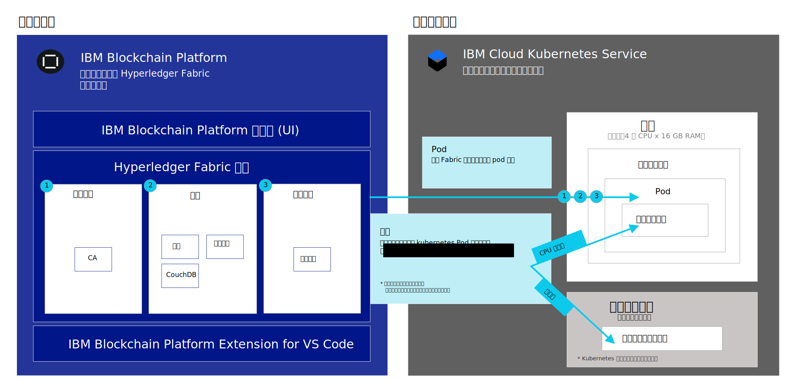

---

copyright:
  years: 2019
lastupdated: "2019-07-16"

keywords: getting started tutorials, videos, web browsers, integration

subcollection: blockchain

---

{:external: target="_blank" .external}
{:shortdesc: .shortdesc}
{:screen: .screen}
{:codeblock: .codeblock}
{:note: .note}
{:important: .important}
{:tip: .tip}
{:pre: .pre}
{:gif: data-image-type='gif'}

# {{site.data.keyword.blockchainfull_notm}} Platform for {{site.data.keyword.cloud_notm}} 入门
{: #ibp-v2-deploy-iks}

{{site.data.keyword.blockchainfull}} Platform for {{site.data.keyword.cloud_notm}} 包含 {{site.data.keyword.blockchainfull_notm}} Platform 控制台，这是一个用户界面，可以简化和加快部署及管理区块链组件的过程。本教程描述了如何开始使用 {{site.data.keyword.blockchainfull_notm}} Platform for {{site.data.keyword.cloud_notm}}，以及使用该控制台对 {{site.data.keyword.cloud_notm}} 上 {{site.data.keyword.cloud_notm}} Kubernetes Service 集群中的区块链组件进行部署和管理。有关 Kubernetes 和 {{site.data.keyword.cloud_notm}} Kubernetes Service 的更多信息，请参阅 [Kubernetes](/docs/services/blockchain/reference?topic=blockchain-k8s-overview "Kubernetes")。
{:shortdesc}

**目标受众**：本主题适用于负责在 {{site.data.keyword.cloud_notm}} 上设置 Kubernetes 集群和部署 {{site.data.keyword.blockchainfull_notm}} Platform 的系统管理员。

将 {{site.data.keyword.blockchainfull_notm}} Platform 链接到 {{site.data.keyword.cloud_notm}} Kubernetes 集群后，可以启动控制台来创建和管理区块链组件，并体验以下重要优点：

- **控制：**可以通过一个中央控制台来控制和管理区块链组件和证书。请仅部署您的业务所需的组件，以后随着需求的增长可添加更多组件。
- **基于 Kubernetes 的灵活部署：**可以利用 Kubernetes 集群的计算（CPU、内存和存储器）选项，并可利用内置的 HA 和 DR 选项。

## 什么是区块链服务？
{: #ibp-v2-deploy-iks-blockhain-service}

下图说明了 {{site.data.keyword.blockchainfull_notm}} Platform 的三个要素：


- **{{site.data.keyword.blockchainfull_notm}} Platform 控制台 (UI)**：此控制台允许您创建和管理区块链组件。在 {{site.data.keyword.cloud_notm}} 中供应服务实例后，可以部署 {{site.data.keyword.blockchainfull_notm}} 控制台的实例，并将其链接到 {{site.data.keyword.cloud_notm}} Kubernetes 集群。然后，可以使用控制台来创建和管理 Kubernetes 集群中的区块链组件。该控制台可免费使用。

- **Hyperledger Fabric 组件**：控制台用于创建和管理基于 Hyperledger Fabric V1.4.1 认证中心、同级和排序服务映像的区块链组件。这些组件部署到 Kubernetes 集群中，并在部署时使用`缺省`存储类为其供应存储器。

- **{{site.data.keyword.IBM_notm}} VS Code 扩展（开发工具）**：从 VS Code Marketplace 下载 VS Code 扩展，以便开始开发、打包和测试客户机应用程序和智能合同。

## 注意事项
{: #ibp-v2-deploy-iks-considerations}

部署控制台之前，请确保了解以下注意事项：

- {{site.data.keyword.blockchainfull_notm}} Platform for {{site.data.keyword.cloud_notm}} 基于 Hyperledger Fabric V1.4.1 而构建。
- 使用控制台或 API 部署的所有同级都将 CouchDB 用作其状态数据库。
- 可以选择将 {{site.data.keyword.blockchainfull_notm}} Platform 服务实例链接到免费的 Kubernetes 集群来评估产品，但是容量和性能有限，不能迁移任何数据，并且 30 天后会将集群删除。
- 您负责管理 Kubernetes 集群的运行状况监视、安全性和日志记录。请参阅此[信息](/docs/containers?topic=containers-responsibilities_iks#your-responsibilities-by-using-ibm-cloud-kubernetes-service){: external}，以获取有关 {{site.data.keyword.cloud_notm}} 管理的内容以及您所负责部分的详细信息。
- 您还负责使用 Kubernetes 仪表板监视 Kubernetes 集群的资源使用情况。如果需要提高集群的存储容量或性能，请参阅有关如何[修改现有卷](/docs/containers?topic=containers-file_storage#change_storage_configuration){: external}的信息。
- 您负责管理和保护证书和专用密钥。{{site.data.keyword.IBM_notm}} 不会在 Kubernetes 集群中存储证书。
- {{site.data.keyword.blockchainfull_notm}} Platform 仅在精选区域中可用。请参阅有关 [{{site.data.keyword.blockchainfull_notm}} Platform 位置](/docs/services/blockchain/howto?topic=blockchain-ibp-regions-locations)的主题，以获取更新的列表。
- {{site.data.keyword.blockchainfull_notm}} Platform 无法部署在使用 {{site.data.keyword.IBM_notm}} Kubernetes Service 创建的 OpenShift 集群上。
- 在 {{site.data.keyword.cloud_notm}} Kubernetes 集群中，Kubernetes 必须是 V1.11 或更高稳定版本。使用以下指示信息[升级新集群和现有集群](/docs/services/blockchain/howto?topic=blockchain-ibp-v2-deploy-iks#ibp-v2-deploy-iks-updating-kubernetes)至此版本。
- 如果您不想在 {{site.data.keyword.cloud_notm}} 中供应 Kubernetes 集群时使用预先选择的缺省铜牌级文件存储器，那么可以供应您选择的存储器。请参阅有关[持久性存储器注意事项](/docs/services/blockchain?topic=blockchain-ibp-v2-deploy-iks#ibp-console-storage)的主题来了解更多信息。
- 如果决定在 Kubernetes 集群中包含 {{site.data.keyword.cloud_notm}} 多专区支持，那么必须供应您自己的存储器。请参阅[将多专区 (MZR) 集群用于 {{site.data.keyword.blockchainfull_notm}} Platform](/docs/services/blockchain?topic=blockchain-ibp-v2-deploy-iks#ibp-console-mzr)，以获取更多详细信息。
- 不支持“虚拟路由和转发 (VRF)”。{site.data.keyword.blockchainfull_notm}} Platform 服务与启用了子网 IP 块之间自动全局路由的帐户不兼容。与此类似，配置了专用 VLAN 的 Kubernetes 集群也不受支持。

## 视频教程
{: #ibp-v2-deploy-video}

请观看以下[视频系列]( http://ibm.biz/BlockchainPlatformSeries)，了解有关 {{site.data.keyword.blockchainfull_notm}} Platform 控制台的更多信息，以及如何着手部署 {{site.data.keyword.blockchainfull_notm}} Platform for {{site.data.keyword.cloud_notm}}。

## 开始之前
{: #ibp-v2-deploy-iks-prereq}

开始之前：

- 确保您具有 [{{site.data.keyword.cloud_notm}} 付费帐户](https://cloud.ibm.com/catalog/services/blockchain){: external}。如果没有该帐户，请执行以下操作：
   1. 单击**注册**按钮。
   2. 在创建免费试用帐户后，通过转至 {{site.data.keyword.cloud_notm}} 控制台中的**管理** > **计费和使用情况** > **计费**，然后单击**添加信用卡**，将其升级为**现收现付**类型。
   3. 确保用户针对将链接到其区块链服务实例的 Kubernetes 集群具有“管理员”和“管理者”角色。请参阅有关[如何分配 Kubernetes 访问角色](#ibp-v2-deploy-iks-k8x-access-roles)的相应步骤，以获取更多信息。

计划在更广泛的组织范围解决方案的上下文中使用服务实例时，建议参与组织使用功能电子邮件地址来创建自己的网络。在这种情况下，对网络的访问权不依赖于任何个人的可用性。
{:tip}  

- 如果计划使用现有的 {{site.data.keyword.cloud_notm}} Kubernetes Service 集群，请检查 Kubernetes 版本，并根据需要将其升级到 1.11 或更高版本。有关如何确定集群正在运行的 Kubernetes 版本以及如何升级版本的更多信息，请参阅[更新集群的 Kubernetes 版本](/docs/services/blockchain/howto?topic=blockchain-ibp-v2-deploy-iks#ibp-v2-deploy-iks-updating-kubernetes)。

### 浏览器
{: #ibp-v2-deploy-iks-browsers}
以下列表指定了 {{site.data.keyword.blockchainfull_notm}} Platform 控制台必需的最低浏览器软件：

- Chrome：适用于您操作系统的最新版本
- Firefox：适用于您操作系统的最新常规（非 ESR）版本
- Safari：适用于 Mac 的最新版本
- Edge：V44.17763.1.0 或更高版本

### 需要的资源
{: #ibp-v2-deploy-iks-resources-required}

#### 集群大小建议
{: #ibp-v2-deploy-iks-resources-required-free}

 将 {{site.data.keyword.blockchainfull_notm}} Platform 控制台链接到 {{site.data.keyword.cloud_notm}} Kubernetes Service 集群时，需要确保 Kubernetes 集群满足最低硬件资源需求：

|Kubernetes 集群类型|用例|CPU|RAM|工作程序节点|
|-----------|------|-----|-----------------------|
|标准（建议）|适用于 MVP|4（共享）|16 GB（共享）|多个|
|免费**|适用于评估|2|4 GB|1|  
** 将 {{site.data.keyword.blockchainfull_notm}} Platform 服务实例链接到 {{site.data.keyword.cloud_notm}} Kubernetes 免费集群时，可免费预览 {{site.data.keyword.blockchainfull_notm}} Platform 30 天。但性能在吞吐量、存储器和功能方面会受到限制。{{site.data.keyword.cloud_notm}} 将在 30 天后删除 Kubernetes 集群，并且您无法将任何节点或数据从免费集群迁移到付费集群。

这些资源足以用于测试和试验。在[构建网络教程](/docs/services/blockchain/howto?topic=blockchain-ibp-console-build-network#ibp-console-build-network)中，将创建两个同级、两个 CA 和一个排序服务，该教程将占用大约 4.15 个 CPU，而五节点排序服务将占用其中 1.75 个 CPU。因此，如果计划部署五节点排序服务，那么不应部署具有 2 个 CPU 的单工作程序节点的 Kubernetes 集群，因为该排序服务不能轻松适用于其他节点。建议使集群中的节点至少具有 4 个 CPU。添加的工作程序节点越多，集群就能越轻松地处理部署。
{:note}

#### 付费集群
{: #ibp-v2-deploy-iks-resources-required-paid}

{{site.data.keyword.blockchainfull_notm}} Platform 的生产级别部署将部署到 {{site.data.keyword.cloud_notm}} Kubernetes Service 的付费集群。此集群的大小和配置将取决于特定用例的需求。更大的部署必然需要部署在更大的集群上。集群比预计的部署大多少由您决定。最好至少有一些空余空间，因为这将允许同级和排序服务成为其他通道的一部分并获得更高的吞吐量，而不必在调整节点大小**之前**，将更多资源部署到 Kubernetes 集群中。有关如何调整这些值的更多信息，请参阅[重新分配资源](/docs/services/blockchain/howto?topic=blockchain-ibp-console-govern#ibp-console-govern-reallocate-resources)。

您需要创建类型为 Kubernetes 的集群来部署 {{site.data.keyword.blockchainfull_notm}} Platform。{{site.data.keyword.blockchainfull_notm}} Platform 不支持使用 {{site.data.keyword.IBM_notm}} Kubernetes Service 创建的 OpenShift 集群。
{:important}

对于选择不使用 [{{site.data.keyword.cloud_notm}} Kubernetes Service 自动缩放器](/docs/containers?topic=containers-ca#ca){: external}的用户来说，创建足够大小的初始部署来支持增长尤其重要，这可以为用户承担部署更多节点和 pod 的一部分负担。

将足够的资源部署到 {{site.data.keyword.cloud_notm}} Kubernetes Service 中，能够视情形扩展 pod 和工作程序节点，而不必先增大 Kubernetes 集群部署，这种做法虽然更简单，但 Kubernetes 集群部署越大，成本越高。用户必须认真考虑自己的选项，并且无论选择哪种选项，都对所做的权衡有清楚的认识。

要粗略了解集群中将需要的存储量和计算量，请参阅此图表，其中包含同级、排序节点和 CA 的当前缺省值：

|**组件**（所有容器）|CPU|内存 (GB)|存储器 (GB) |
|--------------------------------|---------------|-----------------------|------------------------|
|**同级**| 1.1            |2.4|200（包括 100 GB 用于同级，100 GB 用于 CouchDB）|
|**CA**|0.1|0.2|20|
|**排序节点**| 0.35           |0.9|100|

如果计划部署五节点 Raft 排序服务，请注意部署总数将增加为五倍。因此，五个 Raft 节点共有 1.75 个 CPU、4.5 GB 内存和 500 GB 存储器。建议至少使用具有 4 个 CPU 的 Kubernetes 单工作程序节点集群，以允许 Raft 集群及您部署的任何其他节点具有足够的 CPU。
{:tip}

## 步骤 1：在 {{site.data.keyword.cloud_notm}} 中创建服务实例
{: #ibp-v2-deploy-iks-create-service-instance}

使用以下步骤来创建 {{site.data.keyword.blockchainfull_notm}} Platform for {{site.data.keyword.cloud_notm}} 的服务实例。

1. 在 {{site.data.keyword.cloud_notm}}“目录”中找到 [Blockchain 服务](https://cloud.ibm.com/catalog/services/blockchain){: external}，或者在 {{site.data.keyword.cloud_notm}}“目录”页面中搜索 `Blockchain`。
2. 建议重命名实例的**服务名称**，以便将来易于识别。
3. 选择区域。有关可用区域的列表，请参阅[区域](/docs/services/blockchain/reference?topic=blockchain-ibp-regions-locations#ibp-regions-locations)。
4. 可以将“资源组”和“标记”字段保留不变。
5. 选择**标准**套餐。
6. 单击**创建**以供应服务实例。

## 步骤 2：部署 {{site.data.keyword.blockchainfull_notm}} Platform
{: #ibp-v2-deploy-iks-steps}

创建服务实例后，可以立即遵循指导信息来部署 {{site.data.keyword.blockchainfull_notm}} Platform。

1. **欢迎和先决条件**步骤。如果您已在**达拉斯**区域拥有现有的 {{site.data.keyword.IBM_notm}} Kubernetes Service 集群，并且希望将其用于区块链服务，请选中相应复选框。**如果使用的是现有集群，那么可以跳过下一步；但请确保 Kubernetes 版本为 V1.11 或更高稳定版本**。单击**继续**。
2. **创建集群**步骤。如果在步骤 1 中选中了相应复选框来使用现有 Kubernetes 集群，将跳过此步骤。否则，请单击**新建集群**，这将启动 {{site.data.keyword.cloud_notm}} Kubernetes 仪表板来创建集群。有关更多信息，请参阅 [{{site.data.keyword.cloud_notm}} Kubernetes Service 入门](/docs/containers?topic=containers-getting-started){: external}。请留出额外的时间来完成此过程。
  - 有关集群位置的信息，请参阅[区域](/docs/services/blockchain/reference?topic=blockchain-ibp-regions-locations#ibp-regions-locations)。
  - 选择**标准集群（建议）：**如果需要包含多个节点的更长期选项以实现高可用性。对于集群类型，选择 **Kubernetes**。**选择至少 V1.11 或更高稳定版本。**要部署付费集群，请参阅[创建标准集群](/docs/containers?topic=containers-clusters#clusters_ui_standard){: external}。请注意，如果需要高可用性或灾难恢复，那么需要决定要使用的存储类。动态供应将使用集群上的`缺省`存储类。因此，客户可以将任何存储类设置为缺省值。有关更多信息，请参阅[决定文件存储器配置](/docs/containers?topic=containers-file_storage#file_predefined_storageclass){: external}。
  - 选择**免费集群：**如果要在不到 30 天的时间内预览平台。**请注意**，无法从免费集群迁移到付费集群。免费类型的集群提供的存储量和事务吞吐量有限。有关 Kubernetes 集群到期时该如何做的指示信息，请参阅有关 [Kubernetes 集群到期](/docs/services/blockchain/howto?topic=blockchain-ibp-console-manage-console#ibp-console-manage-console-cluster-expiration)的主题。
  - 有关 {{site.data.keyword.cloud_notm}} 上免费和付费 Kubernetes 集群之间差异的更多信息，请参阅[免费集群和标准集群比较](/docs/containers?topic=containers-cluster_types#cluster_types){: external}。  

   创建集群后，必须在浏览器中返回此选项卡，以便完成 {{site.data.keyword.blockchainfull_notm}} Platform 部署过程。  
   {:important}  

  您需要等待集群成功部署。然后，单击**我有集群**按钮。
3. 在集群中运行的 Kubernetes 版本必须为 V1.11 或更高版本。请执行以下[步骤](/docs/services/blockchain/howto?topic=blockchain-ibp-v2-deploy-iks#ibp-v2-deploy-iks-updating-kubernetes)来检查集群版本，并根据需要升级。然后返回并继续遵循这些指示信息进行操作。
4. **部署到集群**步骤。从下拉列表中选择要将 {{site.data.keyword.blockchainfull_notm}} Platform 部署到其中的 Kubernetes 集群，然后单击**部署到集群**。  

  如果 Kubernetes 集群未显示在下拉列表中，可能是由以下情况所引起的：
  - 集群创建过程最长可能需要 60 分钟才能完成。如果创建了集群，请留出一些额外的时间，直到集群状态变为**正常**。
  - **达拉斯**区域以外的集群不会显示，因此无法使用。
  - 检查以确保使用的不是 ESR 版本的 Firefox。如果使用的是这种版本，请切换到其他浏览器（如 Chrome），然后重试。

5. **启动控制台**步骤。{{site.data.keyword.blockchainfull_notm}} Platform 成功部署后，单击**启动 {{site.data.keyword.blockchainfull_notm}} Platform** 以打开 {{site.data.keyword.blockchainfull_notm}} Platform 控制台。正在供应控制台期间，可能需要几分钟时间，该按钮才能启用。

下图显示了如何将 {{site.data.keyword.blockchainfull_notm}} Platform 组件部署到 Kubernetes 集群。



- **Pod**：部署每个认证中心、同级或排序服务时，会在集群中的一个工作程序节点中创建新的 pod。
- **应用程序容器**：在部署的每个节点的 pod 内创建容器。  
- **持久性存储器**：每次部署节点时，都会从 Kubernetes 集群`缺省`存储类中为每个节点动态供应存储器。

## （可选）向控制台添加其他用户
{: #ibp-v2-deploy-iks-add-users}

缺省情况下，控制台使用 [{{site.data.keyword.cloud_notm}} Identity and Access Management (IAM)](/docs/iam?topic=iam-iamoverview#iamoverview){: external} 作为 {{site.data.keyword.cloud_notm}} 身份服务提供者。通过将 {{site.data.keyword.IBM_notm}} 所有者的电子邮件地址配置为控制台管理员，以供应 {{site.data.keyword.blockchainfull_notm}} Platform 控制台。作为管理员，此用户有权通过其电子邮件地址授予其他用户对控制台的访问权。请参阅有关如何[通过控制台添加和除去用户](/docs/services/blockchain?topic=blockchain-ibp-console-manage-console#ibp-console-manage-console-add-remove)的指示信息，以获取更多信息。

## 后续步骤
{: #ibp-v2-deploy-iks-next-steps}

- 在创建任何节点之前，需要先决定 Kubernetes 集群的存储插件。如果刚刚开始试用，那么在供应集群时预先选择的缺省铜牌级文件存储器是适合的选项。此时无需执行进一步的操作。但是，准备好部署集群以用于正式测试或生产用途时，需要根据您的需求决定相应的存储插件。请首先参阅有关[持久性存储器注意事项](#ibp-console-storage)的主题。

- 既然控制台已准备就绪，接下来可以继续学习[构建网络教程](/docs/services/blockchain/howto?topic=blockchain-ibp-console-build-network#ibp-console-build-network)。请考虑将控制台的 URL 设置为书签，以便以后需要时可以回来参考。若不设置书签，可以执行[安装后指示信息](#ibp-v2-deploy-iks-post-install)中的步骤以通过浏览器返回到该 URL。

## 与 {{site.data.keyword.cloud_notm}} 和其他第三方服务集成
{: #ibp-v2-deploy-iks-integrations}

{{site.data.keyword.blockchainfull_notm}} Platform 可以利用 {{site.data.keyword.cloud_notm}}“目录”中提供的一套服务，支持用户更好地了解其网络或与其他服务集成。

  

**访问控制**  
- 使用 [{{site.data.keyword.cloud_notm}} Identity and Access Management (IAM)](/docs/services/Log-Analysis-with-LogDNA?topic=LogDNA-iam) 安全地认证用户并控制对所有云资源的访问。

** Monitoring **  
- 使用 [{{site.data.keyword.cloud_notm}} Activity Tracker with LogDNA](/docs/services/Log-Analysis-with-LogDNA?topic=LogDNA-getting-started#getting-started) 服务可实时对日志进行故障诊断，诊断问题，并确保 Kubernetes 集群中的问题。

- 使用 [{{site.data.keyword.cloud_notm}} Activity Tracker with SysDig](/docs/services/Monitoring-with-Sysdig?topic=Sysdig-getting-started#getting-started) 可监视 IBM Cloud 中服务和应用程序的活动及运行状况。

- 请参阅此教程，了解如何[使用 LogDNA 和 Sysdig 分析日志和监视应用程序运行状况](/docs/tutorials?topic=solution-tutorials-application-log-analysis)。

**存储**  
- 供应区块链节点时，利用{{site.data.keyword.cloud_notm}}[文件存储器](/docs/infrastructure/FileStorage?topic=FileStorage-about#getting-started-with-file-storage)和[块存储器](/docs/infrastructure/BlockStorage?topic=BlockStorage-About#getting-started-with-block-storage)。请参阅有关[持久性存储器注意事项](#ibp-console-storage)的主题，以了解有关区块链如何与 {{site.data.keyword.cloud_notm}} 存储选项集成的更多信息。

- 设置 [Portworx](/docs/containers?topic=containers-portworx#portworx) 来管理跨容器化数据库的本地持久性存储器，或者在多个专区的 pod 之间共享数据。

有关可用 {{site.data.keyword.cloud_notm}} 服务和其他第三方集成的更多信息，请参阅[支持的 {{site.data.keyword.cloud_notm}} 和第三方集成](/docs/containers?topic=containers-supported_integrations#supported_integrations){: external}列表。

## 更新集群的 Kubernetes 版本
{: #ibp-v2-deploy-iks-updating-kubernetes}

如果使用现有 {{site.data.keyword.cloud_notm}} Kubernetes Service 集群，请确保 Kubernetes 版本为 V1.11 或更高版本。

可以在 {{site.data.keyword.cloud_notm}} 上的 [Kubernetes 集群页面](https://cloud.ibm.com/kubernetes/clusters){: external}中检查集群的 Kubernetes 版本，该页面以表格形式列出了所有集群。

如果 Kubernetes 版本不是 V1.11 或更高版本，那么需要完成以下步骤来更新集群的 Kubernetes 版本。

1. 单击行末尾的溢出菜单图标，然后选择**更新版本**。此过程大约需要一小时才能完成。如果版本已成功更新，那么可以在 **Kubernetes 版本**列中看到集群的已更新版本。  
2. 从 Kubernetes 版本下拉列表中选择 Kubernetes V1.11 或更高版本，然后单击**更新**。
3. 单击集群，然后转至**工作程序节点**选项卡。选中要更新的工作程序节点前面的复选框，然后单击弹出菜单栏中的**更新 Kubernetes**。如果集群包含多个工作程序节点，那么必须更新所有工作程序节点。

  更新工作程序节点可能会导致应用程序和服务产生停机时间。系统会对工作程序节点机器重新应用映像，并且如果数据未[存储在 pod 外部](/docs/containers?topic=containers-storage_planning#persistent_storage_overview){: external}，那么将删除数据。
{:important}

{: gif}

有关更新 {{site.data.keyword.IBM_notm}} Kubernetes Service 集群和工作程序节点的 Kubernetes 版本的更多信息，请参阅[更新集群、工作程序节点和附加组件](/docs/containers?topic=containers-update#update){: external}。  

必须等待更新完成后，才能[恢复 {{site.data.keyword.blockchainfull_notm}} Platform 部署](/docs/services/blockchain/howto?topic=blockchain-ibp-v2-deploy-iks#ibp-v2-deploy-iks-steps)。

## 如何分配 Kubernetes 访问角色
{: #ibp-v2-deploy-iks-k8x-access-roles}

将区块链服务实例链接到 Kubernetes 集群的用户必须在 Kubernetes 中具有“管理员”和“管理者”角色。要配置此访问权，必须完成以下步骤：
   1. 在 {{site.data.keyword.cloud_notm}} 仪表板中，单击**管理**下拉列表，然后单击**访问权 (IAM)**。
   2. 在左侧导航菜单中，单击**用户**，然后单击要将服务实例链接到 Kubernetes 集群的用户的标识。
   3. 单击**访问策略**，然后单击**分配访问权**。
   4. 单击**分配对资源的访问权**磁贴。
   5. 在**服务**下拉列表中，选择 **Kubernetes Service**。
   6. 为此用户选中**管理员**和**管理者**角色。
   7. 单击**分配**。

{: gif}

有关 Kubernetes 访问控制的更多信息，请参阅[如何为用户选取正确的访问策略和角色](/docs/containers?topic=containers-users#access_roles)。

## 安装后指示信息
{: #ibp-v2-deploy-iks-post-install}

部署控制台后，可以单击**启动 {{site.data.keyword.blockchainfull_notm}} Platform** 按钮以在浏览器中打开控制台。可以将控制台 URL 设置为浏览器的书签。

### 从 {{site.data.keyword.cloud_notm}} 返回到控制台
{: #ibp-v2-deploy-iks-rtn-to-console}

如果没有控制台 URL，您可以在 {{site.data.keyword.cloud_notm}} 仪表板中找到该 URL。

1. 在浏览器中，打开 [{{site.data.keyword.cloud_notm}} 资源列表](https://cloud.ibm.com/resources){: external}。您需要使用 {{site.data.keyword.IBM_notm}} 标识登录。
2. {{site.data.keyword.blockchainfull_notm}} Platform 服务实例会显示在**服务**折叠标记下。找到部署的 {{site.data.keyword.blockchainfull_notm}} Platform 服务实例并单击该实例。
3. 在后续面板中，单击左侧导航中的**管理**，然后单击**启动 {{site.data.keyword.blockchainfull_notm}} Platform**。

控制台会在浏览器中打开。

## 持久性存储器注意事项
{: #ibp-console-storage}

{{site.data.keyword.blockchainfull_notm}} Platform 需要为每个 CA、同级和排序节点提供持久性存储器。在 {{site.data.keyword.cloud_notm}} 中部署标准 Kubernetes 集群时，已预配置了[铜牌级文件存储器](/docs/containers?topic=containers-file_storage#file_predefined_storageclass){: external}插件作为`缺省`存储类。然后，使用控制台或 API 将区块链节点部署到该集群时，将根据部署该节点时请求的存储量为该节点动态供应一些数量的文件存储器。因此，部署会使用`缺省`存储类在集群中供应存储器。可以从多个 [Kubernetes 存储选项](/docs/containers?topic=containers-storage_planning#persistent_storage_overview){: external}中进行选择，并决定最适合您用例的存储类型。请注意，会针对存储用量单独向您收费，因此在进行选择时可以考虑各种存储选项的成本。

如果要添加您自己的存储插件，那么必须创建定制存储类。请阅读有关如何针对解决方案[添加存储类](/docs/containers?topic=containers-kube_concepts#storageclasses){: external}的信息。由于 {{site.data.keyword.blockchainfull_notm}} Platform 通过`缺省`存储类来使用[动态卷供应](/docs/containers?topic=containers-kube_concepts#dynamic_provisioning){: external}，因此需要运行以下命令来更改缺省存储类，以使用存储插件：

```
   kubectl patch storageclass <storageclass> -p '{"metadata": {"annotations":{"storageclass.kubernetes.io/is-default-class":"true"}}}'
   ```
{:codeblock}

将 ``<storageclass>`` 替换为存储类的名称。

将区块链节点部署到集群后，不应更改 Kubernetes 集群的缺省存储类，因为这将丢失用于存储已部署的 CA、同级和排序节点的存储器。因此，在部署任何区块链节点之前，需要先决定存储插件。
{: important}

### 将多专区 (MZR) 集群用于 {{site.data.keyword.blockchainfull_notm}} Platform
{: #ibp-console-mzr}

在 {{site.data.keyword.cloud_notm}} 中创建标准 Kubernetes 集群时，缺省情况下，在提供集群的区域中，已预先选择[多专区支持](/docs/containers?topic=containers-regions-and-zones#regions_multizone){: external}。虽然这不是必需功能，但此功能提供节点的高可用性，以防任何一个专区或数据中心发生故障。如果集群包含多专区支持，那么需要使用自带存储解决方案。您可以从多个[持久性存储器选项](/docs/containers?topic=containers-storage_planning#persistent_storage_overview){: external}中进行选择。

创建存储类后，运行上面的 `kubectl patch storageclass` 命令，以将多专区区域的存储类设置为`缺省`存储类。

### 定价和计费信息
{: #ibp-v2-deploy-iks-pricing-billing}

- 如果需要重新访问 {{site.data.keyword.blockchainfull_notm}} Platform 定价信息，请参阅[定价](/docs/services/blockchain/howto?topic=blockchain-ibp-saas-pricing)。
- 您的当前 {{site.data.keyword.cloud_notm}} 使用情况信息在 {{site.data.keyword.cloud_notm}} 仪表板的[使用情况磁贴](https://cloud.ibm.com/billing/){: external}中提供，并且帐单显示在[计费信息](https://cloud.ibm.com/billing/billing-items){: external}下。请参阅有关[计费](/docs/services/blockchain/howto?topic=blockchain-ibp-saas-pricing#ibp-saas-pricing-billing)的主题，以获取有关 {{site.data.keyword.blockchainfull_notm}} Platform 计费运作方式的更多详细信息。

### 删除服务实例
{: #ibp-v2-deploy-iks-delete-service-instance}

不再需要服务实例时，可以从 Kubernetes 集群中将其删除以释放资源。可以使用 {{site.data.keyword.cloud_notm}} 仪表板来删除 {{site.data.keyword.blockchainfull_notm}} Platform 服务实例。

1. 在浏览器中，打开 [{{site.data.keyword.cloud_notm}} 资源列表](https://cloud.ibm.com/resources){: external}。您需要使用 {{site.data.keyword.IBM_notm}} 标识登录。
2. 在**服务**折叠标记下，找到要删除的服务实例，然后单击“操作”菜单上的**删除**。

**请谨慎选择此选项。**如果删除服务实例，与每个节点关联的存储器都会被删除，并且无法复原。所有分类帐数据也将被删除。
{: important}

如果服务实例删除失败，可能是因为无法访问 Kubernetes 集群。如果发生这种情况，请开具[支持凭单](/docs/services/blockchain?topic=blockchain-blockchain-support#blockchain-support-cases)以请求删除服务实例。
