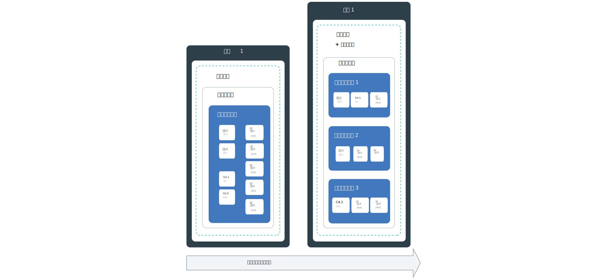
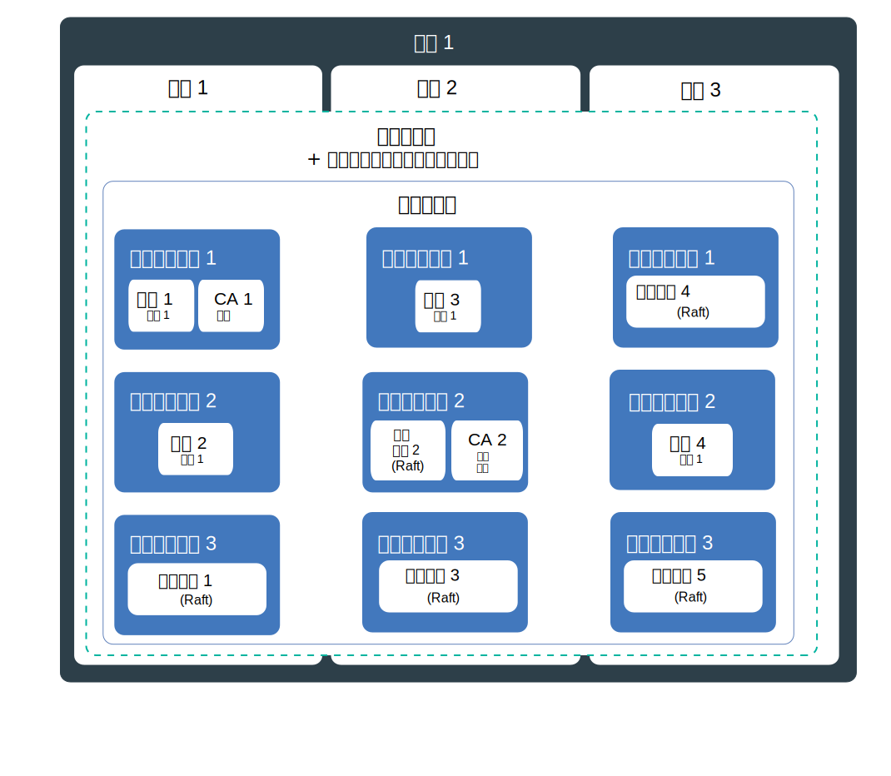
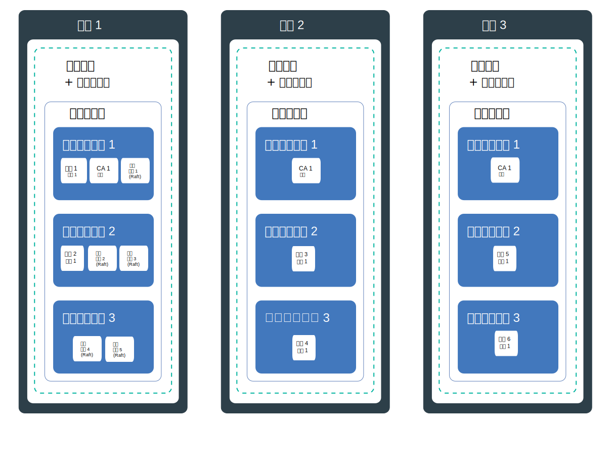

---

copyright:
  years: 2019
lastupdated: "2019-07-10"

keywords: high availability, HA, IBM Cloud, failures, zone failure, region failure, component failure, worker node failure

subcollection: blockchain

---

{:external: target="_blank" .external}
{:shortdesc: .shortdesc}
{:screen: .screen}
{:codeblock: .codeblock}
{:note: .note}
{:important: .important}
{:tip: .tip}
{:pre: .pre}

# 高可用性 (HA)
{: #ibp-console-ha}

使用内置 Kubernetes 功能和 {{site.data.keyword.blockchainfull}} Platform 组件部署策略，可使区块链网络具有更高可用性，并在集群中的组件发生故障时，保护网络不产生停机时间。
{:shortdesc}

**目标受众：**本主题适用于负责在 {{site.data.keyword.cloud_notm}} 或 {{site.data.keyword.cloud_notm}} Private 上规划和配置 {{site.data.keyword.blockchainfull_notm}} 的架构设计师和系统管理员。

高可用性是 IT 基础架构中的一个核心原则，用于保持应用程序正常启动并运行，即便在站点的一部分或整体发生故障后也不例外。高可用性的主要目的是消除 IT 基础架构中的潜在故障点。例如，可以通过添加冗余并设置故障转移机制来准备好应对一个系统发生故障的情况。

可以在 IT 基础架构的不同级别以及在集群的不同层中实现高可用性。适合您的可用性级别取决于多个因素，例如您的业务需求、您与组织签订的“服务级别协议”以及冗余成本。

继续之前，建议您查看针对 HA 的特定于平台的指导信息：
- 如果使用的是 {{site.data.keyword.cloud_notm}}，那么可以在有关 [ {{site.data.keyword.cloud_notm}} Kubernetes Service 的高可用性](/docs/containers?topic=containers-ha){: external}的主题中阅读有关如何在 {{site.data.keyword.cloud_notm}} 中使 Kubernetes 实现 HA 的更多信息。
- 如果使用的是 {{site.data.keyword.cloud_notm}} Private，请查看有关[在 {{site.data.keyword.cloud_notm}} Private 上实现 HA](https://www.ibm.com/cloud/garage/practices/manage/high-availability-ibm-cloud-private){: external} 的内容。  

可以使用此主题以获取有关特定于区块链的 HA 指导详细信息，并从以上特定于平台的主题中获得相关建议。

## {{site.data.keyword.blockchainfull_notm}} Platform for {{site.data.keyword.cloud_notm}} 中的潜在故障点概述
{: #ibp-console-ha-points-of-failure-overview}

{{site.data.keyword.blockchainfull_notm}} Platform 体系结构旨在确保可靠性、处理等待时间短以及服务正常运行时间最长。然而，还是可能发生故障。{{site.data.keyword.blockchainfull_notm}} Platform 提供了多种方法，通过添加冗余和[反亲缘关系](https://www.ibm.com/blogs/cloud-archive/2016/07/ibm-containers-anti-affinity/){: external}策略来提高集群的可用性，并在可用时，确保在不同工作程序节点中部署相同类型和组织的区块链组件。通过在区块链网络中添加冗余，可以避免故障或停机时间。  

为了尽可能提升高可用性，建议您通过在多个区域中的多个 Kubernetes 集群中供应同级和排序节点来构建冗余。组件分布在多个区域中并且区块链分类帐分布在这些组件上时，任何单个区域中的故障都不会影响事务处理。对于日常事务处理，CA 并不太重要。所有用户都已使用 CA 注册和登记后，在下次需要这些服务之前，都不再需要该 CA。

### 同级注意事项
{: #ibp-console-ha-peers}

同级 HA 意味着始终有冗余同级，即在同一通道上每个组织至少有两个同级可用于处理来自客户机应用程序的请求。多个同级可以部署到一个工作程序节点，也可分布在多个工作程序节点、多个专区（如果使用的是 {{site.data.keyword.cloud_notm}}）甚至是多个区域中。每当部署多个同级并将其加入同一通道时，同级会充当 HA 对，因为通道和数据会在通道中的所有同级上自动同步。根据设计，区块链网络旨在让多个组织在相同通道上进行事务处理。因此，常用部署模型是，对于任何给定通道，每个组织都有冗余同级分布在多个组织帐户集群中，所有集群相互之间同步数据。每个组织可以在任何区域内其自己的集群中具有同级。

为了增强 HA 覆盖范围，可以在多个区域中支持多个集群，并在所有集群中部署同级。但是，如果需要高性能，那么在分布同级时必须谨慎，以确保同级之间的等待时间和带宽足以达到性能目标。

通道上的**锚点同级**有助于实现使用专用数据、Gossip 和服务发现所必需的跨组织通信。如果通道上只存在一个锚点同级，而该同级变为不可用，那么这些组织不再连接在一起，并且无法再使用跨组织 Gossip。因此，在为组织创建冗余同级时，请确保同时在通道上添加冗余[锚点同级](/docs/services/blockchain?topic=blockchain-ibp-console-govern#ibp-console-govern-channels-anchor-peers)。

### 排序服务注意事项
{: #ibp-console-ha-ordering-service}

{{site.data.keyword.blockchainfull_notm}} Platform 基于 Hyperledger Fabric V1.4.1（包括 Raft 排序服务）进行构建。Raft 是基于 [Raft 协议](https://raft.github.io/raft.pdf){: external}实现的崩溃容错 (CFT) 排序服务。根据设计，Raft 排序节点使用基于 Raft 的共识自动彼此同步数据。在 {{site.data.keyword.blockchainfull_notm}} Platform 中，组织网络操作员可以选择支持单节点基于 Raft 的排序节点（无 HA）或支持单个区域中五个排序节点（通过 Raft 自动配置为实现 HA）。

## HA 核对表
{: #ibp-console-ha-checklist}

下表包含计划提高 HA 程度时要考虑的选项的列表。

|  |单个节点|具有多个节点的单个集群|多专区（仅限 {{site.data.keyword.cloud_notm}}**）|多个区域中的多个集群|
|-----|-----|-----|-----|-----|
|冗余同级| | | | |
|通道上的冗余锚点同级| | | | |
|反亲缘关系***（同级）|  | | | |
|Raft 排序服务| | | | |
|反亲缘关系***（排序节点）|  | | | |
|开发或测试环境| | | | |
|生产环境| | | | |
{: row-headers}
{: class="comparison-table"}
{: caption="表 1. 比较部署场景以提高网络 HA" caption-side="top"}
{: summary="This table has row and column headers. The row headers identify the deployment scenarios. The column headers identify available options in each scenario to increase your HA."}

*** {{site.data.keyword.blockchainfull_notm}} Platform 部署节点无法保证同级或排序节点分布在不同的专区中。您可以使用 {{site.data.keyword.blockchainfull_notm}} Platform API 将节点部署到 {{site.data.keyword.cloud_notm}} 上的特定专区中，并确保网络可迅速应对专区故障。有关更多信息，请参阅[多专区 HA](#ibp-console-ha-multi-zone)。  

** {{site.data.keyword.cloud_notm}} 上标准 Kubernetes 集群的缺省配置是包含 4 个 CPU 和 16 GB RAM 的集群，其中包含三个专区，每个专区三个工作程序节点。可以根据需要选择更大或更小的配置来实现扩展或缩减。

## 潜在故障点
{: #ibp-console-ha-points-of-failure}

{{site.data.keyword.blockchainfull_notm}} Platform 提供了多种方法，通过添加冗余和使用反亲缘关系策略来提高网络可用性。请查看以下各图，以了解有关潜在故障点以及如何消除这些故障点的更多信息。可以根据应用程序的重要程度、服务级别和成本来选择模型。通常，可以通过实现冗余来达到服务级别。所有这些场景都必须根据实现更高弹性的成本进行权衡。

### 单区域 HA
{: #ibp-console-ha-single-region}




1. **组件故障。**

   **单专区集群**：  

   每次部署区块链组件（例如，同级或排序节点）时，都会为工作程序节点中的组件创建新的 pod。根据设计，容器和 pod 的生存时间短，并且可能会意外发生故障。例如，如果组件中发生错误，那么容器或 pod 可能会崩溃。为了使同级具有高可用性，必须确保同级有足够的实例来处理工作负载，另外还有其他实例用于发生故障的情况。

   **同级**：需要多少个同级？在生产场景中，建议对每个通道部署同一组织的三个同级。这是为了允许一个同级停止运行（例如，在维护周期内），同时仍然保持两个高可用性同级。因此，为了补偿同级故障，并且为了实现最基本级别的 HA，只需在工作程序节点上的一个通道上为每个组织部署三个同级，就可以实现同级冗余。请注意，需要确保节点上有足够的资源可用于支持这些组件。

   **排序服务**：如上所述，缺省情况下，HA 排序服务基于 Raft，并且包含五个排序节点。因为系统可以在节点（包括领导节点）丢失的情况下仍保持运行，只要剩余的排序节点占大多数（称为“定额”）即可，因此 Raft 被认为实现了“崩溃容错”(CFT)。换句话说，如果通道中有五个节点，那么可以丢失两个节点（剩余三个节点）。通过控制台部署排序服务时，请选择五节点服务以实现 HA。  

   此场景在单个工作程序节点上使用冗余同级和排序节点，这可保护不受组件故障的影响，但无法避免受到节点故障的影响。因此，此场景仅适用于开发和测试目的。

2. **工作程序节点故障。**  

   **具有多个工作程序节点和反亲缘关系的单专区集群**：

   工作程序节点是在物理硬件上运行的 VM。工作程序节点故障包括硬件中断，例如电源、散热或联网中断，以及 VM 本身的问题。可以通过在供应集群中设置多个工作程序节点，应对一个工作程序节点故障。区块链组件分布在多个工作程序节点上，可保护不受工作程序节点故障的影响。请注意，{{site.data.keyword.cloud_notm}} Kubernetes Service 包含一个集群中多个专区的选项。{{site.data.keyword.cloud_notm}} Private 不支持专区。

   **同级**：{{site.data.keyword.blockchainfull_notm}} Platform 部署节点反亲缘关系策略在其集群或专区中的各个工作程序节点上分布冗余同级（即，来自同一组织的同级）。

   **排序服务**：每当部署 Raft 排序服务时，都会使用反亲缘关系策略并基于节点上的资源可用性，在集群中的工作程序节点上自动分布五个排序节点。  

   此场景在单个集群或专区中的多个工作程序节点上使用冗余同级和排序节点，这可保护不受节点故障的影响，但无法避免受到集群或专区故障的影响。因此，建议不要用于生产。

### 多专区 HA（仅限 {{site.data.keyword.cloud_notm}} Kubernetes Service）
{: #ibp-console-ha-multi-zone}

_此场景仅适用于使用 {{site.data.keyword.cloud_notm}} Kubernetes Service 的客户。_



   **专区故障。**  

   **具有多个工作程序节点和反亲缘关系的多专区集群**：

   请将专区视为数据中心。专区故障会影响所有物理计算主机和 NFS 存储器。故障包括电源、散热、联网或存储中断，以及洪水、地震和飓风等自然灾害。要保护不受专区故障的影响，必须在至少两个不同专区中具有集群，并通过外部负载均衡器对集群进行负载均衡。缺省情况下，在 {{site.data.keyword.cloud_notm}} 中部署 Kubernetes 集群时，该集群配置为支持多专区，包含三个专区，但您可以选择两个专区。

   如果可以容许专区中断，那么单专区就足以满足开发和测试环境的要求。因此，要利用多个专区的 HA 优点，在供应集群时，请确保选择多个专区。两个专区优于一个专区，但建议使用三个专区来实现 HA，以提高在任何一个专区发生故障时，另外两个专区可以承担该专区工作负载的可能性。如果同一组织和通道的冗余同级和排序节点分布在多个专区中，那么任何一个专区中的故障都应该不会影响网络处理事务的能力，因为工作负载会切换到其他专区中的区块链节点。

   {{site.data.keyword.blockchainfull_notm}} Platform 部署节点无法保证区块链组件分布在多个**专区**中。部署节点将根据工作程序节点上的可用资源将组件部署到多个专区，但不一定会将同一组织的两个同级或将多个排序节点放入不同的专区中。
   如果要确保将特定节点部署到不同的专区，您可以使用 {{site.data.keyword.blockchainfull_notm}} Platform API 指定创建节点的专区。有关更多信息，请参阅[在特定专区内创建节点](/docs/services/blockchain?topic=blockchain-ibp-v2-apis#ibp-v2-apis-zone)。
   {:note}

   此场景在多个工作程序节点和多个专区中使用冗余同级和排序节点，这可保护不受专区故障的影响，但无法避免受到整个区域故障的影响。这是生产网络的建议场景。

### 多区域 HA
{: #ibp-console-ha-multi-region}

此场景提供可能的最高级别 HA。



   **区域故障。**

   **具有多个工作程序节点和反亲缘关系的多区域集群**：

   整个区域发生故障的可能性较低。但是，要应对此故障，可以在不同区域中设置多个集群，其中每个集群有其自己的链接控制台。如果整个区域发生故障，其他区域的集群中的冗余同级可以处理工作负载。对于生产环境，在多个区域中配置区块链**同级**可提供最大的可用 HA 覆盖范围。

   此场景在多个区域的多个工作程序节点上使用冗余同级，以提供最高程度的 HA。如果弹性需求值得投资，那么这也是生产网络的建议场景。  

   请参阅有关[设置多区域 HA 部署](/docs/services/blockchain?topic=blockchain-ibp-console-hadr-mr)的主题，以获取在多个区域中配置 {{site.data.keyword.blockchainfull_notm}} Platform 同级的步骤。


## 灾难恢复 (DR)
{: #ibp-console-ha-dr}

在所有情况下，为了防止数据损坏，建议您定期备份与每个已部署组件相关联的存储器。由于分类帐是在所有同级和排序节点之间共享的，因此定期进行备份至关重要。例如，如果任何一个同级分类帐损坏，此损坏会传播到所有同级分类帐，因此需要备份才能复原整个网络中的分类帐。您可以根据恢复需要来决定执行备份的频率，但一般准则是执行每日备份。  

|存储解决方案提供者|指导信息|
|----------|---------|
|{{site.data.keyword.cloud_notm}} 存储解决方案|可以利用 [{{site.data.keyword.cloud_notm}} Kubernetes Service 提供的功能](/docs/services/RegistryImages/ibm-backup-restore?topic=RegistryImages-ibmbackup_restore_starter#ibmbackup_restore_starter){: external}。但请注意，如果没有快照功能，节点必须处于[已停止](#ibp-console-ha-stop-nodes)状态才能确保可靠备份。|
|{{site.data.keyword.cloud_notm}} Private 存储解决方案|可以使用存储器提供者提供的备份或复原技术。同样，确保在执行备份之前[已停止](#ibp-console-ha-stop-nodes)节点。|
|Portworx|[快照功能](https://docs.portworx.com/portworx-install-with-kubernetes/cloud/ibm/#prerequisites){: external}可用于在不停止节点的情况下进行备份。|
{: caption="表 2. 针对存储器的备份建议" caption-side="top"}

需要复原备份时，必须在整个网络中的每个组件上复原备份。

### 停止节点以准备备份
{: #ibp-console-ha-stop-nodes}

如果不是将 Portworx 用作存储解决方案，那么可以使用以下 `kubectl` 命令在执行备份之前停止节点，例如：

   ```
   kubectl scale deployment my-deployment --replicas=0
   ```
   {:codeblock}

   运行备份。然后重新启动节点：

   ```
   kubectl scale deployment my-deployment --replicas=1
   ```
   {:codeblock}
