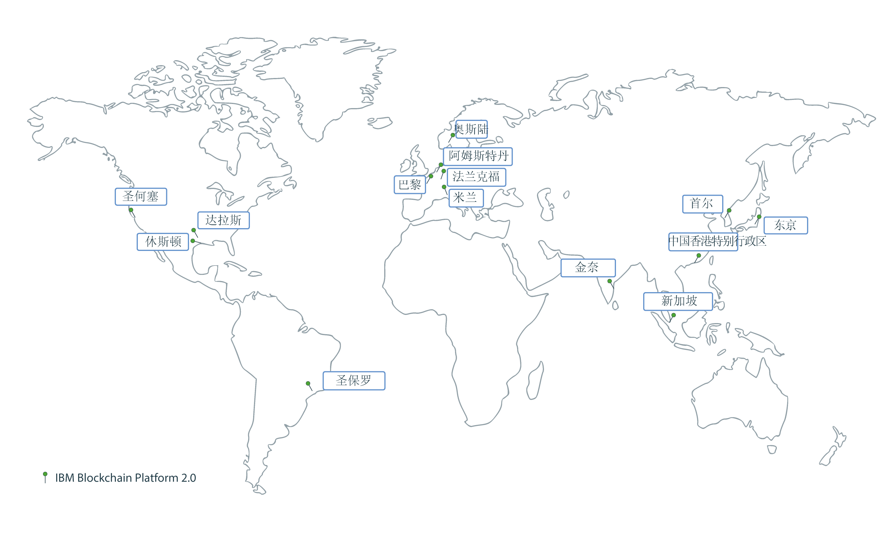
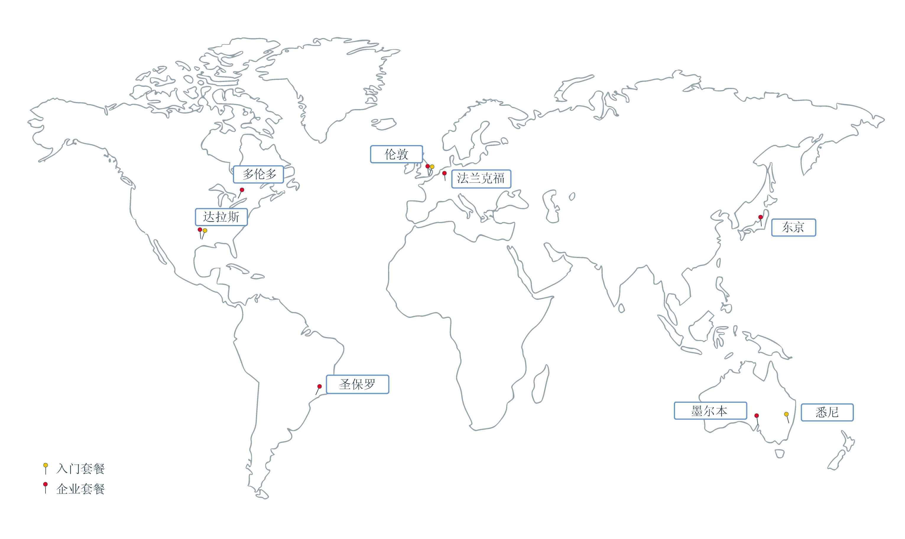

---

copyright:
  years: 2017, 2019
lastupdated: "2019-06-18"

keywords: data centers, IBM Cloud regions, available locations

subcollection: blockchain

---

{:external: target="_blank" .external}
{:shortdesc: .shortdesc}
{:screen: .screen}
{:pre: .pre}
{:table: .aria-labeledby="caption"}
{:codeblock: .codeblock}
{:tip: .tip}
{:download: .download}

# {{site.data.keyword.blockchainfull_notm}} Platform 位置
{: #ibp-regions-locations}

{{site.data.keyword.cloud}} 在全球范围的各种位置托管。位置是由端点访问的地理区域内的数据中心。{{site.data.keyword.blockchainfull_notm}} Platform 在全球不同位置的 {{site.data.keyword.cloud_notm}} 中部署区块链网络。在 {{site.data.keyword.cloud_notm}} 中创建 {{site.data.keyword.blockchainfull_notm}} Platform 服务实例时，会在创建服务实例的 {{site.data.keyword.cloud_notm}} 位置中创建并存储区块链网络和网络资源。
{:shortdesc}

不同的 {{site.data.keyword.blockchainfull_notm}} Platform 产品在不同的 {{site.data.keyword.cloud_notm}} 位置中可用。您只能在 {{site.data.keyword.blockchainfull_notm}} Platform 套餐可用的 {{site.data.keyword.cloud_notm}} 位置中创建区块链网络。

表 1 和图 1 显示了 {{site.data.keyword.blockchainfull_notm}} Platform for {{site.data.keyword.cloud_notm}} 支持的 {{site.data.keyword.cloud_notm}} 区域和位置。

如果要使用免费 {{site.data.keyword.cloud_notm}} Kubernetes 集群，不要选择亚太地区的免费集群。否则，免费集群会在亚太地区南部的墨尔本进行创建，而不是在亚太地区北部创建。但目前，亚太地区南部集群无法用于部署 {{site.data.keyword.blockchainfull_notm}} Platform V2.0。如果计划使用免费集群，请选择**美国南部**或**欧洲中部**位置。
{: note}

|区域|{{site.data.keyword.cloud_notm}} 位置|
|--------|--------------------|
|美国南部|圣何塞、圣保罗、达拉斯、休斯敦|
|亚太地区北部|东京、金奈、中国香港特别行政区、首尔、新加坡|
|欧洲中部|法兰克福、阿姆斯特丹、米兰、奥斯陆、巴黎|

_表 1. {{site.data.keyword.blockchainfull_notm}} Platform for {{site.data.keyword.cloud_notm}} 位置_

表 2 和图 2 显示了 {{site.data.keyword.blockchainfull_notm}} Platform 入门套餐和企业套餐支持的 {{site.data.keyword.cloud_notm}} 区域和位置。

|位置|入门套餐|企业套餐|
|--------|----------|----------|
|达拉斯|是|是|
|伦敦|是|是|
|东京|  |是|
| 法兰克福|  |是|
|悉尼|是|  |
|墨尔本|  |是|
|圣保罗|  |是|
|多伦多|  |是|

_表 2. 入门套餐和企业套餐位置_

