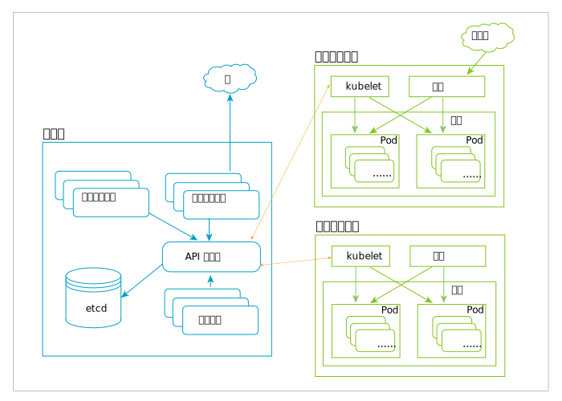

---

copyright:
  years: 2019
lastupdated: "2019-06-18"

subcollection: blockchain

---

{:external: target="_blank" .external}
{:shortdesc: .shortdesc}
{:screen: .screen}
{:codeblock: .codeblock}
{:note: .note}
{:important: .important}
{:tip: .tip}
{:pre: .pre}

# Kubernetes
{: #k8s-overview}

通过 {{site.data.keyword.blockchainfull_notm}} Platform，可以将区块链组件供应到 {{site.data.keyword.cloud_notm}} Kubernetes 集群中。Kubernetes 是一个开放式源代码系统，用于自动对容器化应用程序进行部署、缩放和管理。
{:shortdesc}

Kubernetes 提供的是以容器为中心的管理环境。Kubernetes 代表用户工作负载来编排计算、联网和存储基础架构。这不仅提供了平台即服务 (PaaS) 的大部分简洁性和基础架构即服务 (IaaS) 的灵活性，还支持不同基础架构提供者之间的可移植性。

下图说明了 Kubernetes 的体系结构。有关节点、容器和 pod 的更多说明，请参阅下面的[主要 Kubernetes 对象](#k8s-overview-key-obj)部分。

## {{site.data.keyword.cloud_notm}} Kubernetes Service
{: #k8s-overview-iks}

{{site.data.keyword.cloud_notm}} Kubernetes Service 通过组合 Docker 容器、Kubernetes 技术、直观的用户体验以及内置安全性和隔离，提供功能强大的工具来自动对计算主机集群中的容器化应用程序进行部署、操作、缩放和监视。

有关 {{site.data.keyword.cloud_notm}} Kubernetes Service 的更多信息，请参阅 {{site.data.keyword.cloud_notm}} Kubernetes Service 文档中的以下主题：
- [{{site.data.keyword.cloud_notm}} Kubernetes Service 技术](/docs/containers?topic=containers-ibm-cloud-kubernetes-service-technology#ibm-cloud-kubernetes-service-technology){: external}
- [为什么选择 {{site.data.keyword.cloud_notm}} Kubernetes Service](/docs/containers?topic=containers-cs_ov#cs_ov){: external}
- [定义 Kubernetes 策略](/docs/containers?topic=containers-strategy#strategy){: external}

## 主要 Kubernetes 对象
{: #k8s-overview-key-obj}

- **集群**

  一组机器（称为节点），用于运行由 Kubernetes 管理的容器化应用程序。一个集群具有多个工作程序节点，并且至少有一个主节点。

- **节点**

  节点是 Kubernetes 中的工作程序机器。节点可以是 VM，也可以是物理机器，具体取决于集群。每个节点都包含运行 pod 所必需的服务，并由主节点组件进行管理。节点上的服务包括容器运行时 `kubelet` 和 `kube-proxy`。有关更多信息，请参阅 Kubernetes 文档中的 [Kubernetes 节点](https://kubernetes.io/docs/concepts/architecture/nodes/){: external}部分。

- **容器**

  一种轻量级、可移植的可执行映像，包含软件及其所有依赖项。容器将应用程序与底层主机基础架构相分离，因此能更轻松地在不同的云或操作系统环境中进行部署，并且缩放也更轻松。

- **Pod**

  最小且最简单的 Kubernetes 对象。Pod 表示集群上正在运行的一组容器。Pod 通常设置为运行单个主容器。它还可以运行可选的侧柜容器，侧柜容器用于添加补充功能，如日志记录等。Pod 通常由部署进行管理。有关更多信息，请参阅 Kubernetes 文档中的 [Kubernetes Pod](https://kubernetes.io/docs/concepts/workloads/pods/pod/){: external} 部分。
