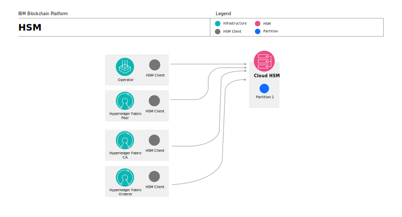

---

copyright:
  years: 2021
lastupdated: "2021-03-08"

keywords: HSM, Gemalto, IBM Cloud

subcollection: blockchain

---

{:DomainName: data-hd-keyref="APPDomain"}
{:DomainName: data-hd-keyref="DomainName"}
{:android: data-hd-operatingsystem="android"}
{:api: .ph data-hd-interface='api'}
{:apikey: data-credential-placeholder='apikey'}
{:app_key: data-hd-keyref="app_key"}
{:app_name: data-hd-keyref="app_name"}
{:app_secret: data-hd-keyref="app_secret"}
{:app_url: data-hd-keyref="app_url"}
{:authenticated-content: .authenticated-content}
{:beta: .beta}
{:c#: data-hd-programlang="c#"}
{:cli: .ph data-hd-interface='cli'}
{:codeblock: .codeblock}
{:curl: .ph data-hd-programlang='curl'}
{:deprecated: .deprecated}
{:dotnet-standard: .ph data-hd-programlang='dotnet-standard'}
{:download: .download}
{:external: target="_blank" .external}
{:faq: data-hd-content-type='faq'}
{:fuzzybunny: .ph data-hd-programlang='fuzzybunny'}
{:generic: data-hd-operatingsystem="generic"}
{:generic: data-hd-programlang="generic"}
{:gif: data-image-type='gif'}
{:go: .ph data-hd-programlang='go'}
{:help: data-hd-content-type='help'}
{:hide-dashboard: .hide-dashboard}
{:hide-in-docs: .hide-in-docs}
{:important: .important}
{:ios: data-hd-operatingsystem="ios"}
{:java: .ph data-hd-programlang='java'}
{:java: data-hd-programlang="java"}
{:javascript: .ph data-hd-programlang='javascript'}
{:javascript: data-hd-programlang="javascript"}
{:new_window: target="_blank"}
{:note .note}
{:note: .note}
{:objectc data-hd-programlang="objectc"}
{:org_name: data-hd-keyref="org_name"}
{:php: data-hd-programlang="php"}
{:pre: .pre}
{:preview: .preview}
{:python: .ph data-hd-programlang='python'}
{:python: data-hd-programlang="python"}
{:route: data-hd-keyref="route"}
{:row-headers: .row-headers}
{:ruby: .ph data-hd-programlang='ruby'}
{:ruby: data-hd-programlang="ruby"}
{:runtime: architecture="runtime"}
{:runtimeIcon: .runtimeIcon}
{:runtimeIconList: .runtimeIconList}
{:runtimeLink: .runtimeLink}
{:runtimeTitle: .runtimeTitle}
{:screen: .screen}
{:script: data-hd-video='script'}
{:service: architecture="service"}
{:service_instance_name: data-hd-keyref="service_instance_name"}
{:service_name: data-hd-keyref="service_name"}
{:shortdesc: .shortdesc}
{:space_name: data-hd-keyref="space_name"}
{:step: data-tutorial-type='step'}
{:subsection: outputclass="subsection"}
{:support: data-reuse='support'}
{:swift: .ph data-hd-programlang='swift'}
{:swift: data-hd-programlang="swift"}
{:table: .aria-labeledby="caption"}
{:term: .term}
{:tip: .tip}
{:tooling-url: data-tooling-url-placeholder='tooling-url'}
{:troubleshoot: data-hd-content-type='troubleshoot'}
{:tsCauses: .tsCauses}
{:tsResolve: .tsResolve}
{:tsSymptoms: .tsSymptoms}
{:tutorial: data-hd-content-type='tutorial'}
{:ui: .ph data-hd-interface='ui'}
{:unity: .ph data-hd-programlang='unity'}
{:url: data-credential-placeholder='url'}
{:user_ID: data-hd-keyref="user_ID"}
{:vbnet: .ph data-hd-programlang='vb.net'}
{:video: .video}


# IBM Cloud Hardware Security Module (HSM)
{: #ibp-hsm-gemalto}
{: help}
{: support}

{{site.data.keyword.cloud_notm}} includes an [HSM](#x6704988){: term}
service that provides cryptographic processing for key generation, encryption, decryption, and key storage. This document describes how to use that service with the {{site.data.keyword.blockchainfull}} Platform.
{: shortdesc}

While this tutorial focuses specifically on using {{site.data.keyword.cloud_notm}} HSM, you can learn more about the overall configuration process for using any HSM that supports PCKS #11 with the {{site.data.keyword.blockchainfull_notm}} Platform, see
[Configuring a node to use a Hardware Security Module](/docs/blockchain?topic=blockchain-ibp-console-adv-deployment#ibp-console-adv-deployment-cfg-hsm).

## Why would I want to use an HSM with my {{site.data.keyword.blockchainfull_notm}} Platform network?
{: #ibp-hsm-gemalto-why}

When a Certificate Authority (CA), peer, or ordering node is configured to use an HSM, their private key is generated by and protected inside a tamper resistant HSM device. {{site.data.keyword.cloud_notm}} HSM is a FIPS 140-2 Level 3 validated, single-tenant device that implements Gemalto (Luna) HSM. When a CA is configured to use HSM, the CA root private key is stored in the HSM. This is the key that is used to sign enrollment requests. After a peer or ordering node is configured to use HSM, the nodes are able to sign and endorse transactions without ever exposing their private key.

Because only the private keys of node identities are secured in the HSM, when you enroll other admin or client application identities with a CA, their private keys are not stored inside the HSM because they will need their private key to transact on the network.  
{: important}

## Using {{site.data.keyword.cloud_notm}} HSM
{: #ibp-hsm-gemalto-using}

{{site.data.keyword.cloud_notm}} HSM 6.0 and 7.0 are available in the [{{site.data.keyword.cloud_notm}} catalog](/catalog/infrastructure/hardware-security-module){: external}. Both versions are supported, however, these instructions focus on how to configure {{site.data.keyword.cloud_notm}} HSM 6.0 to work with the {{site.data.keyword.blockchainfull_notm}} Platform. If you are using 7.0, it is possible that some of the commands will differ slightly.

## Process overview
{: #ibp-hsm-gemalto-overview}

- [Part One: Set up the HSM device and HSM client](#ibp-hsm-gemalto-part-one)

  This process involves deploying an **HSM** and configuring a partition as well as deploying an **HSM client** that you will use to configure the device. Throughout these instructions you will run some commands from the HSM server and others from the HSM client. For clarity, we prefix these steps with either  or .

- [Part Two: Configure communications between the HSM server and client](#ibp-hsm-gemalto-part-two)

  Communications between the HSM and client require a **Network Trust Link (NTL)** -- an encrypted, secure communications channel between the HSM and client. NTL uses digital certificates that the client and HSM server can use to verify each other's identity. You will run a command to get the HSM server certificate that allows the client to communicate with the HSM server. Likewise, you will generate a certificate and private key for the client and then copy them to the HSM server.

- [Part Three: Register the client with the HSM server](#ibp-hsm-gemalto-part-three)

  After the secure communications are configured, you can register the client with the HSM server and then assign the HSM partition to the client.

- [Part Four: Build a Docker image](#ibp-hsm-gemalto-part-four)  

  You have two options:
  - **(Recommended)** Build an HSM Client image
  - **(Deprecated)** Build a PKCS #11 proxy image and deploy it to your Kubernetes cluster

This process requires [Docker](https://docs.docker.com/install/){: external} to be installed on the machine where the HSM client is running and that you are familiar with the process for building Docker images. It also presumes you are comfortable with using the Kubernetes CLI to administer your Kubernetes cluster.

 If you are using a Kubernetes cluster on {{site.data.keyword.cloud_notm}} and {{site.data.keyword.cloud_notm}} HSM, both services need to be deployed from the same {{site.data.keyword.cloud_notm}} account and on the same VLAN. If they are not on the same VLAN, then VLAN spanning must be enabled.
{: important}


When the entire HSM configuration is complete, it resembles the following diagram:

**HSM configured with an HSM client image**  

{: caption="Figure 1. An example configuration of an HSM configured with an HSM client image." caption-side="bottom"}

The steps in this topic focus specifically on the creation of the Cloud HSM and the HSM Client in the diagram.  When you deploy a CA, peer, or ordering node to use the HSM, you need to provide the label and PIN of the HSM partition. This configuration assumes you enabled HSM on your Kubernetes cluster when you deployed the service.  

**(Deprecated) HSM configured with a PKCS #11 proxy**  

{: caption="Figure 2. An example configuration of an HSM configured with a PKCS #11 proxy." caption-side="bottom"}  

When you choose to deploy the PKCS #11 proxy and configure a node with HSM, you need to provide the PKCS #11 proxy endpoint URL, along with the label and PIN of the HSM partition. It is the combination of the PKCS #11 proxy and the HSM client that allows the node to store and retrieve the node private key from the HSM.

### Part One: Set up the HSM device and HSM client
{: #ibp-hsm-gemalto-part-one}

1. Provision the HSM and configure it with at least one partition. For example, you can follow instructions for [Provisioning {{site.data.keyword.cloud_notm}} HSM](/docs/hardware-security-modules?topic=hardware-security-modules-provisioning-ibm-cloud-hsm){: external}.

   Be sure to record the `Label` and `PIN` for the partition. You will need to provide these values later when you configure a blockchain node to use this HSM partition. Also, save the IP address associated with the HSM device. We will refer to this value throughout these instructions as `<HSM_ADDRESS>`.
   {: important}

2. [Install the HSM client](/docs/hardware-security-modules?topic=hardware-security-modules-installing-the-ibm-cloud-hsm-client){: external} on your local machine. **Make sure the client version that you are running matches the HSM server version.** Record the IP address or fully qualified host name where the HSM client is running. We will refer to this value throughout these instructions as `<CLIENT_ADDRESS>`.

  The client runs on AIX, Linux, Oracle Solaris, or Microsoft Windows, but is not supported on MacOS.
  {: tip}

### Part Two: Configure communications between the HSM server and client
{: #ibp-hsm-gemalto-part-two}

In this section you will get the HSM server certificate and create the HSM client certificate-key pair in order for them to be exchanged.

1.  Run the following command using the HSM client to get the server certificate. This certificate enables the client to communicate with the server.

  ```bash
  scp hsm_admin@<HSM_ADDRESS>:server.pem server.pem
  ```
  {: codeblock}

  Replace
  - `<HSM_ADDRESS>` with the IP address of the HSM.

2.  Now, add the HSM server to the client configuration by running the following command:

  ```bash
  vtl addServer -n <HSM_ADDRESS> -c server.pem
  ```
  {: codeblock}

  Replace
  - `<HSM_ADDRESS>` with the IP address of the HSM.

3.  Create the certificate and private key for the client by running the command:

  ```bash
  vtl createcert -n <CLIENT_ADDRESS>
  ```
  {: codeblock}

  Replace
  - `<CLIENT_ADDRESS>` with the IP address or fully qualified host name of the client.

  The name of the generated certificates includes the `<CLIENT_ADDRESS>`. The output of this command looks similar to:
  ```
  Private Key created and written to: /usr/safenet/lunaclient/cert/client/<CLIENT_ADDRESS>Key.pem
  Certificate created and written to: /usr/safenet/lunaclient/cert/client/<CLIENT_ADDRESS>.pem
  ```

4.  Copy the client certificate and private key to the HSM server by running the command:

  ```bash
  scp /usr/safenet/lunaclient/cert/client/<CLIENT_ADDRESS>.pem hsm_admin@<HSM_ADDRESS>:.
  ```
  {: codeblock}

  Replace
  - `<CLIENT_ADDRESS>` with the IP address or fully qualified host name of the client.
  - `<HSM_ADDRESS>` with the IP address of the HSM.

### Part Three: Register the client with the HSM server
{: #ibp-hsm-gemalto-part-three}

1.  SSH into the HSM as the admin the HSM server and register the client by running **one** of the following commands.

  If the `<CLIENT_ADDRESS>` is the IP address of the client:

  ```bash
  client register -client ${CLIENT_NAME} -ip <CLIENT_ADDRESS>
  ```
  {: codeblock}

  If the `<CLIENT_ADDRESS>` is the fully qualified host name of the client:

  ```bash
  client register -client ${CLIENT_NAME} -hostname <CLIENT_ADDRESS>
  ```
  {: codeblock}

  Replace
  - `{CLIENT_NAME}` with the name of the client. This value can be anything meaningful to you.
  - `<CLIENT_ADDRESS>` with either the IP address or fully qualified host name of the client.

2.  Because network address translation (NAT) exists between the client and the HSM, we need to disable client source IP address validation by the Network Trust Link Server (NTLS) upon Network Trust Link Agent (NTLA) client connection.  Disable ip check on the HSM server and then restart the NTLS service on the HSM server by running the following commands:

  ```bash
  ntls ipcheck disable
  service restart ntls
  ```
  {: codeblock}

3.  Assign a partition to the newly created client on the HSM server by running the following command:

  ```bash
  client assignpartition -client ${CLIENT_NAME} -partition ${PARTITION_NAME}
  ```
  {: codeblock}

  Replace
  - `{CLIENT_NAME}` with the name that you gave to your HSM client.
  - `{PARTITION_NAME}` with the name of the HSM partition you created in [Part one](#ibp-hsm-gemalto-part-one), step 1.

  You can verify the command worked by running the following command:

  ```bash
  client show -client ${CLIENT_NAME}
  ```
  {: codeblock}

  The output will look similar to:

  ```
  ClientID:     hsmclient
  IPAddress:    10.220.203.73
  HTL Required: no
  OTT Expiry:   n/a
  Partitions:   "partition1"

  Command Result : 0 (Success)
  ```

4.  Verify the client can connect to HSM server by running the command:

  ```bash
  vtl verify
  ```
  {: codeblock}

  The output will look similar to:

  ```
  The following Luna SA Slots/Partitions were found:
  Slot	Serial #        	Label
  ====	================	=====
  0	    500752010 	      partition1
  ```

5.   Create a `configs` folder on the client and then copy the `server.pem` certificate from [Part two](#ibp-hsm-gemalto-part-two), step 1 and the `<CLIENT_ADDRESS>Key.pem` and `<CLIENT_ADDRESS>.pem` files from [Part two](#ibp-hsm-gemalto-part-two), step 3 into the folder:

   - Copy `server.pem` to `configs/server.pem`  
   - Copy `/usr/safenet/lunaclient/cert/client/<CLIENT_ADDRESS>Key.pem` to `configs/key.pem`  
   - Copy `/usr/safenet/lunaclient/cert/client/<CLIENT_ADDRESS>.pem` to `configs/cert.pem`  

### Part Four: Build a Docker image
{: #ibp-hsm-gemalto-part-four}

There are two ways to configure HSM on your blockchain network. The use of a **PKCS #11 proxy** has been deprecated in favor of building an **HSM client image** which is simpler to configure and provides better overall performance. Both processes are supported, however if you are configuring a new HSM, it is recommended that you build the HSM client image. Both sets of instructions are provided, starting with **Build an HSM client image**. If you still prefer to use a PKCS #11 proxy, you can refer to those [instructions](/docs/blockchain?topic=blockchain-ibp-hsm-build-pkcs11-proxy-ic) instead. If you are currently using the **PKCS #11 proxy** and want to try out the **HSM client image**, it is possible to have both HSM configurations running on the platform at the same time. However, when you deploy a new node you have to choose which HSM implementation you want to use.

#### Build an HSM client image
{: #ibp-console-adv-deployment-hsm-client}

Next we build a Docker file that contains the HSM client image. These instructions assume that you have successfully configured your HSM appliance and HSM client. Use these steps to generate an image that is consumable by the {{site.data.keyword.blockchainfull_notm}} Platform operator.

- Step one: Modify the HSM client configuration.
- Step two: Build the HSM client image.
- Step three: Push the Docker image to your container registry.
- Step four: Create a Kubernetes secret `hsmcrypto`.
- Step five: Create the HSM configmap.

##### Step one: Modify the HSM client configuration
{: #ibp-hsm-gemalto-part-four-client-cfg}

Each HSM has its own configuration file that is typically named `Chrystoki.conf`.  This is the main configuration file for the HSM integration and controls many aspects of the HSM client operation. After you install the HSM client, you need to modify the `etc/Chrystoki.conf` file to point to the `hsm` folder that contains the  HSM shared object library and cryptographic material. The paths specified in `Chrystoki.conf` represent the location where the {{site.data.keyword.blockchainfull_notm}} Platform operator mounts these files on the containers. You need to modify parameters inside the `Chrystoki2` and `LunaSA Client` sections as follows:

**Chrystoki2 settings**  
- **LibUnix:** Name of the Chrystoki2 library on x86 Linux/UNIX operating systems. The actual name of the library depends on the type of HSM you are using.
- **LibUNIX64:** Name of the Chrystoki2 library on 64-bit Linux/UNIX operating systems. The actual name of the library depends on the type of HSM you are using.  

**LunaSA Client  settings** Typically no changes would be required here unless you have explicitly modified the names of these files.
- **ClientPrivKeyFile:** Name of the HSM client private key.
- **ClientCertFile:**  Name of the HSM client certificate.
- **ServerCAFile:**  Name of the HSM server certificate.

The following example shows what the file would look like if you were using {{site.data.keyword.cloud_notm}} HSM. It provides the path to the HSM shared object, certificate and keys. Note that the naming of these files depends on the HSM library that is being used.

```
Chrystoki2 = {
   LibUNIX = /hsm/libCryptoki2.so;
   LibUNIX64 = /hsm/libCryptoki2_64.so;
}
...
LunaSA Client = {
...
   ClientPrivKeyFile = /hsm/key.pem;
   ClientCertFile = /hsm/cert.pem;
   ServerCAFile = /hsm/cafile.pem;
...
}
```
{: codeblock}

##### Step two: Build the HSM client image
{: #ibp-hsm-gemalto-part-four-docker}

The HSM client image can be built with a Docker file similar to the following:

- The following Docker file is for {{site.data.keyword.cloud_notm}} HSM. If you are not using {{site.data.keyword.cloud_notm}} HSM, you need to build your own Docker file.
- You should be aware that this Docker file automatically accepts the Gemalto client license.
- Note that the `64` folder inside the Docker file is required for installing the HSM client.

```
FROM registry.access.redhat.com/ubi8/ubi-minimal as builder

## This directory contains the installation files for gemalto/luna client
COPY 64 64

RUN microdnf install -y \
   gcc \
   gcc-c++ \
   openssh-clients \
   bind-utils \
   iputils \
   && cd 64 && \
   # NOTE we are accepting the license for installing gemalto client here
   # please take a look at the license before moving forward
   echo "y" | ./install.sh -p sa

### Final image ###

FROM registry.access.redhat.com/ubi8/ubi-minimal

# Copy the library files from builder
COPY --from=builder /usr/lib/libCryptoki2_64.so /usr/lib/libCryptoki2_64.so
COPY --from=builder /usr/lib/libCryptoki2_64.so.2 /usr/lib/libCryptoki2_64.so.2
COPY --from=builder /usr/lib/libCryptoki2_64.so.6.3.0 /usr/lib/libCryptoki2_64.so.6.3.0
```
{: codeblock}

Now, run the following command to build the Docker image:

```
docker build -t hsm-client:v1 -f Dockerfile .
```
{: codeblock}

##### Step three: Push the Docker image to your container registry
{: #ibp-hsm-gemalto-part-four-push}

After the image is built, the next step is to push the image to your Docker registry (for example, Docker Hub). The commands look similar to:

```
docker login -u <DOCKER_HUB_ID> -p <DOCKER_HUB_PWD>
docker tag hsm-client:v1 <DOCKER_HUB_ID>/hsm-client:v1
docker push <DOCKER_HUB_ID>/hsm-client:v1
```
{: codeblock}

- Replace `<DOCKER_HUB_ID>` with your Docker Hub id.
- Replace `<DOCKER_HUB_PWD>` with your Docker Hub password.


**Create a Kubernetes image pull secret**

If the HSM client image that you published is not public, then the operator requires an `image pull secret` that contains a valid username and password (or access token) for the container registry. If the image is public, the imagepullsecret is not required and you can skip this command. To build the image pull secret named `hsm-docker-secret`, run the following command in the namespace or project where you deployed the service:

```
kubectl create secret docker-registry hsm-docker-secret --docker-server=<DOCKER_REGISTRY_SERVER> --docker-username=<DOCKER_USER> --docker-password=<DOCKER_PASSWORD> --docker-email=<DOCKER_EMAIL> -n <NAMESPACE>
```
{: codeblock}

Replace:
- `DOCKER_REGISTRY_SERVER` - Registry server url where the HSM client image is hosted.
- `DOCKER_USER` - Valid username with access to HSM client image in the container registry.
- `DOCKER_PASSWORD` - Valid password or access token for the HSM client image in the container registry.
- `DOCKER_EMAIL` - Email address for container registry user.
- `NAMESPACE` - Name of the  project or namespace that is visible on the console **Support** page.

  These instructions are obviously for the Docker registry. If you are using the {{site.data.keyword.IBM_notm}} Container Registry, then you need to set up your own image pull secret in your cluster:

    - [Using an image pull secret to access images in other IBM Cloud accounts or external private registries from non-default Kubernetes namespaces](/docs/containers?topic=containers-registry#other)
    - [Copying an existing image pull secret](/docs/containers?topic=containers-registry#copy_imagePullSecret)
    - [Referring to the image pull secret in your pod deployment](/docs/containers?topic=containers-images#pod_imagePullSecret)

#### Step four: Create a Kubernetes secret `hsmcrypto`
{: #ibp-console-adv-deployment-hsm-client-crypto}

In order for a CA, peer, or ordering node to be able to communicate with the HSM client image you need to
create a Kubernetes secret named `hsmcrypto` that contains the keys and configuration files for the HSM that you are using. When the console deploys a node that is configured with HSM, it uses this secret to access the HSM client image keys and configuration files.

The Kubernetes secret needs to be created in the {{site.data.keyword.blockchainfull_notm}}  Platform service instance namespace that is visible on the console **Support** page.    If you are using the {{site.data.keyword.cloud_notm}} HSM, the command would be:

```
$ kubectl create secret generic hsmcrypto -n <NAMESPACE> --from-file=Chrystoki.conf --from-file=cert.pem --from-file=key.pem --from-file=server.pem
```
{: codeblock}

Replace `<NAMESPACE>` with the name of your  service instance namespace or OpenShift project If you are not using {{site.data.keyword.cloud_notm}} HSM, you need to replace the values of the `--from-file` parameters with the set of certificates and configuration files that are required for your HSM client image.

When successful, the output looks similar to:
```
secret/hsmcrypto created
```

To verify the contents of the secret, run the command:
```
kubectl get secret -n <namespace> hsmcrypto -o yaml
```
{: codeblock}

You should see results similar to:
```
apiVersion: v1
data:
  Chrystoki.conf: ""
  cafile.pem: ""
  cert.pem: ""
  key.pem: ""
kind: Secret
metadata:
  name: hsmcrypto
  namespace: <NAMESPACE>
```

#### Step five: Create the HSM configmap
{: #ibp-console-adv-deployment-hsm-configmap}


Copy the following text and save it to a file named `ibp-hsm-config.yaml`:

```yaml
version: v1
type: hsm
library:
  image: <HSM_IMAGE_URL>
  auth:
    imagePullSecret: <IMAGE_PULL_SECRET>
  filepath: <HSM_LIBRARY_FILE_PATH>
envs:  
- name: <ENVIRONMENT_VARIABLE_NAME>
  value: <ENVIRONMENT_VARIABLE_VALUE>
mountpaths:
- mountpath: <MOUNTPATH>
  name: <MOUNTPATH_NAME>
  secret: <HSM_CRYPTO_SECRET>
  paths:
  - key: <KEY>
    path: <PATH>
  - key: <KEY>
    path: <PATH>
- mountpath: <MOUNTPATH>
  name: <MOUNTPATH_NAME>
  secret: <HSM_CRYPTO_SECRET>
  paths:
  - key: <KEY>
    path: <PATH>
  - key: <KEY>
    path: <PATH>
```
{: codeblock}

Replace the following values:
- `HSM_IMAGE_URL`: URL of the HSM client image that you published to your container registry.
- `IMAGE_PULL_SECRET`: (Optional)  Name of the image pull secret `hsm-docker-secret` that you created in the same namespace as your service. Only required if the HSM client image is not publicly available. **Important:** If an image pull secret is not required, set this value to `""`.
- `ENVIRONMENT_VARIABLE_NAME` - If there are any environment variables that need to be set for the HSM client, specify them individually.
- `ENVIRONMENT_VARIABLE_VALUE` - Value that corresponds to the `ENVIRONMENT_VARIABLE_NAME`.
- `HSM_LIBRARY_FILE_PATH`: Path to the HSM library file, for example, `/usr/lib/libCryptoki2_64.so`.
- `MOUNTPATH`: Location where the file or folder should be mounted.
- `MOUNTPATH_NAME`: Name you want to use for the `mountpath`.
- `KEY`:  Name of the key inside the `hsmcrypto` Kubernetes secret.
- `PATH`: Mount location of the file path where the key should be mounted.
- `HSM_CRYPTO_SECRET`: Name of the Kubernetes secret that contains the keys and configuration files for the HSM that is used by the `mountpath`.

Each HSM likely has a different set of keys that are required by the HSM client. Optionally replicate the "`key`" and "`path`" sections according to the number required by your HSM client. Similarly, if multiple sets of folders need to be mounted, you can replicate the "`mountpath`" section.  

For example, if you are using {{site.data.keyword.cloud_notm}} HSM, the file looks similar to:

```yaml
version: v1
type: hsm
library:
  image: us.icr.io/hsm/gemalto-client:v1.2.3-amd64
  auth:
    imagePullSecret: hsm-docker-secret
  filepath: /usr/lib/libCryptoki2_64.so
mountpaths:
- mountpath: /hsm
  name: hsmcrypto
  paths:
  - key: cafile.pem
    path: cafile.pem
  - key: cert.pem
    path: cert.pem
  - key: key.pem
    path: key.pem
  - key: server.pem
    path: server.pem
  secret: hsmcrypto
- mountpath: /etc/Chrystoki.conf
  name: hsmconfig
  secret: hsmcrypto
  subpath: Chrystoki.conf
```
{: codeblock}

In this example, the first `mountpath` contains four configuration files (cafile.pem, cert.pem, key.pem, server.pem) and the `hsmcrypto` secret, and all of them are mounted to the mountpath `/hsm`. The actual name of the mountpath is `hsmcrypto`, and it contains an exact mapping of the key value pair to the Kubernetes secret and the location to mount it to. For example, `cafile.pem` is read from the path `cafile.pem` in the hsmcrypto mountpath using the `hsmcrypto` secret and mounted to `/hsm/cafile.pem`.  

A second mountpath is included for the HSM `/etc/Chrystoki.conf` file. Because the HSM requires its config file in the `/etc` folder, which is a system directory, we need to use the `subpath` parameter to avoid replacing the entire `/etc` directory. If the subpath is not used, the entire `/etc` directory is replaced with the volume being mounted.  


Run the following command to create the configmap named `ibp-hsm-config` in your cluster namespace or project:
```
kubectl create configmap ibp-hsm-config --from-file=ibp-hsm-config.yaml -n <NAMESPACE>
```
{: codeblock}

The output looks similar to:

```
configmap/ibp-hsm-config created
```

### What's next
{: #ibp-hsm-gemalto-next-steps}

After you have used these instructions to configure your {{site.data.keyword.cloud_notm}} HSM and build the  **HSM client image** or **PKCS #11 proxy**, you are ready to configure your blockchain nodes to use the HSM. When you create a CA, peer, or ordering node, select the [HSM Advanced deployment option](/docs/blockchain?topic=blockchain-ibp-console-adv-deployment#ibp-console-adv-deployment-cfg-hsm-node) to configure the node to use this HSM.

When a node is configured with HSM, a temporary Kubernetes job is started to run this HSM "enrollment" process. Before configuring a node to use HSM, ensure that you have enough resources in your cluster to support this job that takes approximately 0.1CPU and 100Mi memory.
{: important}

On the **HSM configuration** panel, the **Use HSM client image** toggle is visible. When it is on, you can enter the following values:

- **HSM label** - Enter the name of the HSM partition to be used for this node.
- **HSM PIN** - Enter the PIN for the HSM slot.  

If you prefer to use an HSM that was configured with a PKCS #11 proxy instead, slide the **Use HSM client image** toggle to **off**. One additional field becomes visible:
- **HSM proxy endpoint** -Enter the URL for the PKCS #11 proxy that begins with `tcp://` and includes the `CLUSTER-IP` address and `PORT`. For example, `tcp://172.21.106.217:2345`.

When the node is deployed, a private key for the specified node enroll ID and secret is generated by the HSM and stored securely in the appliance.

## Using multiple partitions
{: #ibp-hsm-gemalto-multiple-partitions}

If your HSM has multiple partitions, only one PKCS #11 proxy is required to communicate with the HSM.
