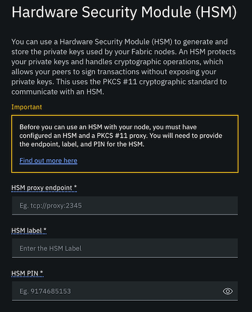

---

copyright:
  years: 2020
lastupdated: "2020-06-18"

keywords: HSM, Gemalto, IBM Cloud

subcollection: blockchain

---

{:external: target="_blank" .external}
{:shortdesc: .shortdesc}
{:screen: .screen}
{:pre: .pre}
{:table: .aria-labeledby="caption"}
{:codeblock: .codeblock}
{:note: .note}
{:term: .term}
{:important: .important}
{:tip: .tip}
{:download: .download}

# IBM Cloud Hardware Security Module (HSM)
{: #ibp-hsm-gemalto}
{: help}
{: support}


{{site.data.keyword.cloud_notm}} includes an [HSM](#x6704988){: term}
service that provides cryptographic processing for key generation, encryption, decryption, and key storage. This document describes how to use that service with the {{site.data.keyword.blockchainfull}} Platform.
{: shortdesc}

While this tutorial focuses specifically on using {{site.data.keyword.cloud_notm}} HSM, you can learn more about the overall configuration process for using any HSM that supports PCKS #11 with the {{site.data.keyword.blockchainfull_notm}} Platform, see
[Configuring a node to use a Hardware Security Module](/docs/blockchain?topic=blockchain-ibp-console-adv-deployment#ibp-console-adv-deployment-cfg-hsm).

## Why would I want to use an HSM with my {{site.data.keyword.blockchainfull_notm}} Platform network?
{: #ibp-hsm-gemalto-why}

When a Certificate Authority (CA), peer, or ordering node is configured to use an HSM, their private key is generated by and protected inside a tamper resistant HSM device. {{site.data.keyword.cloud_notm}} HSM is a FIPS 140-2 Level 3 validated, single-tenant device that implements Gemalto (Luna) HSM. When a CA is configured to use HSM, the CA root private key is stored in the HSM. This is the key that is used to sign enrollment requests. After a peer or ordering node is configured to use HSM, the nodes are able to sign and endorse transactions without ever exposing their private key.

Because only the private keys of node identities are secured in the HSM, when you enroll other admin or client application identities with a CA, their private keys are not stored inside the HSM because they will need their private key to transact on the network.  
{: important}

## Using {{site.data.keyword.cloud_notm}} HSM
{: #ibp-hsm-gemalto-using}

{{site.data.keyword.cloud_notm}} HSM 6.0 and 7.0 are available in the [{{site.data.keyword.cloud_notm}} catalog](/catalog/infrastructure/hardware-security-module){: external}. Both versions are supported, however, these instructions focus on how to configure {{site.data.keyword.cloud_notm}} HSM 6.0 to work with the {{site.data.keyword.blockchainfull_notm}} Platform. If you are using 7.0, it is possible that some of the commands will differ slightly.

## Process overview
{: #ibp-hsm-gemalto-overview}

- [Part One: Set up the HSM device and HSM client](#ibp-hsm-gemalto-part-one)

  This process involves deploying an **HSM** and configuring a partition as well as deploying an **HSM client** that you will use to configure the device. Throughout these instructions you will run some commands from the HSM server and others from the HSM client. For clarity, we prefix these steps with either  or .

- [Part Two: Configure communications between the HSM server and client](#ibp-hsm-gemalto-part-two)

  Communications between the HSM and client require a **Network Trust Link (NTL)** -- an encrypted, secure communications channel between the HSM and client. NTL uses digital certificates that the client and HSM server can use to verify each other's identity. You will run a command to get the HSM server certificate that allows the client to communicate with the HSM server. Likewise, you will generate a certificate and private key for the client and then copy them to the HSM server.

- [Part Three: Register the client with the HSM server](#ibp-hsm-gemalto-part-three)

  After the secure communications are configured, you can register the client with the HSM server and then assign the HSM partition to the client.

- [Part Four: Build a Docker image that contains the HSM client and PKCS #11 proxy](#ibp-hsm-gemalto-part-four)

  You need to customize a set of `.yaml` files that are provided in these instructions in order to build the Docker image.

- [Part Five: Deploy the Docker image onto your Kubernetes cluster](#ibp-hsm-gemalto-part-five)

  After you customize the `service.yaml` and `deployment.yaml` files according to your environment, you can then deploy the Docker image to your cluster.

These instructions require that [Docker](https://docs.docker.com/install/){: external} is installed on the machine where the HSM client is running and that you are familiar with the process for building Docker images. They also presume you are comfortable with using the Kubernetes CLI to administer your Kubernetes cluster.

 If you are using a Kubernetes cluster on {{site.data.keyword.cloud_notm}} and {{site.data.keyword.cloud_notm}} HSM, both services need to be deployed from the same {{site.data.keyword.cloud_notm}} account and on the same VLAN. If they are not on the same VLAN, then VLAN spanning must be enabled.
{: important}


When the entire HSM configuration is complete, it will resemble the following diagram:

{: caption="Figure 1. An example configuration of an HSM with a single partition. " caption-side="bottom"}

The steps in this topic focus specifically on the creation of the HSM and the HSM client in the middle and right columns of the diagram. After that process is complete you can follow instructions for [Configuring a node to use a Hardware Security Module (HSM)](/docs/blockchain?topic=blockchain-ibp-console-adv-deployment#ibp-console-adv-deployment-cfg-hsm) to deploy the PKCS #11 proxy and configure a node with HSM. When you deploy a CA, peer, or ordering node to use the HSM, you provide the PKCS #11 proxy endpoint URL, along with the label and PIN of the HSM partition. It is the combination of the PKCS #11 proxy and the HSM client that allows the node to store and retrieve the node private key from the HSM.

### Part One: Set up the HSM device and HSM client
{: #ibp-hsm-gemalto-part-one}

1. Provision the HSM and configure it with at least one partition. For example, you can follow instructions for [Provisioning {{site.data.keyword.cloud_notm}} HSM](/docs/hardware-security-modules?topic=hardware-security-modules-provisioning-ibm-cloud-hsm){: external}.

   Be sure to record the `Label` and `PIN` for the partition. You will need to provide these values later when you configure a blockchain node to use this HSM partition. Also, save the IP address associated with the HSM device. We will refer to this value through these instructions as `<HSM_ADDRESS>`.
   {: important}

2. [Install the HSM client](/docs/hardware-security-modules?topic=hardware-security-modules-installing-the-ibm-cloud-hsm-client){: external} on your local machine. **Make sure the client version that you are running matches the HSM server version.** Record the IP address or fully qualified host name where the HSM client is running. We will refer to this value through these instructions as `<CLIENT_ADDRESS>`.

  The client runs on AIX, Linux, Oracle Solaris, or Microsoft Windows, but is not supported on MacOS.
  {: tip}

### Part Two: Configure communications between the HSM server and client
{: #ibp-hsm-gemalto-part-two}

In this section you will get the HSM server certificate and create the HSM client certificate-key pair in order for them to be exchanged.

1.  Run the following command using the HSM client to get the server certificate. This certificate enables the client to communicate with the server.

  ```bash
  scp hsm_admin@<HSM_ADDRESS>:server.pem server.pem
  ```
  {: codeblock}

  Replace
  - `<HSM_ADDRESS>` with the IP address of the HSM.

2.  Now, add the HSM server to the client configuration by running the following command:

  ```bash
  vtl addServer -n <HSM_ADDRESS> -c server.pem
  ```
  {: codeblock}

  Replace
  - `<HSM_ADDRESS>` with the IP address of the HSM.

3.  Create the certificate and private key for the client by running the command:

  ```bash
  vtl createcert -n <CLIENT_ADDRESS>
  ```
  {: codeblock}

  Replace
  - `<CLIENT_ADDRESS>` with the IP address or fully qualified host name of the client.

  The name of the generated certificates includes the `<CLIENT_ADDRESS>`. The output of this command looks similar to:
  ```
  Private Key created and written to: /usr/safenet/lunaclient/cert/client/<CLIENT_ADDRESS>Key.pem
  Certificate created and written to: /usr/safenet/lunaclient/cert/client/<CLIENT_ADDRESS>.pem
  ```

4.  Copy the client certificate and private key to the HSM server by running the command:

  ```bash
  scp /usr/safenet/lunaclient/cert/client/<CLIENT_ADDRESS>.pem hsm_admin@<HSM_ADDRESS>:.
  ```
  {: codeblock}

  Replace
  - `<CLIENT_ADDRESS>` with the IP address or fully qualified host name of the client.
  - `<HSM_ADDRESS>` with the IP address of the HSM.

### Part Three: Register the client with the HSM server
{: #ibp-hsm-gemalto-part-three}

1.  SSH into the HSM as the admin the HSM server and register the client by running **one** of the following commands.

  If the `<CLIENT_ADDRESS>` is the IP address of the client:

  ```bash
  client register -client ${CLIENT_NAME} -ip <CLIENT_ADDRESS>
  ```
  {: codeblock}

  If the `<CLIENT_ADDRESS>` is the fully qualified host name of the client:

  ```bash
  client register -client ${CLIENT_NAME} -hostname <CLIENT_ADDRESS>
  ```
  {: codeblock}

  Replace
  - `{CLIENT_NAME}` with the name of the client. This value can be anything meaningful to you.
  - `<CLIENT_ADDRESS>` with either the IP address or fully qualified host name of the client.

2.  Because network address translation (NAT) exists between the client and the HSM, we need to disable client source IP address validation by the Network Trust Link Server (NTLS) upon Network Trust Link Agent (NTLA) client connection.  Disable ip check on the HSM server and then restart the NTLS service on the HSM server by running the following commands:

  ```bash
  ntls ipcheck disable
  service restart ntls
  ```
  {: codeblock}

3.  Assign a partition to the newly created client on the HSM server by running the following command:

  ```bash
  client assignpartition -client ${CLIENT_NAME} -partition ${PARTITION_NAME}
  ```
  {: codeblock}

  Replace
  - `{CLIENT_NAME}` with the name that you gave to your HSM client.
  - `{PARTITION_NAME}` with the name of the HSM partition you created in [Part one](#ibp-hsm-gemalto-part-one), step 1.

  You can verify the command worked by running the following command:

  ```bash
  client show -client ${CLIENT_NAME}
  ```
  {: codeblock}

  The output will look similar to:

  ```
  ClientID:     hsmclient
  IPAddress:    10.220.203.73
  HTL Required: no
  OTT Expiry:   n/a
  Partitions:   "partition1"

  Command Result : 0 (Success)
  ```

4.  Verify the client can connect to HSM server by running the command:

  ```bash
  vtl verify
  ```
  {: codeblock}

  The output will look similar to:

  ```
  The following Luna SA Slots/Partitions were found:
  Slot	Serial #        	Label
  ====	================	=====
  0	    500752010 	      partition1
  ```

5.   Create a `configs` folder on the client and then copy the `server.pem` certificate from [Part two](#ibp-hsm-gemalto-part-two), step 1 and the `<CLIENT_ADDRESS>Key.pem` and `<CLIENT_ADDRESS>.pem` files from [Part two](#ibp-hsm-gemalto-part-two), step 3 into the folder:

   - Copy `server.pem` to `configs/server.pem`  
   - Copy `/usr/safenet/lunaclient/cert/client/<CLIENT_ADDRESS>Key.pem` to `configs/key.pem`  
   - Copy `/usr/safenet/lunaclient/cert/client/<CLIENT_ADDRESS>.pem` to `configs/cert.pem`  

### Part Four: Build a Docker image that contains the HSM client and PKCS #11 proxy
{: #ibp-hsm-gemalto-part-four}

Next we build a Docker image that contains the HSM client that will run on your Kubernetes cluster. But before you can build the image, two files are required on the client: the `docker-entrypoint.sh` and the Docker image file.

1.  First, copy and save the following text to a file named `docker-entrypoint.sh`. You do not need to make any changes to this file.

  ```bash
  #!/bin/bash -ex

  # CLIENT_ADDRESS - address where the client is running
  # HSM_ADDRESS - address where the HSM server is running

  # add the server
  vtl addServer -n ${HSM_ADDRESS} -c /configs/server.pem

  # create fake certs for client for lunaclient to register the addresses
  # in the config
  vtl createcert -n ${CLIENT_ADDRESS}

  # copy the certs mounted to the location where the client looks
  # for them
  cp /configs/cert.pem /usr/safenet/lunaclient/cert/client/${CLIENT_ADDRESS}.pem
  cp /configs/key.pem /usr/safenet/lunaclient/cert/client/${CLIENT_ADDRESS}Key.pem

  # finally verify that the connection worked
  vtl verify

  # start the pkcs11 proxy
  pkcs11-daemon $LIBRARY_LOCATION -
  ```
  {: codeblock}

2.  Next, save the following text as a Docker file on your client. (The command in the subsequent step refers to this Docker file with the name of `test`.)

  - You should be aware that this Docker file automatically accepts the Gemalto client license.
  - Note that the `64` folder inside the Docker file is required for installing the HSM client.

  ```
  ########## Build the pkcs11 proxy ##########
  FROM registry.access.redhat.com/ubi8/ubi-minimal as builder
  ARG ARCH=amd64

  ARG VERSION=2032875

  RUN microdnf install -y \
  	git \
  	make \
  	cmake \
  	openssl-devel \
  	gcc;

  RUN if [ "${ARCH}" == "amd64" ]; then ARCH="x86_64"; fi && \
  	rpm -ivh https://kojipkgs.fedoraproject.org/packages/libseccomp/2.4.2/2.fc30/${ARCH}/libseccomp-2.4.2-2.fc30.${ARCH}.rpm && \
  	rpm -ivh https://kojipkgs.fedoraproject.org/packages/libseccomp/2.4.2/2.fc30/${ARCH}/libseccomp-devel-2.4.2-2.fc30.${ARCH}.rpm

  RUN git clone https://github.com/SUNET/pkcs11-proxy && \
  	cd pkcs11-proxy && \
  	git checkout ${VERSION} && \
  	cmake . && \
  	make && \
  	make install

  ########## FINAL image - Build luna client ##########

  FROM registry.access.redhat.com/ubi8/ubi-minimal

  ## This directory contains the installation files for gemalto/luna client
  COPY 64 64

  RUN microdnf install -y \
  	gcc \
  	gcc-c++ \
  	openssh-clients \
  	bind-utils \
  	iputils \
  	&& cd 64 && \
  	# NOTE we are accepting the license for installing gemalto client here
  	# please take a look at the license before moving forward
  	echo "y" | ./install.sh -p sa

  COPY --from=builder /usr/local/bin/pkcs11-daemon /usr/local/bin/pkcs11-daemon
  COPY --from=builder /usr/local/lib/libpkcs11-proxy.so.0.1 /usr/local/lib/libpkcs11-proxy.so.0.1
  COPY --from=builder /usr/local/lib/libpkcs11-proxy.so.0 /usr/local/lib/libpkcs11-proxy.so.0
  COPY --from=builder /usr/local/lib/libpkcs11-proxy.so /usr/local/lib/libpkcs11-proxy.so

  WORKDIR /

  COPY docker-entrypoint.sh docker-entrypoint.sh
  RUN chmod +x docker-entrypoint.sh

  ENV PKCS11_DAEMON_SOCKET="tcp://0.0.0.0:2345"
  ENV PATH="$PATH:/usr/safenet/lunaclient/bin"
  ENV LIBRARY_LOCATION=/usr/safenet/lunaclient/lib/libCryptoki2_64.so

  EXPOSE 2345

  ENTRYPOINT [ "sh", "-c", "./docker-entrypoint.sh" ]
  ```
  {: codeblock}

3.  Now, run the following command to build the Docker image:

   ```
   docker build -t test -f Dockerfile .
   ```
   {: codeblock}

4.  Before you deploy the Docker image to your Kubernetes cluster, it is recommended that you first try to run the image locally. Run the following command to verify that the image was built successfully:

   ```
   docker run -it -e HSM_ADDRESS=<HSM_ADDRESS> -e CLIENT_ADDRESS=<CLIENT_ADDRESS> -v configs/:/configs test
   ```
   {: codeblock}

   Replace
   - `<HSM_ADDRESS>` with the IP address of the HSM.
   - `<CLIENT_ADDRESS>` with either the IP address or fully qualified host name of the client.

  The output of this command looks similar to:
  ```
  $ docker run -it -e HSM_ADDRESS=<HSM_ADDRESS> -e CLIENT_ADDRESS=<CLIENT_ADDRESS> -v ${PWD}/configs/:/configs test
  + vtl addServer -n 10.208.66.177 -c /configs/server.pem

  New server 10.208.66.177 successfully added to server list.

  + vtl createcert -n 10.220.203.73
  Private Key created and written to: /usr/safenet/lunaclient/cert/client/10.220.203.73Key.pem
  Certificate created and written to: /usr/safenet/lunaclient/cert/client/10.220.203.73.pem
  + cp /configs/cert.pem /usr/safenet/lunaclient/cert/client/10.220.203.73.pem
  + cp /configs/key.pem /usr/safenet/lunaclient/cert/client/10.220.203.73Key.pem
  + vtl verify

  The following Luna SA Slots/Partitions were found:

  Slot	Serial #        	Label
  ====	================	=====
     0	       500752010 	partition1

  + pkcs11-daemon /usr/safenet/lunaclient/lib/libCryptoki2_64.so -
  pkcs11-proxy[12]: Listening on: tcp://0.0.0.0:2345
  ```

### Part Five: Deploy the Docker image onto your Kubernetes cluster
{: #ibp-hsm-gemalto-part-five}  

After the local test in the previous step is successful, you are ready to deploy the Docker image to your Kubernetes cluster. In order to deploy the image, you need to create the `hsm` namespace, a Kubernetes secret, as well as the `service.yaml` and `deployment.yaml` files.
1.  Create a namespace for HSM on your Kubernetes cluster:

  ```
  kubectl create ns hsm
  ```
  {: codeblock}

2.  Create a Kubernetes secret in the `hsm` namespace:  
  Create an image pull secret named `docker-pull-secret` for pulling the image from DockerHub which allows you to deploy containers to Kubernetes namespaces other than `default`. You will use the name of this secret in the `deployment.yaml` file in a subsequent step.

  ```
  kubectl create secret docker-registry docker-pull-secret --docker-username=<DOCKER_HUB_ID> --docker-password=<DOCKER_HUB_PWD> --docker-email=<EMAIL> --docker-server=<<DOCKER_HUB_ID>:pkcs11-proxy:v1 -n hsm
  ```
  {: codeblock}

  - Replace `<DOCKER_HUB_ID>` with the docker user name.
  - Replace `<DOCKER_HUB_PWD>` with the docker password.
  - Replace `<EMAIL>` with your DockerHub email address.

  For example:
  ```
  kubectl create secret docker-registry docker-pull-secret --docker-username=dockeruser --docker-password=dockerpwd --docker-email=dockeruser@example.com --docker-server=dockeruser/pkcs11-proxy:v1 -n hsm
  ```
  {: codeblock}
    These instructions are obviously for the Docker registry. If you are using the {{site.data.keyword.IBM_notm}} Container Registry, then you need to set up your own image pull secret in your cluster (doing so will allow you to deploy containers to Kubernetes namespaces other than default). This also implies that you'll need to define a corresponding image pull secret entry in the deployment YAML file. See the following links for further details:

      - [Using an image pull secret to access images in other IBM Cloud accounts or external private registries from non-default Kubernetes namespaces](https://cloud.ibm.com/docs/containers?topic=containers-registry#other)
      - [Copying an existing image pull secret](https://cloud.ibm.com/docs/containers?topic=containers-registry#copy_imagePullSecret)
      - [Referring to the image pull secret in your pod deployment](https://cloud.ibm.com/docs/containers?topic=containers-images#pod_imagePullSecret)
3.   Copy and paste the following text to a file named `service.yaml`:

  ```yaml
  apiVersion: v1
  kind: Service
  metadata:
    name: pkcs11-proxy
    namespace: hsm
    labels:
      app: <LABEL>
  spec:
    ports:
    - name: http
      port: 2345
      protocol: TCP
      targetPort: 2345
    selector:
      app: <LABEL>
    type: ClusterIP
  ```
  {: codeblock}

  Replace
  `<LABEL>` with any value you want to use to represent this proxy. You need to use the same value in the `service.yaml` and the `deployment.yaml` in the next step.

  If you are setting up multiple partitions and proxies, the value of the `<LABEL>` and `metadata.name` parameters need to be unique across proxies.
  {: note}

4.  Copy and paste the following text to a file named `deployment.yaml`:

  ```yaml
  apiVersion: apps/v1
  kind: Deployment
  metadata:
    name: pkcs11-proxy
    namespace: hsm
    labels:
      app: <LABEL>
  spec:
    replicas: 1
    selector:
      matchLabels:
        app: <LABEL>
    template:
      metadata:
        labels:
          app: <LABEL>
      spec:
        imagePullSecrets:
        - name: <DOCKER-PULL-SECRET>
        containers:
        - name: proxy
          image: <DOCKER-IMAGE>
          imagePullPolicy: Always
          resources:
            requests:
              cpu: "0.2"
              memory: "400Mi"
            limits:
              cpu: "0.2"
              memory: "400Mi"
          env:
            - name: LICENSE
              value: accept
            - name: HSM_ADDRESS
              value: <HSM_ADDRESS>
            - name: CLIENT_ADDRESS
              value: <CLIENT_ADDRESS>
          volumeMounts:
          - name: config-volume
            mountPath: /configs
        volumes:
        - name: config-volume
          configMap:
            name: gemalto-config
          # readinessProbe:
          #   tcpSocket:
          #     port: 2345
          #   initialDelaySeconds: 5
          #   periodSeconds: 10
          # livenessProbe:
          #   tcpSocket:
          #     port: 2345
          #   initialDelaySeconds: 15
          #   periodSeconds: 20
  ```
  {: codeblock}

  Replace
  - `<LABEL>` with same value you specified in the `service.yaml`.
  - `<DOCKER-IMAGE>` with Docker image that you created in [Part Four](#ibp-hsm-gemalto-part-four), step 3, for example `mydockerhub/ibp-pkcs11proxy:latest`.
  - `<DOCKER-PULL-SECRET>` the name of the Kubernetes secret you created in the previous step.
  - `<HSM_ADDRESS>` with the IP address of the HSM.
  - `<CLIENT_ADDRESS>` with either the IP address or fully qualified host name of the client.

  If you are setting up multiple partitions and proxies, the value of <LABEL> and `metadata.name` parameters need to be unique across proxies.
  {: tip}

  When you create this deployment on your Kubernetes infrastructure, Kubernetes will attempt to download your Docker image from the specified image registry. You could replace `<DOCKER-IMAGE>` with something similar to `us.icr.io/ns/hsm-proxy:latest`. This tells the Kubernetes environment that the hsm-proxy:latest image should be downloaded from a server whose hostname is `us.icr.io`.

  If you are deploying to a Kubernetes cluster on {{site.data.keyword.cloud_notm}}, then more than likely you will be using the IBM Container Registry as your private image repository. For details on how to leverage this service for hosting your images, see [Setting up an image registry](https://cloud.ibm.com/docs/containers?topic=containers-registry){: external}.

5.  Now, run the following commands using the Kubernetes CLI from your HSM client:

  ```
  # Create configmap on cluster
  kubectl create cm -n hsm gemalto-config --from-file=configs/server.pem --from-file=configs/cert.pem --from-file=configs/key.pem

  # Create service on cluster
  kubectl create -f service.yaml

  # Create deployment on cluster
  kubectl create -f deployment.yaml
  ```
  {: codeblock}

6.  In order to use the HSM, the {{site.data.keyword.blockchainfull_notm}} Platform needs the address of the PCKS #11 proxy. The combination of the **cluster-ip address** of the PCKS #11 proxy and the associated port form the PCKS #11 proxy address that is required by console when you configure a node to use the HSM.  Again, run the following command using the Kubernetes CLI from your HSM client:

  ```
  $ kubectl get service -n hsm
  ```
  {: codeblock}

  The output of this command looks similar to:

  ```
  NAME            TYPE        CLUSTER-IP       EXTERNAL-IP   PORT(S)    AGE
  pkcs11-proxy1   ClusterIP   172.21.191.187   <none>        2345/TCP   5d3h
  ```

  Combine the value of the **CLUSTER-IP** address above `172.21.191.187` and **PORT** `2345` to build the PCKS #11 proxy address that is required by console in the form `tcp://172.21.191.187:2345`.

  Save the value of the PCKS #11 proxy address for later when you configure a blockchain node to use HSM as it represents the **HSM proxy endpoint**.
  {: important}

### What's next
{: #ibp-hsm-gemalto-next-steps}

After you have used these instructions to configure your {{site.data.keyword.cloud_notm}} HSM and build the PKCS #11 proxy you are ready to configure your blockchain nodes to use the HSM. When you create a CA, peer, or ordering node, select the [HSM Advanced deployment option](/docs/blockchain?topic=blockchain-ibp-console-adv-deployment#ibp-console-adv-deployment-cfg-hsm-node) to configure the node to use this HSM.  You will need to provide the **HSM proxy endpoint**, and the **Label** and **PIN** for the partition.

{: caption="Figure 2. Configuring a node to use HSM" caption-side="bottom"}

## Using multiple partitions
{: #ibp-hsm-gemalto-multiple-partitions}

If your HSM has multiple partitions, only one PKCS #11 proxy is required to communicate with the HSM.

