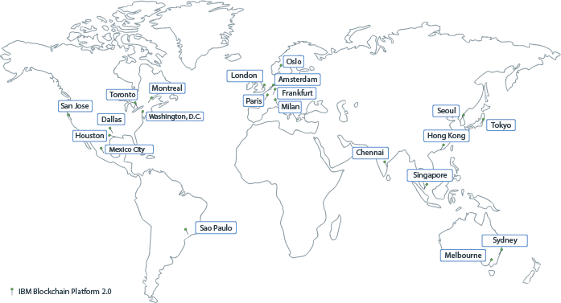

---

copyright:
  years: 2017, 2019
lastupdated: "2019-11-15"

keywords: data centers, IBM Cloud regions, available locations

subcollection: blockchain

---

{:external: target="_blank" .external}
{:shortdesc: .shortdesc}
{:screen: .screen}
{:pre: .pre}
{:note: .note}
{:table: .aria-labeledby="caption"}
{:codeblock: .codeblock}
{:tip: .tip}
{:download: .download}

# {{site.data.keyword.blockchainfull_notm}} Platform locations
{: #ibp-regions-locations}

{{site.data.keyword.cloud}} is hosted worldwide in various locations. Locations are data centers within a geographic area that is accessed by an endpoint. {{site.data.keyword.blockchainfull_notm}} Platform deploys blockchain networks within {{site.data.keyword.cloud_notm}} globally in different locations. When you create {{site.data.keyword.blockchainfull_notm}} Platform service instance in {{site.data.keyword.cloud_notm}}, your blockchain network and network resources are created and stored in the {{site.data.keyword.cloud_notm}} location where you create the service instance in.
{:shortdesc}

Different {{site.data.keyword.blockchainfull_notm}} Platform offerings are available in different {{site.data.keyword.cloud_notm}} locations. You can create blockchain networks in only {{site.data.keyword.cloud_notm}} locations that {{site.data.keyword.blockchainfull_notm}} Platform plans are available.

## {{site.data.keyword.blockchainfull_notm}} Platform for {{site.data.keyword.cloud_notm}}
{: #ibp-regions-locations-ibp}

Table 1 and Figure 1 show the {{site.data.keyword.cloud_notm}} regions and locations that **{{site.data.keyword.blockchainfull_notm}} Platform for {{site.data.keyword.cloud_notm}}** supports.

While the Kubernetes cluster can be provisioned in any of the supported {{site.data.keyword.cloud_notm}} locations below, the third column shows where the console can be provisioned. All nodes provisioned by the console will be deployed in the location of the cluster. For example, if the Kubernetes cluster is located in Toronto and the linked console is in Washington, D.C., when you use the console to deploy a peer, the peer will reside in Toronto.
{: note}

| Region | {{site.data.keyword.cloud_notm}} locations | {{site.data.keyword.blockchainfull_notm}} Platform console location |
|--------|--------------------|----|
| US South | San Jose, Sao Paulo, Dallas, Houston | Dallas |
| US East | Toronto, Montreal, Washington, D.C. | Washington, D.C. |
| AP North | Tokyo, Chennai, Hong Kong, Seoul, Singapore| Tokyo |
| AP South|  Sydney |  Sydney |
| EU Central | Frankfurt, Amsterdam, Milan, Oslo, Paris |  Frankfurt |
{: caption="Table 1. {{site.data.keyword.blockchainfull_notm}} Platform for {{site.data.keyword.cloud_notm}} locations" caption-side="bottom"}

{: caption="Figure 1. {{site.data.keyword.blockchainfull_notm}} Platform for {{site.data.keyword.cloud_notm}} locations" caption-side="bottom"}

See this topic on [{{site.data.keyword.cloud_notm}} Kubernetes cluster locations](/docs/containers?topic=containers-regions-and-zones) for more information about available locations and zone support.

## Starter and Enterprise Plan
{: #ibp-regions-locations-se}

Table 2 and Figure 2 show the {{site.data.keyword.cloud_notm}} regions and locations that **{{site.data.keyword.blockchainfull_notm}} Platform Starter Plan and Enterprise Plan** support.

| Location | Starter Plan | Enterprise Plan |
|--------|----------|----------|
| Dallas | Y | Y |
| London | Y | Y |
| Tokyo |  | Y |
| Frankfurt |  | Y |
| Sydney | Y |  |
| Melbourne |  | Y |
| São Paulo |  | Y |
| Toronto |  | Y |
{: caption="Table 2. Starter Plan and Enterprise Plan locations" caption-side="bottom"}

{: caption="Figure 2. Starter Plan and Enterprise Plan locations" caption-side="bottom"}
