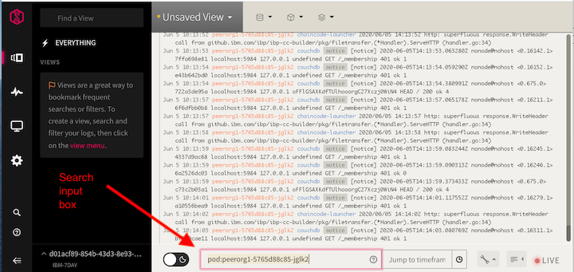
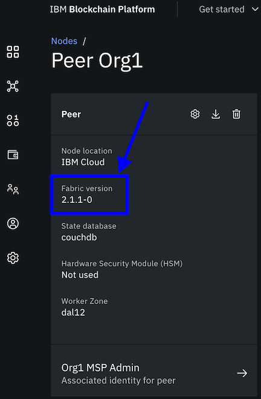
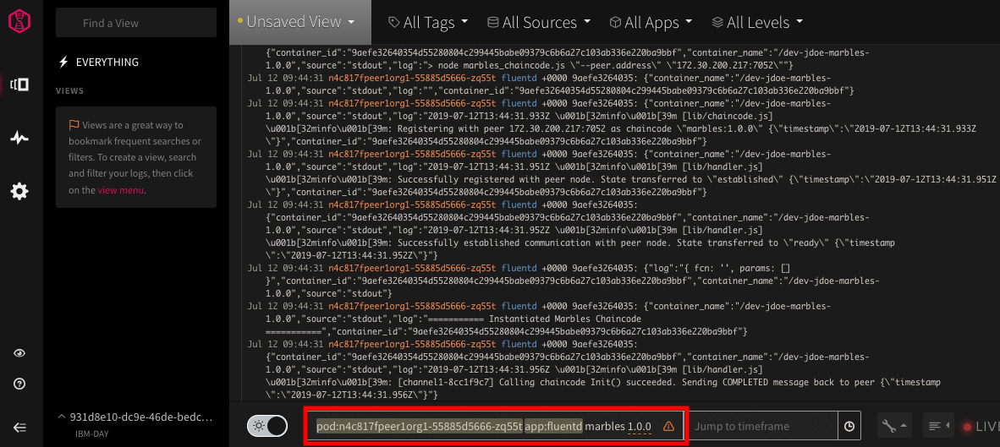

---

copyright:
  years: 2017, 2020
lastupdated: "2019-08-27"

keywords: Log analysis, logDNA, viewing logs, monitoring

subcollection: blockchain

---

{:external: target="_blank" .external}
{:shortdesc: .shortdesc}
{:screen: .screen}
{:pre: .pre}
{:table: .aria-labeledby="caption"}
{:codeblock: .codeblock}
{:note: .note}
{:tip: .tip}
{:download: .download}

# IBM Cloud LogDNA
{: #ibp-LogDNA}
{: help}
{: support}

{{site.data.keyword.cloud_notm}} includes the {{site.data.keyword.la_full_notm}} service which is useful for viewing and parsing the logs of your {{site.data.keyword.blockchainfull}} Platform nodes and smart contract containers.
{: shortdesc}

This tutorial describes how to configure {{site.data.keyword.la_full_notm}} service to work with your {{site.data.keyword.blockchainfull_notm}} Platform service instance. First, you need to configure cluster-level logging for you Kubernetes cluster. Then, you can access the LogDNA dashboard from the **Logging** tab of the **Observability** dashboard in {{site.data.keyword.cloud_notm}}.

## Step one: Configure cluster-level logging
{: #ibp-LogDNA-kubernetes}

You need to deploy an instance of the {{site.data.keyword.la_full_notm}} service in your {{site.data.keyword.cloud_notm}} account. Complete the steps in the [Managing Kubernetes cluster logs with {{site.data.keyword.la_full_notm}}](/docs/Log-Analysis-with-LogDNA?topic=LogDNA-kube){: external} tutorial. If you are using an OpenShift cluster on {{site.data.keyword.cloud_notm}}, when you are ready to you need to configure the LogDNA agent, you can refer to these [instructions](/docs/Log-Analysis-with-LogDNA?topic=LogDNA-config_agent_os_cluster){: external}.

## Step two: View the logs for your {{site.data.keyword.blockchainfull_notm}} Platform nodes
{: #ibp-LogDNA-ibp}

Using the {{site.data.keyword.la_full_notm}} service makes viewing your {{site.data.keyword.blockchainfull_notm}} Platform node logs simple. The search input box located at the bottom of the LogDNA page can be used to filter the logs. See the following examples.

### View node logs
{: #ibp-LogDNA-ibp-nodes}

When you deploy a peer, Certificate Authority (CA), or ordering node,  a new pod is created in your Kubernetes cluster.  You can use the name of the pod to filter the logs by node. For example, to view the logs of a peer node simply add the text `pod:<pod_name_of_peer_node>` to the search input box, replacing `<pod_name_of_peer_node>` with the name of the peer node pod.  The pod name of your node can be obtained by using kubectl commands such as 'kubectl get pod', or it is visible in your Kubernetes dashboard.

```
kubectl get po
```
{: codeblock}

The output looks similar to:
NAME                            READY   STATUS    RESTARTS   AGE
ibp-operator-6558fdc54f-c5zmn   1/1     Running   0          65m
org1ca-74b8f49fb6-z8gvx         1/1     Running   0          60m
peerorg1-5765d88c85-jglk2       4/4     Running   0          25m

In the LogDNA search box, prepend the name of the pod with the text `pod:` such that the resulting search string in the logDNA dashboard resembles:

```
pod:peerorg1-5765d88c85-jglk2
```
{: codeblock}

This same process can be used to view the logs of ordering nodes, peers and CAs. Simply add the pod name of the node to the search bar as shown in the following screenshot:

{: caption="Figure 1.Filtering logs by node" caption-side="bottom"}  

If you are not getting any results, you might need to filter on your namespace for the blockchain nodes to be visible in the Kubernetes dashboard. To find the namespace, open any certificate authority tile in your blockchain console and click the **Info and usage** tab. View the value of the **API URL**. For example: `https://nf85a2a-znorg10524.ibpv2-cluster.us-south.containers.appdomain.cloud:7054`.

The namespace is the first part of the url beginning with the letter `n` and followed by a random string of six alphanumeric characters. So in the example above the value of the namespace is `nf85a2a`.  Then run the kubectl command:
```
kubectl get po -n <NAMESPACE>
```
{: codeblock}
Replace `<NAMESPACE>` with the value of your namespace. For example:
```
kubectl get po -n nf85a2a
```
{: codeblock}
The output looks similar to:
NAME                            READY   STATUS    RESTARTS   AGE
ibp-operator-6558fdc54f-c5zmn   1/1     Running   0          65m
org1ca-74b8f49fb6-z8gvx         1/1     Running   0          60m
peerorg1-5765d88c85-jglk2       4/4     Running   0          25m

In the LogDNA search box, prepend the name of the pod with the text `pod:` and the `namespace`. The resulting search string in the logDNA dashboard would then be:

```
pod:nf85a2apeerorg1-5765d88c85-jglk2
```
{: codeblock}

In this case, `nf85a2apeerorg1-5765d88c85-jglk2` represents the name of the peer pod.

### View smart contract logs
{: #ibp-LogDNA-ibp-smart-contract}

The process to view the logs for a smart contract is similar to how you view your node logs but varies depending on whether your peer is running a Fabric v1.4 or v2.x image. The Fabric version that the peer is running is visible when you click on a peer node in the console:

  {: caption="Figure 2.How to find peer fabric version" caption-side="bottom"}


####  Hyperledger Fabric v1.4 peer image  
{: #ibp-LogDNA-ibp-smart-contract-14}

When your peer is using the Hyperledger Fabric v1.4 image, additional strings are required in the search input box.
- Just like when you view node logs, you filter on the pod name, but it needs to be the name of the peer pod where the smart contract is running.
- Smart contracts run in a `dind` container in the pod, but the logs are forwarded to the `chaincode-logs` container which is of type `fluentd`. Therefore, to filter the logs to only include the smart contract events, you need to include `app:fluentd` in the search input box.
- Finally, you can append the name and optionally the version of the smart contract, `marbles 1.0.0`.

The full search string, including the namespace, would be similar to the following example:

```
pod:n4c817fpeer1org1-55885d5666-zq55t app:fluentd marbles 1.0.0
```
{: codeblock}

{: caption="Figure 3.Filtering logs by smart contract" caption-side="bottom"}

####  Hyperledger Fabric v2.x peer image  
{: #ibp-LogDNA-ibp-smart-contract-2x}

In order to filter on the smart contract logs, you need to provide the name of the pod where the smart contract is running. Complete the following steps to get the name of the smart contract pod:

**Find your cluster namespace**  

If you don't already know it, you need to find your Kubernetes cluster namespace.  From the console, open any CA node and click the **Info and Usage** icon. View the value of the **API URL**. For example: `https://n2734d0-soorg10524.ibpv2-cluster.us-south.containers.appdomain.cloud:7054`. The namespace is the first part of the url beginning with the letter `n` and followed by a random string of six alphanumeric characters. So in the example, the value of the namespace is `n2734d0`.

**Find the smart contract pod**  

Next, use kubectl commands to get a list of all of the chaincode pods running in your cluster:

```
kubectl get po -n <NAMESPACE> | grep chaincode-execution | cut -d" " -f1 | xargs -I {} kubectl get po {} -n <NAMESPACE> --show-labels
```
{:codeblock}
Replacing `<NAMESPACE>` with the name of your cluster namespace.

You should see results similar to:
```
NAME                                                       READY   STATUS            RESTARTS   AGE   LABELS
chaincode-execution-0a8fb504-78e2-4d50-a614-e95fb7e7c8f4   1/1     Running   0          14s   chaincode-id=myjavacc-1.1,peer-id=org1peer1
NAME                                                       READY   STATUS    RESTARTS   AGE   LABELS
chaincode-execution-f3cc736f-94ef-454d-8da3-362a50c653d9   1/1     Running   0          4m    chaincode-id=mynodecc-1.1,peer-id=org1peer1
```
Find your smart contract pod by examining the associated `chaincode-id` that contains the smart contract name and version.

Then in LogDNA, to view the logs for the `myjavacc` version 1.1 smart contract, you can enter the pod name in the search bar as follows:
```
pod:<SMART_CONTACT_POD>
```
{: codeblock}

For example:
```
pod:chaincode-execution-0a8fb504-78e2-4d50-a614-e95fb7e7c8f4
```

## Summary
{: #ibp-LogDNA-summary}

Congratulations. In this tutorial you learned how easy it is to use LogDNA to view the logs for your blockchain nodes and smart contracts. To learn more about monitoring your network, check out the tutorial on using [{{site.data.keyword.mon_full_notm}}](/docs/blockchain?topic=blockchain-ibp-sysdig) with your blockchain network.
