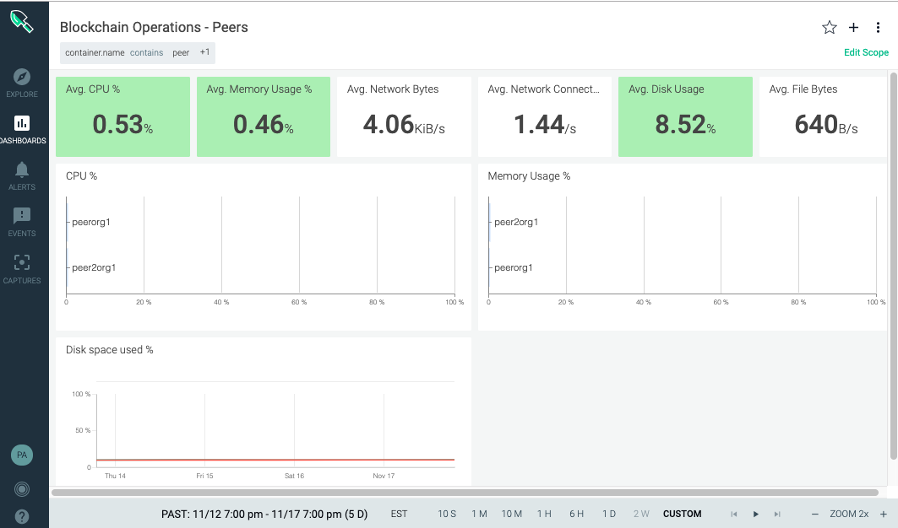
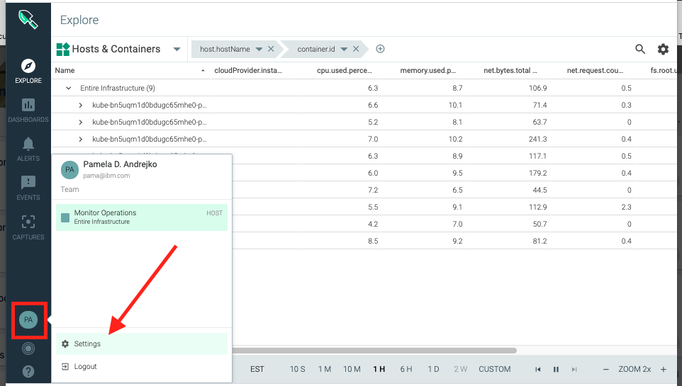
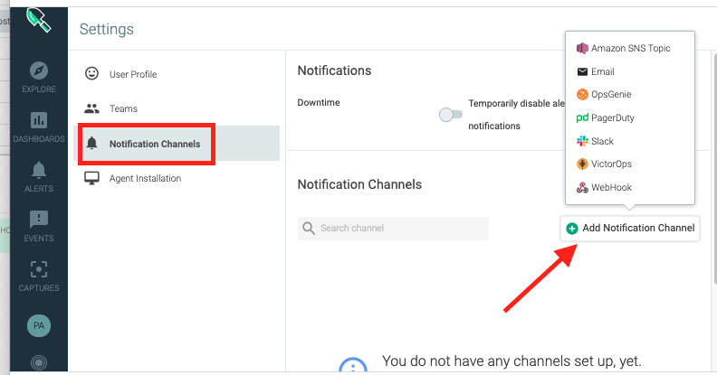
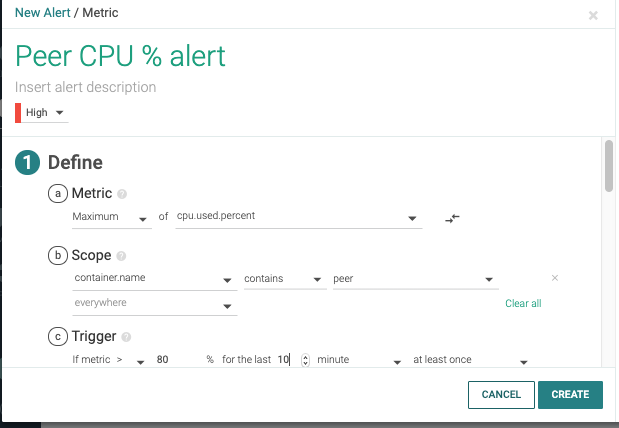

---

copyright:
  years: 2019, 2020
lastupdated: "2020-01-14"

keywords:  sysdig, monitoring, resource consumption, resource allocation, disk space, memory usage, disk usage  

subcollection: blockchain

---

{:external: target="_blank" .external}
{:shortdesc: .shortdesc}
{:screen: .screen}
{:pre: .pre}
{:table: .aria-labeledby="caption"}
{:codeblock: .codeblock}
{:note: .note}
{:tip: .tip}
{:download: .download}

# {{site.data.keyword.mon_full_notm}}
{: #ibp-sysdig}

{{site.data.keyword.cloud_notm}} includes the {{site.data.keyword.mon_full}} service which is useful for monitoring your {{site.data.keyword.blockchainfull_notm}} Platform peer, orderer, and certificate authority (CA) nodes, and smart contract containers.
{: shortdesc}

The tutorial provides a set of instructions for getting started with using the {{site.data.keyword.mon_full_notm}} to monitor the resource usage of peer, CA, and ordering service nodes. These instructions include how to configure the {{site.data.keyword.mon_full_notm}} service to monitor your existing {{site.data.keyword.blockchainfull_notm}} Platform service instance and starts with creating an instance of Sysdig in {{site.data.keyword.cloud_notm}}.  Then, you can configure the Sysdig dashboard to monitor your blockchain components. To learn more about the Sysdig service and what it offers, see the [{{site.data.keyword.mon_full_notm}}](/docs/services/Monitoring-with-Sysdig?topic=Sysdig-about){: external} documentation.

Monitoring the resource allocation for your blockchain nodes is a key part of operating a blockchain network. You are responsible for monitoring your resource usage and taking steps to address resource contention. The  {{site.data.keyword.mon_full_notm}} is a useful tool for monitoring your network, but you can use any tool you prefer.
{: important}

This tutorial uses the Free 30-day Trial version of the service, but more advanced features are available in the **Graduated tier** which you can explore if your requirements merit.

The {{site.data.keyword.mon_full_notm}} service is currently only available in a subset of [regions](/docs/services/Monitoring-with-Sysdig?topic=Sysdig-endpoints#endpoints_regions).  It is recommended that the Sysdig monitoring instance reside in the same region as your {{site.data.keyword.blockchainfull_notm}} Platform instance.
{: note}

## Before you begin
{: #ibp-sysdig-before}

You should already have an {{site.data.keyword.blockchainfull_notm}} Platform service instance deployed and configured with peers, CAs, and ordering service nodes running and ready for monitoring before you attempt this tutorial.  

## Step one: Provision an instance of the {{site.data.keyword.mon_full_notm}} service
{: #ibp-sysdig-provision}

Deploy an instance of the {{site.data.keyword.mon_full_notm}} service in your {{site.data.keyword.cloud_notm}} account. Complete the steps in the [Sysdig Getting started tutorial](/docs/services/Monitoring-with-Sysdig?topic=Sysdig-getting-started){: external} tutorial.

After you provision the Sysdig service, if you click **Edit sources** in the **Monitoring** tab, a curl command is provided to easily configure monitoring of your Kubernetes cluster. Simply login to your Kubernetes cluster from the CLI and run the curl command to configure the Sysdig service for your cluster. In **Step two** below, your Sysdig instance should be ready to go. If the curl command fails, ensure that your kubectl version is 1.14 or higher.
{: tip}

## Step two: Configure the {{site.data.keyword.mon_full_notm}} dashboard for monitoring your {{site.data.keyword.blockchainfull_notm}} Platform nodes
{: #ibp-sysdig-configure}

After you have provisioned the Sysdig service, click **View Sysdig** from the Monitoring tab of the Observability dashboard in {{site.data.keyword.cloud_notm}}.
1. On the **Welcome to Sysdig Monitor** panel click **Next**.
2. Choose **Kubernetes | GKE | OpenShift** as the installation method.
3. If you have not already configured the instance, you can do so now by following the instructions. Otherwise after the service is provisioned and you can click **Go to next step!** then  **Let’s get started** to launch the Sysdig dashboard.

## Step three: Create a new dashboard
{: #ibp-sysdig-configure-db}

A good place to start monitoring your {{site.data.keyword.blockchainfull_notm}} Platform is the **Dashboards** tab where you can copy and tailor default dashboards according to your monitoring requirements. A dashboard shows groups of metrics that report on the health, performance, and state of your infrastructure, applications, and services for a single host or a group of hosts. Dashboards offer a specialized insight into network data, application data, topology, services, hosts, and containers. Use dashboards to monitor your infrastructure, applications, and services.

The following sets of instructions are based on the default dashboard named **Overview by Container** that provides a good set of widgets for getting started monitoring the resource allocation of your nodes. Each dashboard includes a set of preconfigured panels.  We can copy the dashboard and then customize the panels for the node type that we want to monitor.

### Copy the **Overview by Container**  dashboard
{: #ibp-sysdig-configure-create-new-db}
1. Click the **Dashboards** tab in the {{site.data.keyword.mon_full_notm}} web UI.
2. Under the **My Dashboards** twistie, click **Overview by Container**.
3. In the top right corner of the panel, click **Options** , then **Copy Dashboard**.
4. Give the Dashboard a name, **Blockchain Operations - Peers** and click **Copy and Open**.
5. Now we need to filter the data on the page to only include the peer containers. In the top right corner, click **Edit Scope**.
6. Click the **Everywhere** drop down list and specify the filter  `container.name contains peer`.
7. (Optional) If your {{site.data.keyword.cloud_notm}} account includes multiple Kubernetes clusters, you should also filter by cluster. Add an additional cluster filter, by selecting **agent.tag.cluster** `in` and then select your cluster name. Click **Save**.

Next, we will segment the data in the panels by peer containers.

### Configure panels to view CPU and Memory usage
{: #ibp-sysdig-configure-edit-CPU-and-mem}

Now the data on the dashboard is filtered to only show data from the peers in your cluster. Let's drill in a little deeper to see the resource usage by peer container.

1. Click the **CPU %** chart and then click the pencil **Edit Panel** icon. In this panel you can tailor the graph type and even change the metric. But we just want to see the data broken out by peer container, assuming you have more than one peer in your cluster.
2. In the **Segment by** drop down list, select the `kubernetes.deployment.label.name` which is the segmentation choice that causes the chart data to be broken down by each peer container in your cluster. Click **Save**.
3. Repeat this process for the **Memory Usage %** panel. Now you can monitor the CPU and Memory used by each peer container.

At this point you can edit the panels and play with the different chart types to see different representations of the data.

### Configure panels to view disk usage
{: #ibp-sysdig-configure-edit-disk}

Storage usage is also interesting to monitor but is not part of the default dashboard panel set. We need to add a new panel to dashboard to monitor disk usage.

1. Click the `+` sign above the **Edit Scope** button in the top right corner.
2. Give this new panel a title, **Disk space used %**.
3. Select `fs.used.percent` from the **Metrics** drop-down list.
4. In the **Segment by** drop down list, select `kubernetes.deployment.label.name` and click **Save**.
5. Hover your mouse over the data in the generated graph and a pop-up window is displayed that shows the average disk space percentage used by each peer container.

At this point you have configured panels to display the percentage of CPU used by each peer container, the percentage of memory used by each peer container, and the percentage of disk space used by each peer container. You can drag the panels up and down on the dashboard, and delete any panels that are not interesting to you.

{: caption="Figure 1. Peer dashboard in Sysdig" caption-side="bottom"}

### Create dashboards for the CA and ordering nodes
{: #ibp-sysdig-configure-ca-os}

When you are satisfied with your peer dashboard, you can simply replicate it, using the **Copy Dashboard** menu item on the Options menu. Give the dashboard a new name, for example **Blockchain Operations - CAs** or **Blockchain Operations - Ordering nodes**. Then, edit the scope of the new dashboard to be either `container.name contains ca` or `container.name contains orderer` respectively.

## Step four: Configure alerts to monitor resource usage
{: #ibp-sysdig-configure-alerts}

Now that you have configured monitoring of your peer, CA, and ordering nodes, the final important step is to configure alerts in Sysdig so that a notification is triggered when a specified condition is met. You can trigger an alert notification via email, slack, PagerDuty, Webhooks, OpsGenie, and VictorOps channels.
First configure the notification channel and then define the alert triggers.

1. Configure your preferred notification channel by clicking on your user icon followed by **Settings**.

   {: caption="Figure 2. Sysdig settings panel" caption-side="bottom"}

   When you subsequently click **Notification Channels** > **Add Notification Channel** you are able to select how you want to be notified when an alert is triggered.

   {: caption="Figure 3. Sysdig notifications" caption-side="bottom"}

   For more information about configuring notifications, see [Working with notification channels](/docs/Monitoring-with-Sysdig?topic=Sysdig-notifications#notifications).

2. If you return to one of the dashboards that you created, you can click on the action menu in the upper right corner for any panel, and then click **Create Alert** from the drop-down menu.

   {: caption="Figure 4. Sysdig alerts" caption-side="bottom"}

   After you configure the alert based on your custom triggers, scroll down to associate the notification channel that you configured above and select your notification preferences. Optionally, you can also enable Sysdig capture which generates a trace file that you can use to analyze what happens in a host during a selected time frame.

   For more information about the various options when configuring alerts in Sysdig see [Working with alerts](https://sysdigdocs.atlassian.net/wiki/spaces/Monitor/pages/205324292/Alerts){: external}.

As a general guideline, the {{site.data.keyword.blockchainfull_notm}} Platform recommends that you configure alerts for when your node CPU, memory and storage usage exceeds 80% so that you can take appropriate action and adjust the alert settings according to your notification preferences.
{: tip}

## Summary
{: #ibp-sysdig-summary}

This tutorial has provided some basic steps for getting started using Sysdig to monitor your blockchain node resource allocation. You now have three dashboards that you can use to monitor the resource allocation of your peer, CA, and ordering nodes in your Kubernetes cluster. With a graduated tier purchase of the  {{site.data.keyword.mon_full_notm}} service, you can edit your charts and add more segmentations to further scope the data. You've also configured alerts for when nodes approach exceeding their allocated resources. Combined, these actions allow you to monitor your blockchain nodes, alerting you when resources are constrained, so that you can take the appropriate action to scale your network.

