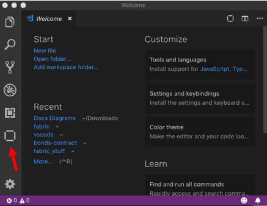
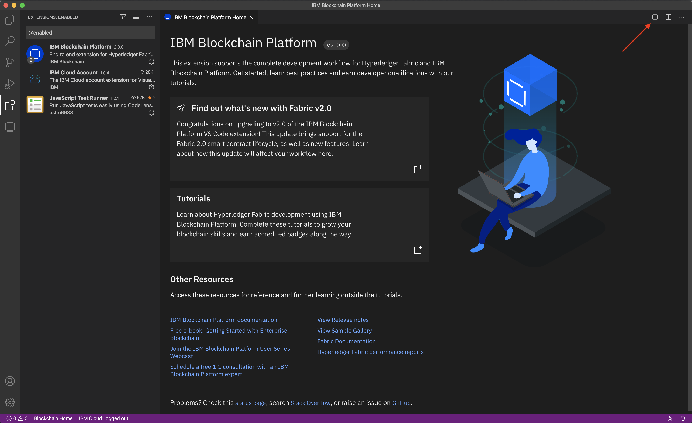

---

copyright:
  years: 2017, 2019
lastupdated: "2019-09-24"

keywords: vs code extension, Visual Studio Code extension, smart contract, development tools

subcollection: blockchain

---

{:shortdesc: .shortdesc}
{:codeblock: .codeblock}
{:screen: .screen}
{:note: .note}
{:important: .important}
{:tip: .tip}
{:pre: .pre}
{:external: target="_blank" .external}

# Developing smart contracts with Visual Studio Code extension
{: #develop-vscode}

The {{site.data.keyword.blockchainfull}} Platform Visual Studio (VS) Code extension provides an environment within Visual Studio Code for developing, packaging, and testing smart contracts. You can use the extension to create your smart contract project and get started developing your business logic. You can then use VS Code to test your smart contract on your local machine by using a preconfigured instance of Hyperledger Fabric before you deploy the smart contract to the {{site.data.keyword.blockchainfull_notm}} Platform. This tutorial describes how to use the VS Code extension.

{: caption="Figure 1. Typical smart contract development workflow with {{site.data.keyword.blockchainfull_notm}} Platform VS Code extension" caption-side="bottom"}  


The {{site.data.keyword.blockchainfull_notm}} Platform extension works seamlessly with any instance of the {{site.data.keyword.blockchainfull_notm}} Platform that uses Hyperledger Fabric versions 1.4 and later.
{: note}

## Step one: Install {{site.data.keyword.blockchainfull_notm}} Platform VS Code extension for free
{: #develop-vscode-install}

Before you install the {{site.data.keyword.blockchainfull_notm}} Platform VS Code extension, you must complete the prerequisites.

### Prerequisites
{: #develop-vscode-prerequisites}

- Windows 10, Linux, or Mac OS are currently the supported operating systems.
- [VS Code version 1.32 or greater](https://code.visualstudio.com/){: external}.
- [Docker version v17.06.2-ce or greater](https://www.docker.com/get-started){: external}.
- [Docker Compose v1.14.0 or greater](https://docs.docker.com/compose/install/){: external}.
- If you are developing Go smart contracts, you will need to install [Go version v1.12 or greater](https://golang.org/dl/){: external}.
- If you are developing Node smart contracts, you will need to install [Node v8.x or v10.x and npm v6.x or greater](https://nodejs.org/en/download/){: external}.
- If you are developing Java smart contracts, you will need to install [Java JDK v8](https://adoptopenjdk.net/?variant=openjdk8){: external}.

If you are using Windows, you also must ensure the following:

- Docker for Windows is configured to use Linux containers (this is the default).
- You have installed the C++ Build Tools for Windows from [windows-build-tools](https://github.com/felixrieseberg/windows-build-tools#windows-build-tools){: external}.
- You have installed OpenSSL v1.0.2 from [Win32 OpenSSL](http://slproweb.com/products/Win32OpenSSL.html){: external}.
  - Install the normal version, not the version marked as "light".
  - Install the Win32 version into C:\OpenSSL-Win32 on 32-bit systems.
  - Install the Win64 version into C:\OpenSSL-Win64 on 64-bit systems.

**If installing Node and npm using a manager such as 'nvm' or 'nodenv', you will need to set the default/global version and restart VS Code for the version to be detected by the Prerequisites page.**

### Install the extension
{: #develop-vscode-installing-the-extension}

1. Navigate to the [Visual Studio Code extension marketplace page](https://marketplace.visualstudio.com/items?itemName=IBMBlockchain.ibm-blockchain-platform){: external} or search for **{{site.data.keyword.blockchainfull_notm}} Platform** in the extensions panel within Visual Studio Code.
2. Click **Install**.
3. Restart Visual Studio Code to complete installation of the extension.

After the installation, you can use the {{site.data.keyword.blockchainfull_notm}} icon on the left side of VS Code to open the {{site.data.keyword.blockchainfull_notm}} Platform panel.

{: caption="Figure 2. {{site.data.keyword.blockchainfull_notm}} icon in VS Code" caption-side="bottom"}

The extension also adds new commands to the Visual Studio Code command palette. You can use the command palette to complete many of the operations that are explained in details in this guide.

### Guided tutorials in VS Code
{: #develop-vscode-guided-tutorials}

The {{site.data.keyword.blockchainfull_notm}} Platform extension provides guided tutorials within VS Code to help you get started. The tutorials provide step by step instructions on how to develop and test your smart contract project, as well has how to deploy the smart contract to a network on {{site.data.keyword.cloud_notm}}. You also can find sample smart contracts that are available for you to download.

To navigate to the to the tutorials from within VS Code, open the extensions tab and click on the {{site.data.keyword.blockchainfull_notm}} Platform extension under **Enabled**. Then click on the {{site.data.keyword.blockchainfull_notm}} Platform icon at the upper right hand corner to view the extension homepage. On the homepage you can find a link to the tutorials gallery and the sample smart contracts.

{: caption="Figure 3. Click on the {{site.data.keyword.blockchainfull_notm}} icon in the upper right hand corner to navigate to the tutorials and sample code" caption-side="bottom"}

## Step two: Create a smart contract project
{: #develop-vscode-creating-a-project}

You can use the extension to create a new smart contract project in Visual Studio Code. The extension creates a basic smart contract that manages an example asset in the language of your choice. You can use the structure of example as a starting point for developing your own business logic. The extension provides all the dependencies that are required to deploy your smart contract to an instance of Hyperledger Fabric.

1. Click the **{{site.data.keyword.blockchainfull_notm}}** icon to open the **{{site.data.keyword.blockchainfull_notm}}** tab. Click the overflow menu in the smart contracts pane and click **Create New Project**.
2. Select the language that you want to create a smart contract in. The current options are JavaScript, TypeScript, Go, and Java. **Note:** VSCode allows you to create and test Java smart contracts locally, but you cannot deploy Java smart contracts to {{site.data.keyword.blockchainfull_notm}} Platform networks. If you are deploying the smart contracts to a production network, JavaScript and TypeScript smart contracts require more resources than contracts written in Go.
3. **If you selected JavaScript, TypeScript, or Java**, select an asset to be managed by the example contract. For example, ***bond***.
4. Create a folder with the name of your project and open it.
5. Select how to open your new project. The project folder should now open.

When the project opens, you can find the new smart contract in the explorer window in the left pane. The structure of the project depends on the language that you selected. However, each smart contract contains the same elements:
- The source code of the smart contract. If you selected to create a Javascipt or TypeScript contract, the extension builds a basic smart contract by using the `fabric-contract-api` with a series of functions that manage your example asset. For example, if you selected ***bond***, you will find the functions of `createBond`, `updateBond`, `readBond`, `bondExists`, and `deleteBond`.
- A test file.
- The accompanying smart contract dependencies.

## Step three: Package a smart contract
{: #packaging-a-smart-contract}

You need to package a smart contract in `.cds` format before you can install it on your {{site.data.keyword.blockchainfull_notm}} Platform network or the preconfigured Hyperledger Fabric network. Complete the following steps to package your smart contract:

1. Open your smart contract project in VSCode by clicking **File** and then **Open ...**. You can also click **Open Workspace** if you saved your project as a workspace. Ensure that you have the smart contract project open in the file viewer.
2. Click the **{{site.data.keyword.blockchainfull_notm}}** icon to open the **{{site.data.keyword.blockchainfull_notm}}** tab.
3. In the **Smart Contracts** pane, click the overflow menu and select **Package Open Project**. You will be asked for the name of the package as well as the version.
  - If you have one smart contract project, it will be packaged automatically and be displayed in the **Smart Contracts** pane.
  - If you have multiple smart contract folders open, you will be asked which one to package.
  - If you have no smart contract folders open, you'll get an error message.

### Exporting, importing, and deleting a smart contract package
{: #develop-vscode-exporting-deleting-smart-contract-package}

After you package a smart contract project, you can export it from VS Code:

1. In the {{site.data.keyword.blockchainfull_notm}} Platform extension panel, right-click the smart contract package and select **Export Package**.
2. Choose the directory to save your smart contract package file and click **Export**.

You can also import an existing smart contract package into the {{site.data.keyword.blockchainfull_notm}} Platform pane:

1. In the **Smart Contracts** pane, click the overflow menu and select **Import a Package**.
2. Browse to the smart contract package that you want to import, and click **Import**.

You can also click **Delete Package** to remove the smart contract package from the list of packages.

## Step four: Deploy a smart contract to a preconfigured Hyperledger Fabric network
{: #develop-vscode-deploy}

You can use the VS Code to deploy your smart contract to a preconfigured Hyperledger Fabric network that the extension creates on your local machine. This allows you to install, instantiate, and test your smart contract before you deploy it to a live network.

### Deploying the preconfigured Hyperledger Fabric network
{: #develop-vscode-connecting-and-disconnecting}

Use the following steps to deploy the preconfigured network:

1. Ensure that Docker is running on your machine.
2. Open the **{{site.data.keyword.blockchainfull_notm}} Platform** tab in VS Code.
3. In the **Local Fabric Ops** pane, click **local fabric runtime**. If Docker is running, the local Hyperledger Fabric instance should be downloaded and started.
4. Double-click **local_fabric** in the **Fabric Gateways** pane to connect to the local network. By default, the connection uses the admin identity in the Fabric wallets pane. You can create a new identity by right-clicking the certificate authority node in the **Local Fabric Ops** pane. This new identity can then be added to a wallet and be associated with **local_fabric** connection.

The VS Code extension creates a basic Fabric network that includes one orderer, one peer, and one certificate authority. The peer is joined to a channel named `mychannel`. You can find the list of nodes, organizations, and channels that belong to the network in the **Local Fabric Ops** pane. Above these nodes, you can find the list of smart contracts that have been installed and instantiated.

### Stopping, restarting, and removing the preconfigured network
{: #develop-vscode-stop-Fabric-runtime}

You can stop or restart the preconfigured network after it has been created:

1. In the **Local Fabric Ops** pane, click the overflow menu.
2. Select **Restart Fabric Runtime** or **Stop Fabric Runtime** to stop or restart the container.

The connection details are saved to a directory called **local_fabric** that is contained in your current project directory. You can also select **Teardown Fabric Runtime** to completely remove the local Fabric network. **Note:** This removal will result in the loss of the ledger and world state data.

### Deploying your smart contract to the preconfigured network
{: #develop-vscode-deploy-smart-contract}

You can deploy any packages in the **Smart Contracts** pane to a running preconfigured network.

First, you need to install the smart contract on a peer:

1. In the **Local Fabric Ops** pane, click **Install Smart Contract**.
2. Select the peer that you want to install the smart contract on.
3. Select the smart contract package that you want to install, and click **Install**.

Next, you can instantiate the smart contract on a channel:

1. In the **Local Fabric Ops** pane, click **Instantiate Smart Contract**.
2. Select the installed smart contract to instantiate.
3. (Optional) Enter the name of the instantiate function in your smart contract. If you used the default smart contract template, no instantiate function is used.
4. (Optional) Enter any arguments that your instantiate function requires.
5. (Optional) Browse to your collection configuration file if your smart contract uses private data.
6. Click **Instantiate**.

If you make any changes to your smart contract code and repackage it, you can upgrade the instantiated smart contract to deploy a newer version to the network:

1. Ensure that the smart contract that you want to upgrade has been instantiated.
2. Install the new version of the smart contract to a peer on the same network.
3. Right-click the instantiated smart contract, and select **Upgrade Smart Contract**.
4. (Optional) Run a transaction after the new smart contract is instantiated.

### Interacting with your smart contract
{: #develop-vscode-submitting-transactions}

After a smart contract is installed and instantiated, you can submit transactions to the functions inside your smart contract by using the **Fabric Gateways** pane:

1. Ensure that your smart contract has installed and instantiated, and that you are connected to the network.
2. In the **Fabric Gateways** pane, expand the **Instantiated Smart Contracts**.
3. Expand the smart contract that you want to interact with. You will find the list of transactions that are listed beneath your smart contract.
4. Right-click the transaction to submit, and select **Submit Transaction**. For example, if you created and packaged the example bonds smart contract, click **createBond**.
5. Enter any arguments that the transaction requires, and press **Enter**. For example, enter `["bond01","100"]` to create your first bond.

### Connecting your applications to the preconfigured network
{: #develop-vscode-exploring-connection-details}

You can test your client applications by connecting them to the preconfigured network and submitting transactions to your smart contract.

First, you need to export your connection profile:

1. Start the network and expand **Nodes** in the **Local Fabric Ops** pane.
2. Right-click the peer and select **Export Connection Profile**.

You can then use the Fabric SDKs and the connection profile to enroll your admin identity by using the username `admin` and the password `adminpw`. You can then use this identity to invoke your smart contract or register and enroll additional users.

## Step five: Debug a smart contract
{: #develop-vscode-development-mode}

You can use the **Debug** view to iteratively develop and debug your smart contracts locally, without having to repackage and upgrade the smart contract after every change. Debugging a smart contract allows you to run through the smart contract transactions with breakpoints and output, ensuring the transactions work as intended.

You will need to install some prerequisites depending on which language you are using:
- If you are developing Go smart contracts, install the [Go extension](https://marketplace.visualstudio.com/items?itemName=ms-vscode.Go).
- If you are developing Java smart contracts, install the [Language Support for Java extension](https://marketplace.visualstudio.com/items?itemName=redhat.java) and the [Debugger for Java extension](https://marketplace.visualstudio.com/items?itemName=vscjava.vscode-java-debug)

If you are debugging a Node (JavaScript or TypeScript) chaincode written using the low-level programming model, you must add the `program` attribute to your launch configuration in launch.json and provide the path to the file calling `Shim.start`. For example:
```
{
    "type": "fabric:node",
    "request": "launch",
    "name": "Debug Smart Contract",
    "program": "${workspaceFolder}/dist/start.js"
}

```
where `start.js` contains the line `Shim.start(new Chaincode());`.
{: note}

Use the following steps to debug your smart contract:

1. Ensure that you are connected to the **local_fabric** network.
2. Open your smart contract project in your workspace.
3. Open the **Debug** view in VS Code from the left-hand navigation bar.
4. Select **Debug Smart Contract configuration** from the drop-down list in the upper left.
5. Clicking the **play** button. The extension will automatically package, install, and instantiate or upgrade the smart contract on the local network.

  If you want to debug the instantiate function in your  smart contract, edit the launch configuration using the example below.
  ```
    "env": {
        "CORE_CHAINCODE_ID_NAME": <name>:<version>
      }    
  ```
  `name` is the name of your smart contract. `version` needs to be a different value to the previous version used. Alternatively if you are using JavaScript or TypeScript then you can update the `version` in the package.json file.

6. Add breakpoints to the smart contract by clicking the relevant line numbers in your smart contract files.
7. On the debug toolbar, click the **Blockchain** button to instantiate the smart contract.
8. On the debug toolbar, click the **Blockchain** button to submit or evaluate transactions. You also can right click on transactions in the `Fabric Gateways` panel to submit or evaluate them. Execution will be paused on any breakpoints you've defined.

To modify your smart contract while debugging, click the **restart** button after you make changes to your smart contract. Restarting debugging means you don't need to instantiate the contract again.


## Step six: Test an instantiated smart contract
{: #develop-vscode-testing-instantiated-smart-contract}

You can generate tests for smart contracts that are instantiated on the networks that you connect to. The tests can be generated as either **JavaScript** or **TypeScript**, and run or debugged. **Note** You cannot yet generate tests for **Java** smart contracts.

1. Ensure that the smart contract has been instantiated.
2. In the **Fabric Gateways** pane, right-click the smart contract under the list of channels to generate tests for.
3. Select **Generate Smart Contract Tests**.
4. Select the language for the test file, either **JavaScript** or **TypeScript**. The {{site.data.keyword.blockchainfull_notm}} Platform extension will install required npm modules and build the test file.

After the test file is built, the tests can be run by clicking the **Run Tests** button in the file.

## Step seven: Connect to your {{site.data.keyword.blockchainfull_notm}} Platform network
{: #develop-vscode-connecting-ibp}

You can also use the extension to connect to your {{site.data.keyword.blockchainfull_notm}} Platform network and invoke any smart contracts that are installed and instantiated by using the {{site.data.keyword.blockchainfull_notm}} Platform console UI.

Open the {{site.data.keyword.blockchainfull_notm}} Platform console that is associated with your instance of the {{site.data.keyword.blockchainfull_notm}} Platform. Navigate to the **Smart Contracts** tab. Use the **Instantiated Smart Contracts** table on the smart contracts tab to download your [connection profile](/docs/services/blockchain/howto?topic=blockchain-ibp-console-app#ibp-console-app-profile) to your local file system. Then, [create an application identity](/docs/services/blockchain/howto?topic=blockchain-ibp-console-app#ibp-console-app-identities) by using your CA and save the enrollID and secret. Follow the steps below to connect to the {{site.data.keyword.blockchainfull_notm}} Platform from VS Code.

1. Open the **{{site.data.keyword.blockchainfull_notm}} Platform** tab.
2. Hover your mouse over the **Fabric Gateways** pane and click **+**.
3. Enter a name for the connection.
4. Enter the fully qualified file path of your connection profile. Your connection should now appear in the connections list underneath **local_fabric**.
5. Hover your mouse over the **Fabric Wallets** pane and click **+**.
6. Choose **Create a new wallet and add an identity** from the options. Provide a name for your wallet and your identity.
7. Enter the MSP ID of your organization.
8. Select the **Select a gateway and provide an enrollment ID and secret** option and choose the gateway that you created above.
9. Enter the enrollID and secret of the application identity that you created with the console. A new identity will be created in the **Fabric Wallets** pane.
10. You can now connect to your instance of your {{site.data.keyword.blockchainfull_notm}} Platform network. Double-click the connection name and select the name of the wallet that you just created. You can also associate the wallet that you created with the gateway by right-clicking the gateway and selecting **Associate A Wallet**. This allows the connection to use the same wallet each time when it connects.

After you connect to the {{site.data.keyword.blockchainfull_notm}} Platform from VS Code, you can see the list of channels that your organization peers have joined under the gateway. Under each channel, you can see the list of smart contracts that are instantiated on each channel and the functions within each smart contract. You can submit transactions to your network by right-clicking a function and selecting **Submit Transaction** and passing the required arguments. You can also generate a test file for the smart contracts that are instantiated on your channels.

### Adding wallets and users
{: #develop-vscode-add-a-wallet}

Use the steps below to create a new wallet by using a certificate and private key:

1. Hover your mouse over the **Fabric Wallets** pane and click **+**.
2. Choose to **Create a new wallet and add an identity** from the options. Provide a name for your wallet and your identity.
3. Enter the MSP ID of your organization.
4. Choose to add a certificate and private key.
5. If you use a certificate and private key, browse to the certificate and private key.

You can also add new users to the wallets that have already been created:

1. In the **Fabric Wallets** pane, right-click a wallet and select **Add Identity**.
2. Provide a name for the identity and an MSPID.
3. You can chose either to upload a JSON file, provide a certificate and private key, or an enrollment id and secret.
  - If you are connecting to a network on the {{site.data.keyword.blockchainfull_notm}} Platform, you can download an identity from your {{site.data.keyword.blockchainfull_notm}} console, either by exporting an identity from your wallet or by enrolling and then exporting an identity using your Certificate Authority. You can then upload the JSON file directly to VS Code.
  - If you use a certificate and private key, browse to the certificate and private key.
  - If you use an enrollment ID and secret, choose the gateway to enroll with and enter the enrollment ID and secret.

### Editing, disconnecting, and deleting connections
{: #develop-vscode-editing-connection}

From the extension, right-click a connection in the lower left to open a contextual menu with the options to add an identity, edit the connection, or delete the connection.

To edit a connection, complete the following steps:
1. Select **Edit connection** option. The **User Settings** page opens with the connection details highlighted.
2. Make any changes that you need and save the settings page.

When you are ready to disconnect from the network, click the **Disconnect** icon in the upper right of the **Fabric Gateways** pane.

To delete a connection, right-click the connection and select **Delete Gateway**.

