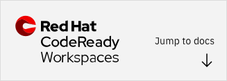

---

copyright:
  years: 2019, 2020
lastupdated: "2020-10-16"

keywords: vs code extension, Visual Studio Code extension, smart contract, development tools

subcollection: blockchain

---

{:shortdesc: .shortdesc}
{:codeblock: .codeblock}
{:screen: .screen}
{:note: .note}
{:term: .term}
{:important: .important}
{:tip: .tip}
{:pre: .pre}
{:external: target="_blank" .external}


# Developing smart contracts with {{site.data.keyword.blockchainfull_notm}} Platform Developer Tools
{: #develop-vscode}


The {{site.data.keyword.blockchainfull}} Platform Developer Tools provide an environment within Visual Studio Code or Red Hat CodeReady Workspaces for developing, packaging, and testing smart contracts. You can use the tools to create your smart contract project and get started developing your business logic. You can then use the tools to test your smart contract either on your local machine by using a preconfigured instance of Hyperledger Fabric, or by connecting to an {{site.data.keyword.blockchainfull_notm}} Platform network, before you deploy the smart contract to the {{site.data.keyword.blockchainfull_notm}} Platform. This tutorial describes how to install and use the Developer Tools.


The {{site.data.keyword.blockchainfull}} Platform Developer Tools provide an environment within Visual Studio Code or Red Hat CodeReady Workspaces for developing, packaging, and testing smart contracts. You can use the tools to create your smart contract project and get started developing your business logic. You can then use the tools to test your smart contract either on your local machine by using a preconfigured instance of Hyperledger Fabric, or by connecting to an {{site.data.keyword.blockchainfull_notm}} Platform network, before you deploy the smart contract to the {{site.data.keyword.blockchainfull_notm}} Platform. This tutorial describes how to install and use the Developer Tools. 


<map name="home_map1" id="home_map1">
<area href="/docs/blockchain?topic=blockchain-develop-vscode#develop-vscode-creating-a-project" alt="Create a smart contract project" title="Create a Smart contract project" shape="rect" coords="15, 50, 140, 104" />
<area href="/docs/blockchain?topic=blockchain-develop-vscode#develop-vscode-creating-a-project" alt="Develop smart contract code in developer tooling" title="Develop smart contract in developer tooling" shape="rect" coords="161, 50, 288, 99" />
<area href="/docs/blockchain?topic=blockchain-develop-vscode#packaging-a-smart-contract" alt="Package the smart contract" title="Package the smart contract" shape="rect" coords="305, 49, 433, 102" />
<area href="/docs/blockchain?topic=blockchain-develop-vscode#develop-vscode-deploy" alt="Deploy locally to test and debug" title="Deploy locally to test and debug" shape="rect" coords="303, 119, 429, 170"/>
<area href="/docs/blockchain?topic=blockchain-develop-vscode#develop-vscode-exporting-deleting-smart-contract-package" alt="Export the package" title="Export the package" shape="rect" coords="449, 49, 572, 100" />
<area href="/docs/blockchain?topic=blockchain-develop-vscode#develop-vscode-connecting-ibp" alt="Deploy to {{site.data.keyword.cloud_notm}}" title="Deploy to {{site.data.keyword.cloud_notm}}" shape="rect" coords="605, 45, 740, 105" /></map>  


The {{site.data.keyword.blockchainfull_notm}} Platform extension works seamlessly with any instance of the {{site.data.keyword.blockchainfull_notm}} Platform that uses Hyperledger Fabric versions 1.4 and later. This tutorial is oriented toward users of the high-level Fabric smart contract programming model. If you are using low-level smart contract APIs, you can find additional instructions in the [{{site.data.keyword.blockchainfull_notm}} Platform extension documentation](https://github.com/IBM-Blockchain/blockchain-vscode-extension/blob/master/README.md). You can also debug smart contracts by running a local Fabric peer in devmode. For more information, see the [Chaincode for developers](https://hyperledger-fabric.readthedocs.io/en/release-1.4/chaincode4ade.html) tutorial in the Fabric documentation.
{: note}

## Before you begin
{: #develop-vscode-before}

The {{site.data.keyword.blockchainfull_notm}} Platform Developer Tools can be installed as a **VS Code extension** on your local system, or if you have a Red Hat OpenShift cluster, it can be deployed into a **Red Hat CodeReady Workspaces 2.1 or higher**. Both options use the exact same tooling but the Red Hat CodeReady Workspaces provide a developer workspace server and cloud IDE. The option that you choose largely depends on whether you prefer to develop locally or collaborate with a development team in a cloud-integrated development environment (IDE).

### What are the benefits of CodeReady Workspaces?
{: #develop-vscode-crw-why}

If you are an existing Red Hat OpenShift customer, CodeReady Workspaces are available at no cost with an OpenShift subscription and can be accessed by joining the [Red Hat developer](https://developers.redhat.com/register/) program. Built on the open **Eclipse Che** project, Red Hat CodeReady Workspaces use Kubernetes and containers to provide any member of the development or IT team with a consistent, secure, and preconfigured development environment. The user experience is as fast and familiar as the IDE on their laptop.

**Browser interface**  
The CodeReady Workspaces use the {{site.data.keyword.blockchainfull_notm}} Platform Developer Tools to build a repeatable workspace, that is designed for development teams to collaborate on smart contract or client applications. Instead of the tooling running on your local machine, it runs in an OpenShift cluster and is accessible through a web browser. It includes the same benefits of running the tooling locally including access to tutorials and samples, as well as the syntax highlighting and code completion that you expect from the IDE.

**Collaboration**  
Teams of developers can work in the same shareable preconfigured environment. Onboarding new developers is streamlined as they avoid spending time configuring a local development environment and can get started quickly.

**Restricted teams**  
This option is beneficial to customers who operate in highly regulated spaces and cannot download tooling locally, allowing them to maintain a secure development environment.

**Familiar development experience**  
The workspace uses the open source **Eclipse Theia IDE** that serves as the editor component of the CodeReady Workspaces, and includes all of the popular packages, tools, and utilities similar to VS Code and supports VS Code extensions. The workspace is also preconfigured with the prerequisite tooling that is required by the {{site.data.keyword.blockchainfull_notm}} Platform Developer Tooling and can be customized for your development team, such as version control so that you can import projects from **GitHub**.


### Current limitations of the CodeReady Workspaces
{: #develop-vscode-crw-limits}

While the {{site.data.keyword.blockchainfull_notm}} Platform Developer Tooling that runs in the CodeReady Workspaces is exactly the same experience as when you run on your local system, the following features will not work in the CodeReady Workspaces and are not currently supported. Bi-weekly updates to the tooling are planned to address these features.

- Debugging of smart contracts
- Creation of a local Fabric network from a template (1 organization, or 2 organizations)

  If you want to deploy and test your smart contracts, instead of using a local Fabric network, you can build an {{site.data.keyword.blockchainfull_notm}} Platform network outside of Red Hat CodeReady Workspaces, and then use the **Add Environment** command to import it into the {{site.data.keyword.blockchainfull_notm}} Platform extension. Detailed steps are included later in this topic.
  {: note}
- If you plan to work on Go smart contracts, you need to configure the Go extension to the editor in your developer workspace.

### Choose your Developer Tooling environment
{: #develop-vscode-crw-choose}

<map name="home_map" id="home_map"><area href="/docs/blockchain?topic=blockchain-develop-vscode#develop-vscode-crw" alt="Install Developer Tooling into Red Hat CodeReady Workspaces in the cloud" title="Install Developer Tooling into Red Hat CodeReady Workspaces in the cloud" shape="rect" coords="1,-4,187,71" /></map>&emsp;&emsp;&emsp;&emsp;&emsp;&emsp;&emsp;<map name="home_map2" id="home_map"><area href="/docs/blockchain?topic=blockchain-develop-vscode#develop-vscode-install" alt="Install the {{site.data.keyword.blockchainfull_notm}} Platform VS Code extension into Visual Studio on your local system" title="Install the {{site.data.keyword.blockchainfull_notm}} Platform VS Code extension into Visual Studio on your local system" shape="rect" coords="-2, 0, 192, 68" /></map>

Both development environments include the same rich functionality of the {{site.data.keyword.blockchainfull_notm}} Platform Developer Tooling. The **Red Hat CodeReady Workspaces** include the pre-installed stack of prerequisites to get up and running quickly in an IDE that is accessible from your web browser. Choose **VS Code extension from the VisualStudio Marketplace** if you prefer to develop smart contracts and applications locally. You will need to download, install, and configure everything on your local system.

## Install Developer Tooling into Red Hat CodeReady Workspaces
{: #develop-vscode-crw}

The following set of steps can be used to install the CodeReady Workspaces and configure it with the {{site.data.keyword.blockchainfull_notm}} Platform Developer Tooling on an OpenShift 4.3+ cluster. If you prefer to install the tooling on your local system, see [Install {{site.data.keyword.blockchainfull_notm}} Platform VS Code extension](#develop-vscode-install).

1. Log in as the administrator of your OpenShift 4.3 cluster.
2. In the navigation bar, click **Operators** > **Operator Hub**. Ensure you have selected the project from the twistie at the top of the page, where you want the operator to be installed.
3. Search for **CodeReady Workspaces** and then, click **Install**.
4. When the operator is successfully installed, it is visible from the **Installed Operators** tab and the status is `Succeeded`.
5. From the table of Installed Operators, click **Red Hat CodeReady Workspaces** > **CodeReady Workspaces cluster**.
6. Red Hat CodeReady Workspaces are based on the open **Eclipse Che** project that uses Kubernetes and containers to provide any member of a development or IT team with a consistent, secure, and zero-configuration development environment. Click **Create CheCluster**.
7. It takes several minutes for the CheCluster creation to complete. When it is ready, there are two URLs visible in the CheCluster Details **Overview** tab:
  - **CodeReady Workspaces URL** - used to access the workspace.
  - **Red Hat SSO Admin Console URL** - used to manage the users that are allowed to interact with the workspace.  

  Click the **CodeReady Workspaces URL** and log in. You are asked to provide a `Username` that is used to form the name of the workspace, along with your `Email` address.  

  To avoid errors when creating the custom workspace in the next step, do not include any special characters in the `Username`.
  {: tip}
8. Click **Create a Custom Workspace** and then click **IMPORT DEVFILE**. CodeReady Workspaces use **Devfiles** to describe the contents of a developer workspace. When you want to use CodeReady Workspaces with the {{site.data.keyword.blockchainfull_notm}} Platform Developer Tooling, you need to bring several components into your Devfile. Specifically, you need to add the Developer Tooling as a `chePlugin` by including it in your list of components. The following `.yaml` file represents a minimal Devfile for using the {{site.data.keyword.blockchainfull_notm}} Platform extension with CodeReady Workspaces:
  ```
  ---
  apiVersion: 1.0.0
  metadata:
    name: ibp-sample-devfile
  components:
    - type: cheEditor
      id: eclipse/che-theia/latest
      alias: theia-editor
      memoryLimit: 1024M
    - type: chePlugin
      reference: https://github.com/IBM-Blockchain/blockchain-vscode-extension/releases/latest/download/ibm-blockchain-platform-che.yaml
      alias: ibm-blockchain-platform
   ```
  {: codeblock}

  Where:  
  - **metadata:** is the name that is given to the workspace. In this example, it is `ibp-sample-devfile`. Users should specify their own value for this property.
  - **components: - type: cheEditor** is the default **Eclipse Theia editor** that is automatically included in the CodeReady Workspaces and is not a required component in a Devfile. However, the {{site.data.keyword.blockchainfull_notm}} Platform extension requires a higher memory limit than the default, so it must be included along with the `memoryLimit` property to override the defaults.
  - **components: - type: chePlugin** is the reference to the **{{site.data.keyword.blockchainfull_notm}} Platform VS Code extension**. The sample includes a reference to the latest version of our extension by using a URL from GitHub: `https://github.com/IBM-Blockchain/blockchain-vscode-extension/releases/latest/download/ibm-blockchain-platform-che.yaml`. This means that whenever the workspace starts or restarts, the latest version of our extension is installed. It is expected that updates are published to the extension every two weeks.

    If you prefer to pin your workspace to a specific version of the VS Code extension, go to the [GitHub Releases page](https://github.com/IBM-Blockchain/blockchain-vscode-extension/releases) and navigate to the URL for the version you prefer. Scroll down to the Assets twistie for that release to locate a set of files. Copy the URL for the file named `ibm-blockchain-platform-che-x.y.z.yaml`, for example `ibm-blockchain-platform-che-1.0.31.yaml`. The URL should look similar to: `https://github.com/IBM-Blockchain/blockchain-vscode-extension/releases/download/v1.0.31/ibm-blockchain-platform-che-1.0.31.yaml`. Paste this URL into the `reference` field, replacing the URL provided in the sample.
    {: tip}

  This file can be further customized according to your developer environment needs, for example to check out Hyperledger Fabric samples from GitHub. Learn more about Devfiles in the [Red Hat documentation](https://access.redhat.com/documentation/en-us/red_hat_codeready_workspaces/2.1/html/end-user_guide/workspaces-overview_crw#what-is-a-devfile_making-a-workspace-portable-using-a-devfile){: external}.

9. Click the **YAML** tile, and paste the edited sample into the `YAML` box. Then,  click **Create & Open**. It takes several minutes for the workspace to load. After it loads successfully, click the blockchain icon to launch the Developer Tooling.

  {: caption="Figure 2. CodeReady Workspaces UI" caption-side="bottom"}  

### Next steps
{: #develop-vscode-crw-next}

An additional benefit of the CodeReady Workspaces is that after your workspace is up and running and you want to share it with a colleague, you can use the **Factories** feature to create a template for the workspace and share the factory via a URL. Read more about how to use Factories in the CodeReady Workspaces [documentation](https://access.redhat.com/documentation/en-us/red_hat_codeready_workspaces/1.0/html/administration_guide/administering_workspaces#factories){: external}.  

Proceed to [Step one](#develop-vscode-guided-tutorials) to learn how to access the tutorials.

**Reference**  
- [CodeReady Workspaces 2.1 Installation Guide](https://access.redhat.com/documentation/en-us/red_hat_codeready_workspaces/2.1/html/installation_guide/index){: external}
- [CodeReady Workspaces 2.1 Administration Guide](https://access.redhat.com/documentation/en-us/red_hat_codeready_workspaces/2.1/html/administration_guide/index){: external}
- [CodeReady Workspaces 2.1 End-user Guide](https://access.redhat.com/documentation/en-us/red_hat_codeready_workspaces/2.1/html/end-user_guide/index){: external}

## Install {{site.data.keyword.blockchainfull_notm}} Platform VS Code extension for free
{: #develop-vscode-install}

Before you install the {{site.data.keyword.blockchainfull_notm}} Platform VS Code extension on your local system, you must complete the prerequisites. If you have already configured the [Red Hat CodeReady Workspaces](#develop-vscode-crw) for your developer environment, you can skip ahead to [Step one](/docs/blockchain?topic=blockchain-develop-vscode#develop-vscode-guided-tutorials) to get started with the tooling.

### Prerequisites
{: #develop-vscode-prerequisites}

- Windows 10, Linux, or Mac OS are currently the supported operating systems.
- [VS Code version 1.38 or greater](https://code.visualstudio.com/){: external}, or version 1.40 or greater if you want to use Fabric v2.x Lifecycle.
- [Docker version v17.06.2-ce or greater](https://www.docker.com/get-started){: external}.
- [Docker Compose v1.14.0 or greater](https://docs.docker.com/compose/install/){: external}.
- If you are developing Go smart contracts, you need to install [Go version v1.12 or greater](https://golang.org/dl/){: external}. Note that if you are using Fabric v2.x, you will need Go version v1.13 or higher instead.
- If you are developing Node smart contracts, you need to install [Node ^10.15.3 or ^12.15.0 and npm v6.x or greater](https://nodejs.org/en/download/){: external}.

Considerations if you are developing Java smart contracts:

- Java 11 is required to execute Java smart contracts.
- Gradle v4.x is used to build Java smart contracts.
- Custom Gradle versions can be used by using a Gradle wrapper.
- Java smart contracts must use fabric-chaincode-shim at v1.4.6 or later (if deploying on a peer using a Fabric 1.4.x image; peer using a Fabric 2.x image do not require a shim), as this version is the first version that includes support for Java 11.
- For an example of a Java smart contract, see the [FabCar Java smart contract](https://github.com/hyperledger/fabric-samples/tree/release-1.4/chaincode/fabcar/java){: external} from Fabric v1.4.


If you are using Windows, you also must ensure the following:

- Docker for Windows is configured to use Linux containers (by default).
- You installed the C++ Build Tools for Windows from [windows-build-tools](https://github.com/felixrieseberg/windows-build-tools#windows-build-tools){: external}.
- You installed OpenSSL v1.0.2 from [Win32 OpenSSL](https://www.openssl.org/community/binaries.html){: external}.
  - Install the normal version, not the version marked as "light".
  - Install the Win64 version into C:\OpenSSL-Win64 on 64-bit systems.

**If you installed Node and npm by using a manager such as 'nvm' or 'nodenv', you need to set the default or global version. You can then restart VS Code for the version to be detected by the Prerequisites page.**

### Install the extension
{: #develop-vscode-installing-the-extension}

**To install v2 of the extension:**  

1. Go to the [GitHub releases page](https://github.com/IBM-Blockchain/blockchain-vscode-extension/releases){: external}
2. Select the most recent v2 release of the extension (tagged 2.0.x), scroll down to the **Assets** twistie and download the `.vsix` file.
3. Navigate to the extensions panel within Visual Studio Code.
4. Click **...** in the top right of the extensions panel and select **Install from VSIX**. Select the downloaded `.vsix` file.
5. Restart Visual Studio Code to complete installation of the extension.

It is currently not possible to upgrade v1 of the extension to v2.
{: note}

**To install v1 of the extension:**

1. Go to the [Visual Studio Code extension marketplace page](https://marketplace.visualstudio.com/items?itemName=IBMBlockchain.ibm-blockchain-platform){: external} or search for **{{site.data.keyword.blockchainfull_notm}} Platform** in the extensions panel within Visual Studio Code.
2. Click **Install**.
3. Restart Visual Studio Code to complete installation of the extension.  

After the installation, you can use the {{site.data.keyword.blockchainfull_notm}} icon on the left side of VS Code to open the {{site.data.keyword.blockchainfull_notm}} Platform panel.

{: caption="Figure 3. {{site.data.keyword.blockchainfull_notm}} icon in VS Code" caption-side="bottom"}

The extension also adds new commands to the Visual Studio Code command palette. You can use the command palette to complete many of the operations that are explained in details in this guide.

## Step one: Guided tutorials in VS Code
{: #develop-vscode-guided-tutorials}

The {{site.data.keyword.blockchainfull_notm}} Platform Developer Tooling includes guided tutorials to help you get started. The tutorials provide step-by-step instructions on how to develop and test your smart contract project, as well has how to deploy the smart contract to a network on {{site.data.keyword.cloud_notm}}. You also can find sample smart contracts that are available for you to download.

To navigate to the tutorials from within VS Code, click the blockchain icon in the left navigation and then click the {{site.data.keyword.blockchainfull_notm}} Platform icon at the upper right corner to view the extension homepage. On the homepage, you can find a link to the tutorials gallery and the sample smart contracts.

{: caption="Figure 4. Click on the {{site.data.keyword.blockchainfull_notm}} icon in the upper right corner to navigate to the tutorials and sample code" caption-side="bottom"}


## Step two: Create a smart contract project
{: #develop-vscode-creating-a-project}

You can use the extension to create a new smart contract project in Visual Studio Code. The extension creates a basic smart contract that manages an example asset in the language of your choice. You can use the structure of the example as a starting point for developing your own business logic. The extension provides all the dependencies that are required to deploy your smart contract to an instance of Hyperledger Fabric.

1. Click the **{{site.data.keyword.blockchainfull_notm}}** icon to open the **{{site.data.keyword.blockchainfull_notm}}** tab. Click the overflow menu in the smart contracts pane and click **Create New Project**.
2. Select the smart contract type to generate. The **Default Contract** example is recommended for first-time users and demonstrates how to perform create, read, update and delete operations to the public ledger that's shared by all network members.
The **Private Data Contract** example demonstrates how to perform create, read, update, delete, and verify operations to a collection, that is private to a single network member.
3. Select the language that you want to create a smart contract in. The current options are JavaScript, TypeScript, Go, and Java. **Note:** You can use the VS Code extension to create and test Java smart contracts locally. If you are deploying the smart contracts to a production network, JavaScript and TypeScript smart contracts require more resources than contracts written in Go.
4. **If you selected JavaScript, TypeScript, or Java**, select an asset to be managed by the example contract. For example, ***bond***.
5. Create a folder with the name of your project and open it.
6. Select how to open your new project. The project folder should now open.

When the project opens, you can find the new smart contract in the explorer window in the left pane. The structure of the project depends on the language that you selected. However, each smart contract contains the same elements:
- The source code of the smart contract. If you selected to create a JavaScript or TypeScript contract, the extension builds a basic smart contract by using the `fabric-contract-api` with a series of functions that manage your example asset. For example, if you selected ***bond***, you can find the functions of `createBond`, `updateBond`, `readBond`, `bondExists`, and `deleteBond`.
- A test file.
- The accompanying smart contract dependencies.

### Do I need to update my smart contract for Fabric v2.x?
{: #develop-vscode-creating-a-project-v2}

Although support for Fabric 2.0 networks was added to the platform, you can still run your existing smart contracts on your peers that run a v1.4 image on a channel with an application capability level of 1.4 or lower. Should you later decide to upgrade your peer to a v2.x image and update your channel application capability level to 2.0, your smart contracts will still continue to function as normal. No updates are required to the smart contract itself.

However, if the smart contract was written using the low level APIs provided by the Fabric Chaincode Shim API, your smart contract needs to contain an `Init` function that is used to initialize the chaincode.  This function is required by the smart contract interface, but does not necessarily need to invoked by your applications. But if your smart contract does use the `Init` function to initialize your ledger, you need to move that initialization logic into the smart contract itself and call it separately. For example, the smart contract can use a reserved key to check if the smart contract has already been initialized or not. If not, then call the initialization logic, otherwise proceed as usual.  


If you want to run your existing smart contract on a channel with application capability 2.x or higher, then you need to repackage the smart contract to the `.tar.gz` format so that it can be installed on peers running Fabric v2.x or higher images.

## Step three: Package a smart contract
{: #packaging-a-smart-contract}

You need to package a smart contract before you can install it on your {{site.data.keyword.blockchainfull_notm}} Platform network or the preconfigured Hyperledger Fabric network. Fabric v1.4 requires smart contract packages to be in the `.cds` format, and v2.x requires the `.tar.gz` format. Complete the following steps to package your smart contract:

1. Open your smart contract project in VS Code by clicking **File** and then click **Open ...**. You can also click **Open Workspace** if you saved your project as a workspace. Ensure that you have the smart contract project open in the file viewer.
2. Click the **{{site.data.keyword.blockchainfull_notm}}** icon to open the **{{site.data.keyword.blockchainfull_notm}}** tab.
3. In the **Smart Contracts** pane, click the overflow menu and select **Package Open Project**. You are asked for the name of the package and the version.
  - If you have one smart contract project, it is packaged automatically and be displayed in the **Smart Contracts** pane.
  - If you have multiple smart contract folders open, you are asked which one to package.
  - If you have no smart contract folders open, you get an error message.

If you want to control which files in the project are packaged, you can create a `.fabricignore` file in the top-level directory of your smart contract project. The file and pattern format for a `.fabricignore` file is the same as a [`.gitignore`](https://git-scm.com/docs/gitignore) file, for example:

```
/.classpath
/.git/
/.gradle/
/.project
/.settings/
/bin/
/build/
```


### Exporting, importing, and deleting a smart contract package
{: #develop-vscode-exporting-deleting-smart-contract-package}

After you package a smart contract project, you can export it from VS Code:

1. In the {{site.data.keyword.blockchainfull_notm}} Platform extension panel, right-click the smart contract package and select **Export Package**.
2. Choose the directory to save your smart contract package file and click **Export**.

You can also import an existing smart contract package into the {{site.data.keyword.blockchainfull_notm}} Platform pane:

1. In the **Smart Contracts** pane, click the overflow menu and select **Import a Package**.
2. Browse to the smart contract package that you want to import, and click **Import**.

You can also click **Delete Package** to remove the smart contract package from the list of packages.

## Step four: Deploy a smart contract to a preconfigured Hyperledger Fabric network
{: #develop-vscode-deploy}

You can use the VS Code extension to deploy your smart contract to a preconfigured Hyperledger Fabric network that the extension creates on your local machine. If you are using the VS Code Extension v1, you can then install, instantiate, and test your smart contract before you deploy it to a live network. If you are using the VS Code Extension v2, which uses the new Fabric 2.x lifecycle process, you can then install then "approve" and "commit" (also referred to throughout this topic as "deploy") a smart contract on a channel, as opposed to instantiating it.

This option to deploy a smart contract to a preconfigured network is currently not available if you are running your developer environment from Red Hat CodeReady Workspaces. Instead, you can use an existing {{site.data.keyword.blockchainfull_notm}} Platform network. See the instructions in [Step seven](#develop-vscode-connecting-ibp) to connect to that network.

### Deploying a preconfigured Hyperledger Fabric network
{: #develop-vscode-connecting-and-disconnecting}

Before you can deploy a smart contract, use the following steps to deploy the preconfigured network:

1. Ensure that Docker is running on your machine.
2. Open the **{{site.data.keyword.blockchainfull_notm}} Platform** tab in VS Code.
3. In the **Fabric Environments** pane, click **1 Org Local Fabric**. If Docker is running, the local Hyperledger Fabric instance should be downloaded and started.
4. Click **1 Org Local Fabric - Org1** in the **Fabric Gateways** pane to connect to the local network. Select the **org1Admin** identity to connect with. You can create a new identity by right-clicking the Certificate Authority node in the **Fabric Environments** pane. This new identity can then be added to a wallet and be associated with **1 Org Local Fabric** connection.

The VS Code extension creates a basic Fabric network that includes one orderer, one peer, and one certificate authority. The peer is joined to a channel named `mychannel`. You can find the list of nodes, organizations, and channels that belong to the network in the **Fabric Environments** pane. Above these nodes, you can find the list of smart contracts that are installed on your peers and instantiated on your channels.

Use the following steps to create a new one organization or two organization network:

1. Ensure that Docker is running on your machine.
2. Hover your mouse over the **Fabric Environments** pane and click **+**, **Add Environment**.
3. Select **Create new from template**.
4. Select **1 Org template (1 CA, 1 peer, 1 channel)**. Alternatively, if you want a larger network or have generated a **Private Data Contract** then select **2 Org template (2 CAs, 2 peers, 1 channel)**.

This will then take a few minutes to create a local Fabric network including the environment, gateways and wallets.

#### Stopping, restarting, tearing down and deleting a preconfigured network
{: #develop-vscode-stop-Fabric-runtime}

You can stop or restart the preconfigured network while it is running:

1. In the **Fabric Environments** pane, click the overflow menu.
2. Select **Restart**, **Stop**, **Teardown** to stop, restart or teardown the container.

Selecting **Teardown** will completely remove the local Fabric network. **Note:** This removal results in the loss of the ledger and world state data.

Selecting **Delete** will perform a **Teardown** as well as remove the network from the **Fabric Environments** pane.

### VS Code Extension v2: Deploying your smart contract
{: #develop-vscode-deploy-smart-contract-v2}

If you are using the VS Code Extension v2, smart contracts can be deployed using the new **deploy view**. This view replaces the install, instantiate, upgrade flow of deploying smart contracts that was used in the Fabric v1.x smart contract lifecycle. Instead, the new deployment steps (install, approve, commit) are all handled by the "deploy" view.

If you are using an earlier version of the VS Code extension with a `.cds` smart contract, you cannot use these steps. Refer to [VS Code Extension v1: Deploying your smart contract](#develop-vscode-deploy-smart-contract) instead.

To launch the deploy view:

1. Check that you are connected to the network in the **Fabric Environments** pane.
2. Expand the channel you want to deploy your smart contract to.
2. Click **+ Deploy smart contract**.

There are three steps to deploying a smart contract using the deploy view.

#### Step 1: Choose a smart contract to deploy
{: #develop-vscode-deploy-smart-contract-v2-choose}

1. Use the dropdown to select the smart contract package that you want to deploy.
2. Click **Next** to proceed.

#### Step 2: Create definition
{: #develop-vscode-deploy-smart-contract-v2-createdef}

1. Provide a name and a version for the smart contract in the appropriate input fields. By default these parameters will be filled by the name and version of the package.
2. (Optional) Enter a custom [endorsement policy](#x8911635){: term} in the appropriate input field.
3. (Optional) Select **Add file** to browse to your collection configuration file if your smart contract uses private data, such as the **Private Data Contract** example.
4. Click **Next** to proceed.

#### Step 3: Deploy
{: #develop-vscode-deploy-smart-contract-v2-deploy}

1. Click **Deploy** to automatically install, approve, and commit the smart contract on all of the networks peers.
2. (Optional) Use the **Perform commit** toggle to enable or disable committing this smart contract definition to the channel.
3. (Optional) Use the **Additional peers to endorse commit transactions** dropdown to select or deselect any available additional peers you need to approve this smart contract definition.

**At this point, you smart contract is now "committed" on the channel.** If you have changed your smart contract code and then repackaged it, you can use the deploy view and follow the same steps as above to upgrade the smart contract definition that you have deployed to the network.

### VS Code Extension v1: Deploying your smart contract
{: #develop-vscode-deploy-smart-contract}

You can deploy any packages in the **Smart Contracts** pane to a running preconfigured network. Follow these steps if you are using an earlier version of the VS Code extension and a `.cds` smart contract package.

First, you need to install the smart contract on a peer:

1. In the **Fabric Environments** pane, right-click **Installed** and the **Install Smart Contract** window opens.
2. Select the peer(s) that you want to install the smart contract on.
3. Select the smart contract package that you want to install, and click **Install**.

Next, you can instantiate the smart contract on a channel:

1. In the **Fabric Environments** pane, right-click **Instantiated** and the **Instantiate Smart Contract** window opens.
2. Select the installed smart contract to instantiate.
3. (Optional) Enter the name of the instantiate function in your smart contract. If you used the default smart contract template, no instantiate function is used.
4. (Optional) Enter any arguments that your instantiate function requires.
5. (Optional) Browse to your collection configuration file if your smart contract uses private data, such as the **Private Data Contract** example.
6. (Optional) Select **Default** or alternatively, **Custom** to browse for a custom smart contract [endorsement policy](#x8911635){: term}.

If you changed your smart contract code and then repackaged it, you can upgrade the instantiated smart contract to deploy a newer version to the network:

1. Check that you are connected to the network in the **Fabric Environments** pane.
2. Ensure that the smart contract that you want to upgrade is instantiated.
3. Install the new version of the smart contract to a peer on the same network.
4. Right-click the instantiated smart contract, and select **Upgrade Smart Contract**.
5. (Optional) Run a transaction after the new smart contract is instantiated.

### Interacting with your smart contract
{: #develop-vscode-submitting-transactions}

After a smart contract is installed and instantiated, or committed to a channel, you can submit transactions to the functions inside your smart contract by using the **Fabric Gateways** pane:

1. Ensure that your smart contract is installed and instantiated or committed to a channel, and that you are connected to the network.
2. In the **Fabric Gateways** pane, expand the **Channels** dropdown. Click the channel that the smart contract is instantiated or committed on.
3. Expand the smart contract that you want to interact with. You can find the list of transactions that are listed beneath your smart contract.
4. Right-click the transaction to submit, and select **Submit Transaction**. For example, if you created and packaged the example bonds smart contract, click **createBond**.
5. Enter any arguments that the transaction requires, and press **Enter**. For example, enter `["bond01","100"]` to create your first bond.
6. (Optional) Enter any arguments that will be submitted as transient data. Transient data is not stored on the channel ledger in order to keep the data private.

### Connecting your applications to the preconfigured network
{: #develop-vscode-exploring-connection-details}

You can test your client applications by connecting them to the preconfigured network and submitting transactions to your smart contract.

First, you need to export your connection profile:

1. Ensure that the network is running in the **Fabric Environments** pane.
2. Right-click on the gateway in the **Fabric Gateways** panel and select **Export Connection Profile**.

You can then use the Fabric SDKs and the connection profile to enroll your admin identity by using the username `admin` and the password `adminpw`. You can then use this identity to invoke your smart contract or register and enroll additional users.

## Step five: Debug a smart contract
{: #develop-vscode-development-mode}

You can use the **Debug** view to iteratively develop and debug your smart contracts locally, without having to repackage and upgrade the smart contract after every change. Debugging a smart contract allows you to run through the smart contract transactions with breakpoints and output, ensuring the transactions work as intended.

You need to install some prerequisites depending on which language you are using:
- If you are developing Go smart contracts, install the [Go extension](https://marketplace.visualstudio.com/items?itemName=golang.Go).
- If you are developing Java smart contracts, install the [Language Support for Java extension](https://marketplace.visualstudio.com/items?itemName=redhat.java) and the [Debugger for Java extension](https://marketplace.visualstudio.com/items?itemName=vscjava.vscode-java-debug)

Use the following steps to debug your smart contract:

1. Ensure that you are connected to the **1 Org Local Fabric** environment, or another local network create from a template.
2. Open your smart contract project in your workspace.
3. Open the **Debug** view in VS Code from the left navigation bar.
4. Select **Debug Smart Contract configuration** from the drop-down list in the upper left.
5. Click the **play** button. The extension will automatically package, install, and instantiate or upgrade, or deploy the smart contract on the local network.

  If you want to debug the instantiate function in your smart contract, edit the launch configuration by using the following example:
  ```
    "env": {
        "CORE_CHAINCODE_ID_NAME": <name>:<version>
      }    
  ```
  `name` is the name of your smart contract. `version` needs to be a different value to the previous version used. Alternatively if you are using JavaScript or TypeScript, then you can update the `version` in the package.json file. Note that this functionality is available for Fabric v1.4 smart contracts only.

6. Add breakpoints to the smart contract by clicking the relevant line numbers in your smart contract files.
7. On the debug toolbar, click the **Blockchain** button to instantiate the smart contract.
8. On the debug toolbar, click the **Blockchain** button to submit or evaluate transactions. You also can right-click on transactions in the `Fabric Gateways` panel to submit or evaluate them. Execution will be paused on any breakpoints you define.

To modify your smart contract while debugging, click the **restart** button after you make changes to your smart contract. Restarting debugging means that you don't need to instantiate or deploy the contract again.

## Step six: Test an instantiated or committed smart contract
{: #develop-vscode-testing-instantiated-smart-contract}

You can generate tests for smart contracts that are instantiated or committed on the channels that you connect to. The tests can be generated as either **JavaScript** or **TypeScript** for Node projects, **Java** for Java projects, or **Go** for Go projects. Generated tests can then be run or debugged.

1. Ensure that the smart contract is instantiated or committed on the channel.
2. In the **Fabric Gateways** pane, right-click the smart contract under the list of channels to generate tests for.
3. Select **Generate Smart Contract Tests**.
4. Select the language for the test file, either **JavaScript**, **TypeScript**, **Java**, or **Go**, depending on the smart contract language. The {{site.data.keyword.blockchainfull_notm}} Platform extension installs the required dependencies and builds the test file.
5. Make sure you have either the [Node Test Runner extension](https://marketplace.visualstudio.com/items?itemName=oshri6688.javascript-test-runner), [Java Test Runner extension](https://marketplace.visualstudio.com/items?itemName=vscjava.vscode-java-test) or [Go extension](https://marketplace.visualstudio.com/items?itemName=golang.Go) installed.

After the test file is built, the tests can be run by clicking the **Run Tests** button in the file.

## Step seven: Connect to your {{site.data.keyword.blockchainfull_notm}} Platform network
{: #develop-vscode-connecting-ibp}

You can also use the extension to interact with your network on the {{site.data.keyword.blockchainfull_notm}} Platform.

### Invoke a smart contract that has been instantiated or committed on your channels
{: #develop-vscode-connecting-ibp-invoke}

You can download your connection profile from the {{site.data.keyword.blockchainfull_notm}} Platform console to build a gateway in the **Fabric Gateways** pane. You can then use the gateway to invoke the smart contracts that were installed and instantiated or committed on your channnel.

Open the {{site.data.keyword.blockchainfull_notm}} Platform console that is associated with your instance of the {{site.data.keyword.blockchainfull_notm}} Platform. Navigate to the **Organizations** tab and click the **Organization MSP** tile for the organization that your client application will interact with. Click **Create connection profile** to open a side panel that allows you to [build and download your connection profile](/docs/blockchain?topic=blockchain-ibp-console-app#ibp-console-app-profile) to your local file system. Then, [create an application identity](/docs/blockchain?topic=blockchain-ibp-console-app#ibp-console-app-identities) by using your CA and save the enrollID and secret. Use the following steps to connect to the {{site.data.keyword.blockchainfull_notm}} Platform from VS Code.

1. Open the **{{site.data.keyword.blockchainfull_notm}} Platform** tab.
2. Hover your mouse over the **Fabric Gateways** pane and click **+**.
3. Choose **Create a gateway from a connection profile**.
4. Enter a name for the connection.
5. Enter the fully qualified file path of your connection profile. Your connection should now appear in the connections list underneath **1 Org Local Fabric**.
6. Hover your mouse over the **Fabric Wallets** pane and click **+**.
7. Choose **Create a new wallet and add an identity** from the options. Provide a name for your wallet and your identity.
8. Enter the MSP ID of your organization.
9. Select the **Select a gateway and provide an enrollment ID and secret** option and choose the gateway that you created above.
10. Enter the enrollID and secret of the application identity that you created with the console. A new identity is created in the **Fabric Wallets** pane.
11. You can now connect to your instance of your {{site.data.keyword.blockchainfull_notm}} Platform network. Click the connection name and select the name of the wallet that you created. You can also associate the wallet that you created with the gateway by right-clicking the gateway and selecting **Associate A Wallet**. This allows the connection to use the same wallet each time when it connects.

After you connect to the {{site.data.keyword.blockchainfull_notm}} Platform from VS Code, you can see the list of channels joined by your organization peers under the gateway. Under each channel, you can see the list of smart contracts that are instantiated or committed on each channel and the transactions within each smart contract. You can submit transactions to your network by right-clicking a function and selecting **Submit Transaction** and passing the required arguments. You can also generate a test file for the smart contracts that are instantiated on your channels.


### Install and instantiate or deploy a smart contract from VS Code
{: #develop-vscode-connecting-ibp-install-instantiate}


You can also import the {{site.data.keyword.blockchainfull_notm}} Platform network into the **Fabric Environments** pane of the extension. You can then use the extension to install and instantiate or deploy smart contracts on your network.

You can export nodes from your console and then import them from another console. You can use the same process to export nodes from your console and then import them into the **Fabric Environments** pane. The easiest way is to use the extension to automatically discover the console and import the nodes.

1. Navigate to the **Settings** tab in the left navigation. You can see a section that is called **Bulk data management** that contains two buttons. The **Export** button opens a panel on the right.  
2. Check the box to export your identities. You can deselect the other options.
3. Click **Export** to download the identities to your local file system in .zip file. Extract the file when the download is complete.

You can then import the nodes of your network into the extension.

#### Importing from {{site.data.keyword.cloud_notm}}
{: #develop-vscode-connecting-ibp-ibmcloud}

1. Hover your mouse over the **Fabric Environments** pane and click **+**, **Add Environment**.
2. Select **Add an {{site.data.keyword.blockchainfull_notm}} Platform environment**.
3. Select **Yes** when asked whether to connect to an {{site.data.keyword.blockchainfull_notm}} Platform service instance on {{site.data.keyword.cloud_notm}}.
4. Select **Log in with username and password** or another method.
5. Enter your {{site.data.keyword.cloud_notm}} username (email address).
6. Enter your {{site.data.keyword.cloud_notm}} password.
7. The extension will now try to discover any {{site.data.keyword.blockchainfull_notm}} Platform service instances - if you have multiple, select the instance to import.
8. Enter a name for your environment.
9. Select the CAs and peers that belong to your organization, along with the ordering nodes of your channels, click **OK** when done.

#### Importing from a Kubernetes cluster not in {{site.data.keyword.cloud_notm}}
{: #develop-vscode-connecting-ibp-k8s}

1. Hover your mouse over the **Fabric Environments** pane and click **+**, **Add Environment**.
2. Select **Add an {{site.data.keyword.blockchainfull_notm}} Platform environment**.
3. Select **No** when asked whether to connect to an {{site.data.keyword.blockchainfull_notm}} Platform service instance on {{site.data.keyword.cloud_notm}}.
4. Enter the URL of the {{site.data.keyword.blockchainfull_notm}} Platform Console software instance.
5. Enter the **User ID** for the console instance.
6. Enter the **Password** for the console instance.
7. Select **Proceed without certificate verification**, or **Cancel** if you're planning to add the CA certificates to the operating systems trusted CA certificate store.
8. Enter a name for your environment.
9. Select the CAs and peers that belong to your organization, along with the ordering nodes of your channels, click **OK** when done.

In steps 5 and 6, you can alternatively enter an API key and secret that you generate using the [{{site.data.keyword.blockchainfull_notm}} Platform REST APIs](/docs/blockchain-sw-251?topic=blockchain-sw-251-ibp-v2-apis#console-icp-manage-create-api-key).
{: tip}

You also need to import your admin identities into the wallet pane and associate them with your nodes. You need to associate an admin identity with your peers, CA, and an ordering node before you can connect with your network.

1. Click on the environment that you created in the **Fabric Environments** pane.
2. You can see an **Alert** sign next to the peer and ordering node. Click on the alert to associate an admin identity with the node.
3. Select **Add a new wallet**.
4. Select **Create a new wallet**.
5. Enter a name for your wallet to identify the orderer or peer admin of your network.
6. Select **Add a new identity**.
7. Enter name for your peer or orderer admin identity.
8. Select **Provide a JSON identity file from the {{site.data.keyword.blockchainfull_notm}} Platform** and then browse to the admin identity that you exported from your console. If the identity is the administrator of multiple nodes in your network, you can associate the identity with multiple nodes.

When you have associated an admin identity with your peers, CA, and an ordering node, you can connect to your network and use the extension to install and instantiate or deploy smart contracts.

### Adding wallets and users
{: #develop-vscode-add-a-wallet}

Use the following steps to create a new wallet by using a certificate and private key:

1. Hover your mouse over the **Fabric Wallets** pane and click **+**.
2. Choose to **Create a new wallet and add an identity** from the options. Provide a name for your wallet and your identity.
3. Enter the MSP ID of your organization.
4. Choose to add a certificate and private key.
5. If you use a certificate and private key, browse to the certificate and private key.

You can also add new users to the wallets that have already been created:

1. In the **Fabric Wallets** pane, right-click a wallet and select **Add Identity**.
2. Provide a name for the identity and an MSP ID.
3. You can upload a JSON file, provide a certificate and private key, or provide an enrollment ID and secret.
  - If you are connecting to a network on the {{site.data.keyword.blockchainfull_notm}} Platform, you can download an identity from your {{site.data.keyword.blockchainfull_notm}} console, either by exporting an identity from your wallet or by enrolling and then exporting an identity using your Certificate Authority. You can then upload the JSON file directly to VS Code.
  - If you use a certificate and private key, browse to the certificate and private key.
  - If you use an enrollment ID and secret, choose the gateway to enroll with and enter the enrollment ID and secret.

